# 字节码文件详解

# 1. Java虚拟机的组成

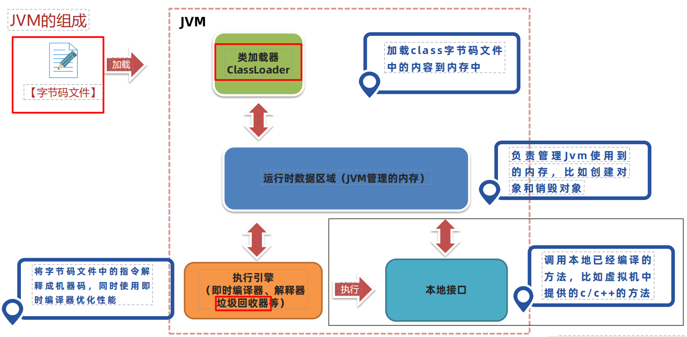

# 2. 字节码文件的组成

## 2.1 应用场景

1. 解决面试难题
   
   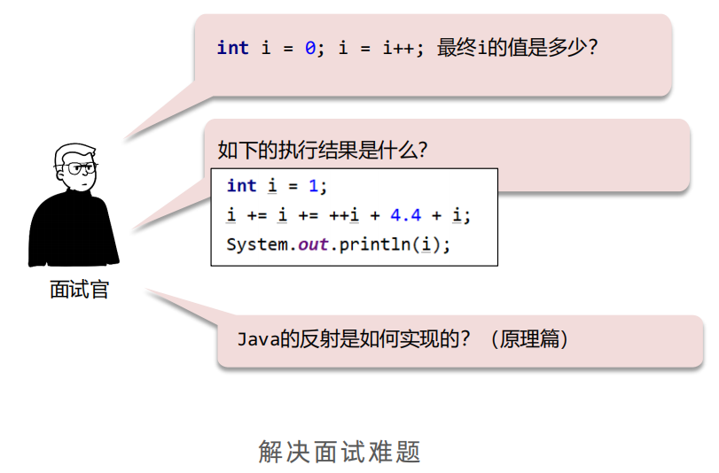

2. 解决工作中的实际问题：版本冲突问题
   
   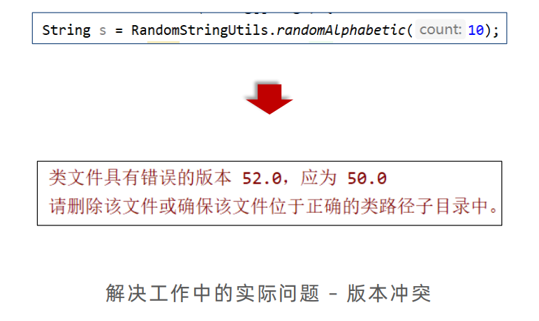

3. 解决工作中的实际问题：系统升级
   
   

## 2.2 学习路线

### 2.2.1 以正确的姿势打开文件

- 字节码文件中保存了源代码编译之后的内容，以二进制的方式存储，无法直接用记事本打开阅读。 

- 通过NotePad++使用十六进制插件查看class文件：
  
  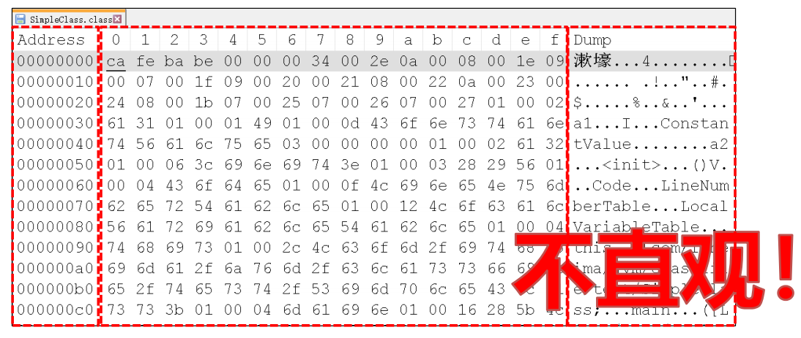

- 推荐使用<font color=red> jclasslib</font>工具查看字节码文件。

- Github地址： https://github.com/ingokegel/jclasslib 
  
  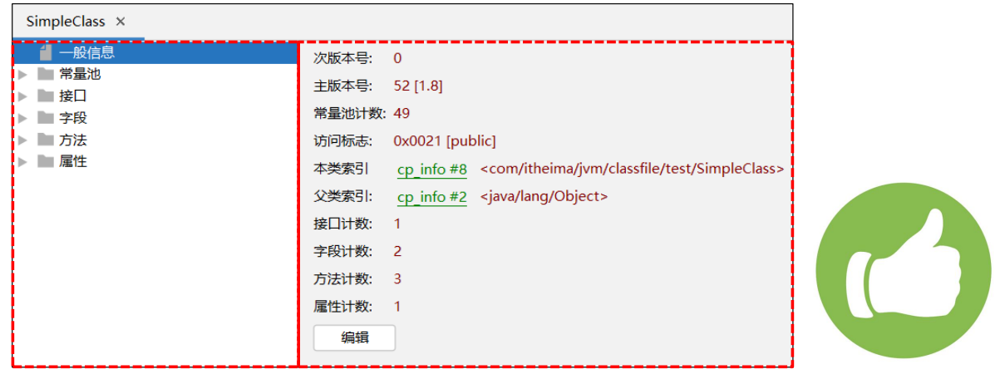

#### 2.2.1.1 案例代码（修改后版本）

```java
package com.study.jvm.methodAreaDemo;

public interface SimpleInterface {
    public void interfaceMethodDemo();
}


package com.study.jvm.methodAreaDemo;

import java.lang.reflect.Field;
import java.lang.reflect.Method;

public class SimpleClass implements SimpleInterface {

    private final static int a1 = 0;
    private int a2 = 0;

    public static void main(String[] args) {

        Class<SimpleClass> clazz = SimpleClass.class;
        // 获取方法信息
        Method[] methods = clazz.getMethods();
        // 获取字段信息
        Field[] fields = clazz.getFields();

        String str1 = "123";
        String str2 = "123";
        int a = 1;
        System.out.println("123");
    }

    @Override
    public void interfaceMethodDemo() {
        System.out.println("重写接口方法测试");
    }
}
```

#### 2.2.1.2 jclasslib 的使用

1. 查看字节码文件的基本信息
   
   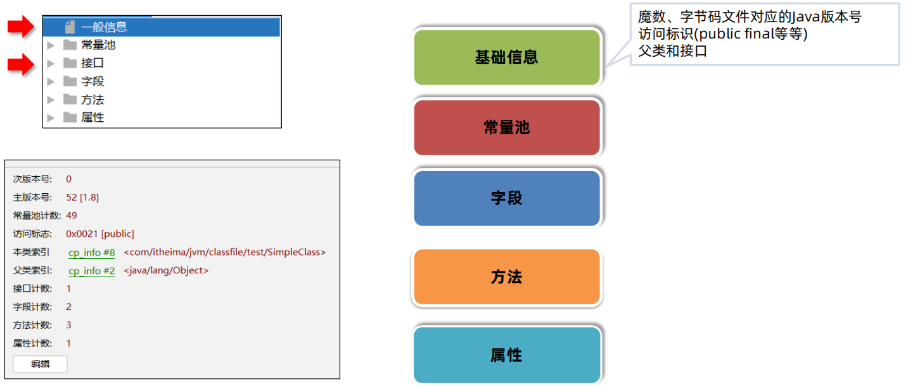

2. 查看字节码文件的常量池
   
   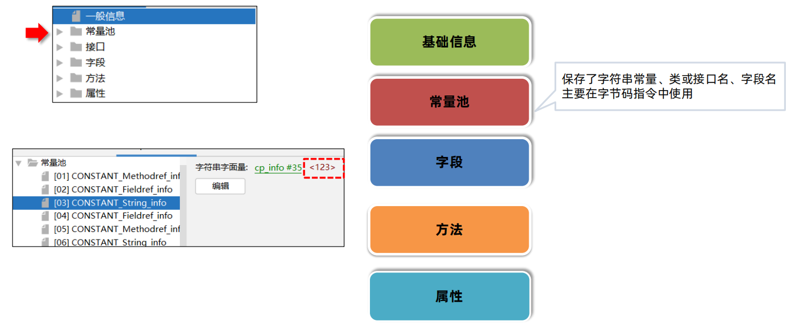

3. 查看字节码文件的字段信息
   
   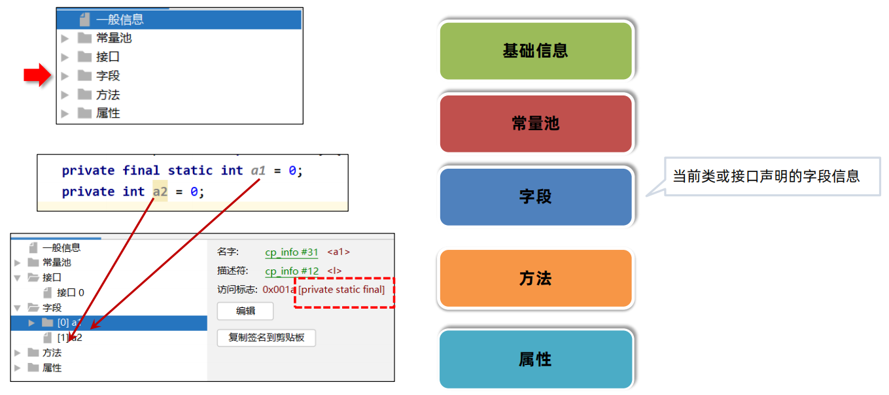

4. 选择方法中对应的方法名，查看字节码文件的 <font color=red>字节码指令</font>
   
   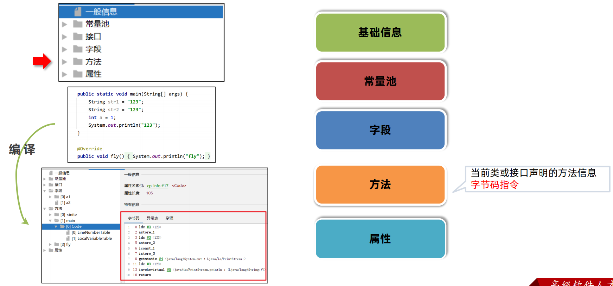
   
   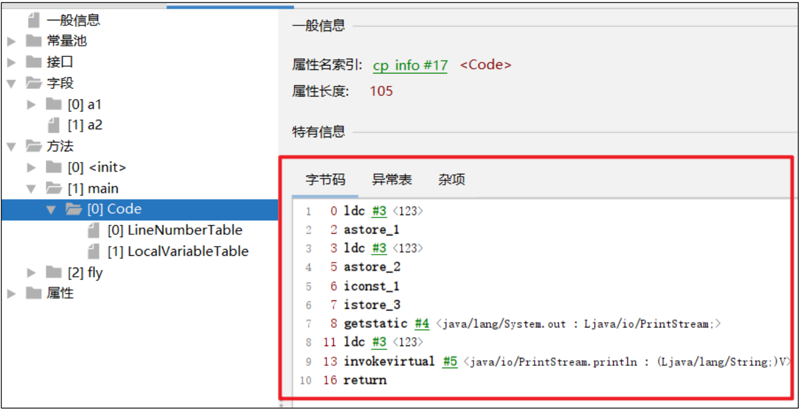

5. 查看字节码文件的属性：类的属性，不是字段信息，是例如源码文件名、内部类的列表等信息
   
   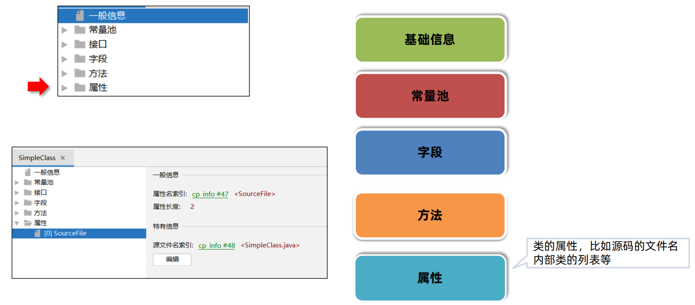

#### 2.2.1.3 Idea中安装jclasslib的插件使用

1. 安装插件
   
   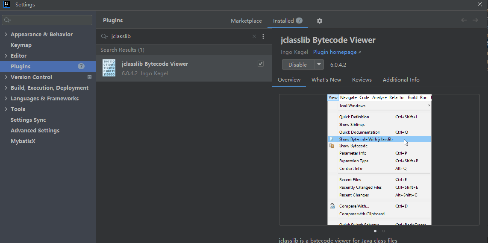

2. 单击选中对应的类文件（也可以是对应的class文件），点击View选框，选择 Show Bytecode With Jclasslib
   
   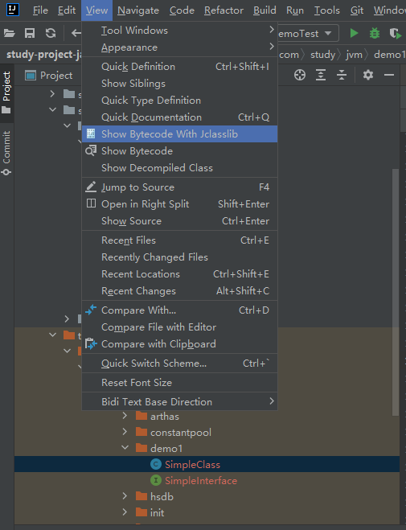

3. 右侧弹出对应的视图，查看相应信息
   
   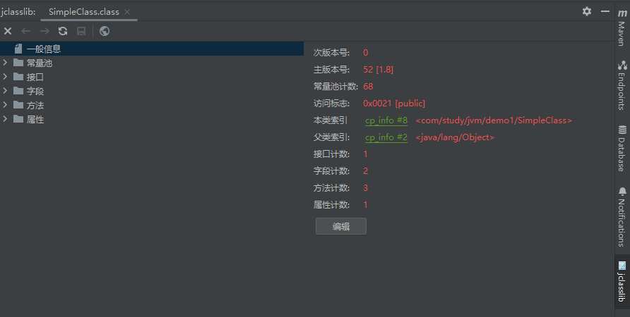

### 2.2.2 字节码文件的组成

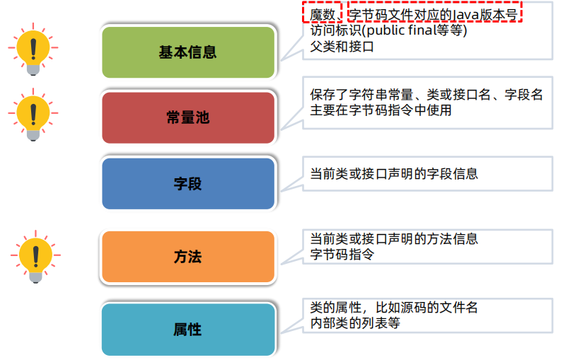

#### 2.2.2.1 Magic 魔数

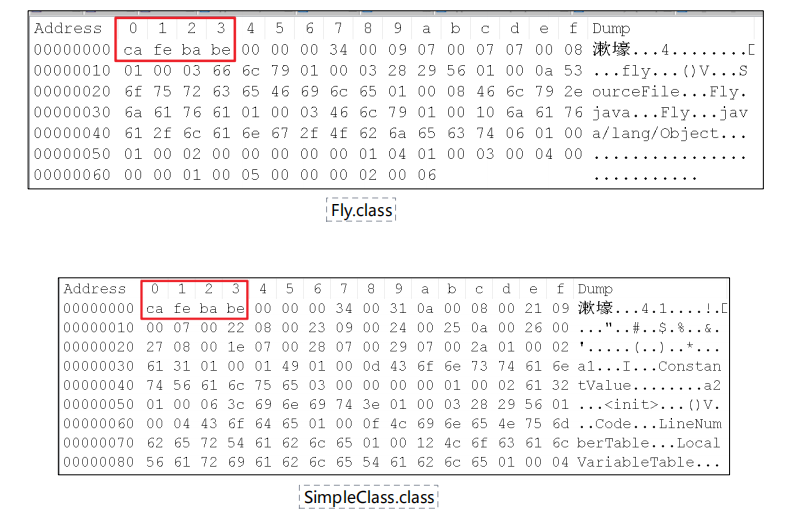

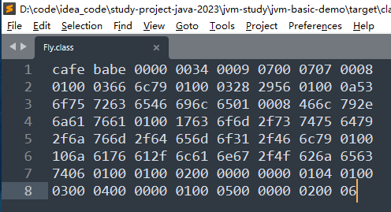

- 文件是<font color=red>无法通过文件扩展名</font>来确定文件类型的，文件扩展名可以随意修改，不影响文件的内容。

- <font color=red>软件使用文件的头几个字节（文件头）去校验文件的类型，如果软件不支持该种类型就会出错。</font>

- Java字节码文件中，将文件头称为<font color=red>magic魔数。</font>
  
  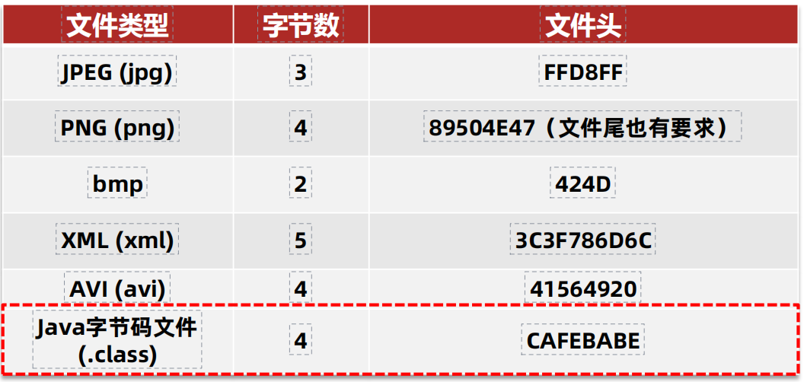

#### 2.2.2.2 主副版本号

- <font color=red>主副版本号指的是编译字节码文件的JDK版本号，</font>主版本号用来标识大版本号。
  
  - JDK1.0 - 1.1 使用了45.0 - 45.3，JDK1.2 是46之后每升级一个大版本就加1；
  - 副版本号是当主版本号相同时，作为区分不同版本的标识，一般只需要关心主版本号。

- <font color=red>版本号的作用主要是判断当前字节码的版本和运行时的JDK是否兼容。</font>
  
  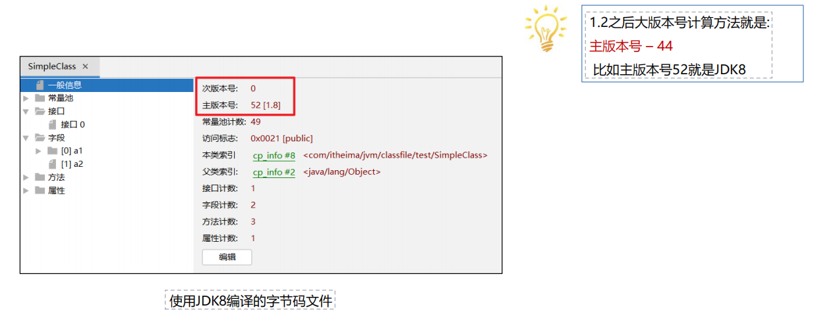

##### 主版本号不兼容导致的错误

**需求：** 解决以下由于主版本号不兼容导致的错误


**两种方案：** 

1. 升级JDK版本 <font color=red>（容易引发其他的兼容性问题，并且需要大量的测试） </font>

2. 将第三方依赖的版本号降低或者更换依赖，以满足JDK版本的要求   <font color=red>√ 建议采用</font>

#### 2.2.2.3 基础信息

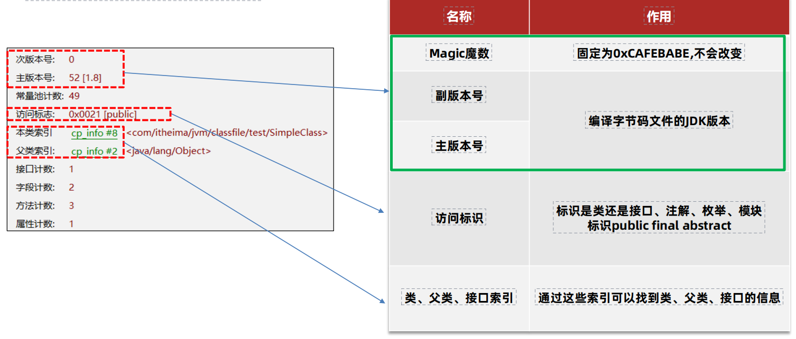

#### 2.2.2.4 常量池

- 字节码文件中常量池的作用：避免相同的内容重复定义，节省空间。
  
  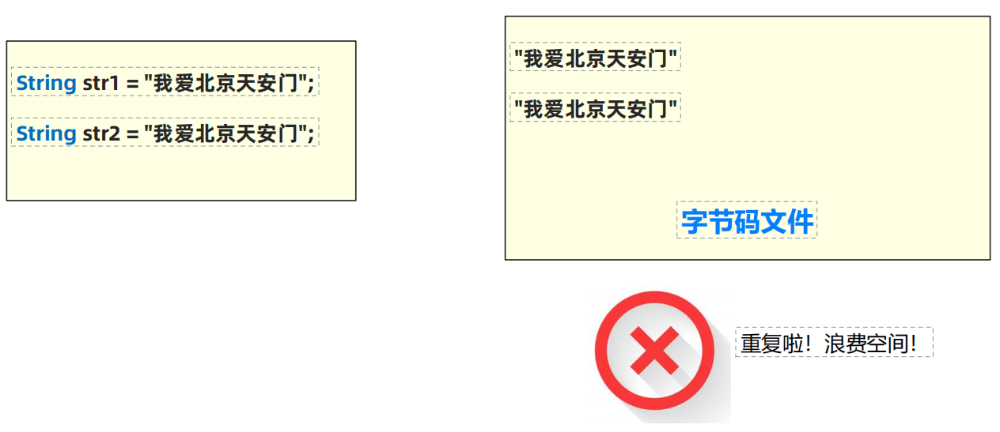

- 常量池中的数据都有一个编号，编号从1开始。在字段或者字节码指令中通过编号可以快速的找到对应的数据。

- 字节码指令中通过编号引用到常量池的过程称之为<font color=red>符号引用。</font>
  
  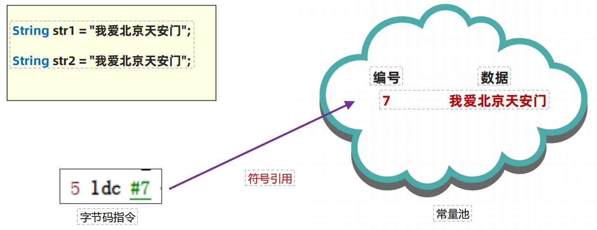

#### 2.2.2.5 方法

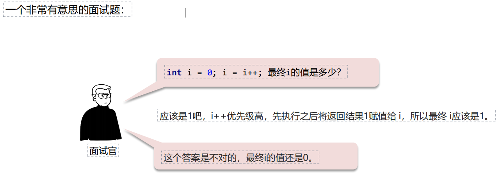

- 字节码中的方法区域是存放<font color=red>字节码指令</font>的核心位置，字节码指令的内容存放在方法的Code属性中。
  
  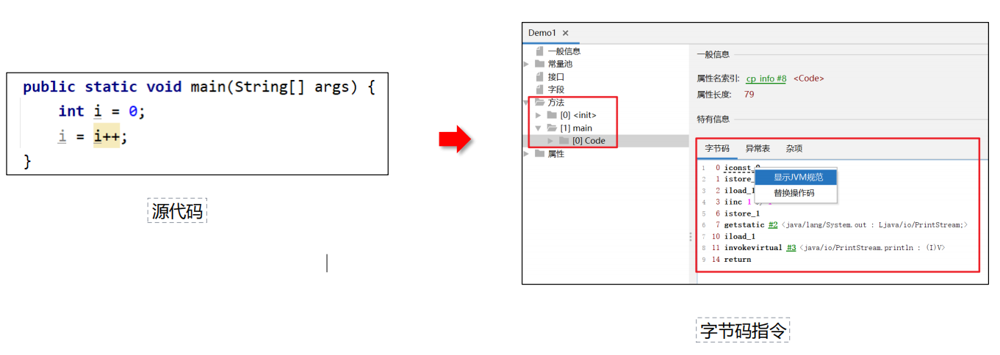

- 操作数栈是临时存放数据的地方，局部变量表是存放方法中的局部变量的位置。

##### i = i + 1执行流程分析

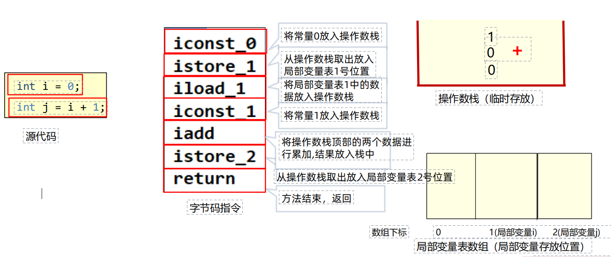

##### i = i++ 执行流程分析

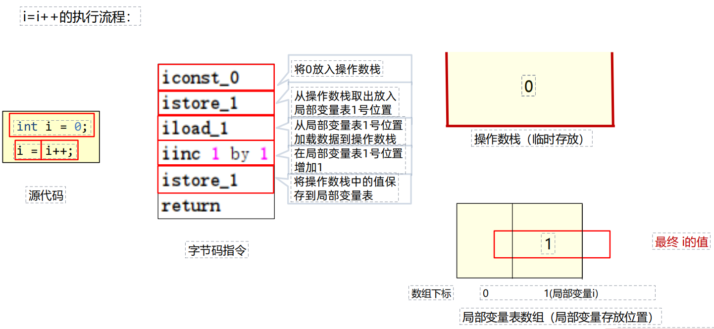

- 原因：<font color =blue>`i++` 先用后加，字节码指令中 **先 iload_位置，再 iinc 位置 by 1**，即先将 i 的值放入操作数栈，然后局部变量表中该位置值加一，操作数栈中还是原来的值  </font> 。

##### i = ++i 执行流程分析

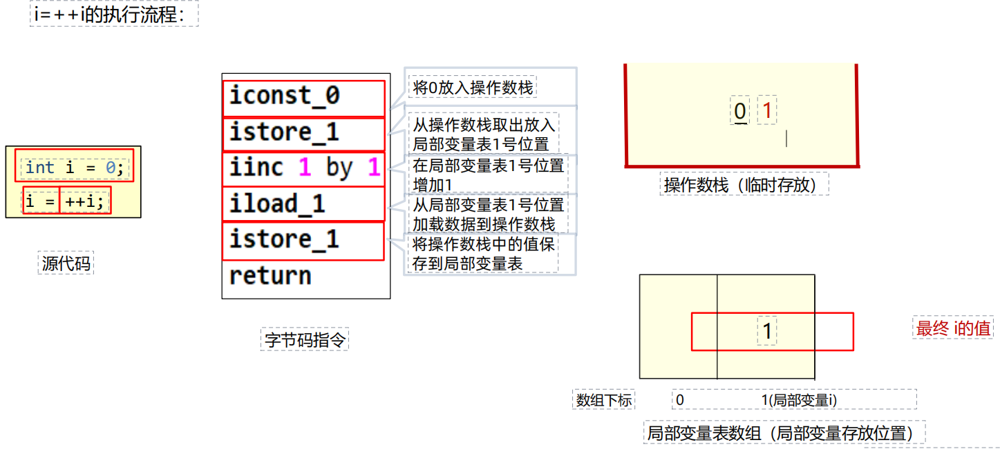

- 原因：<font color=blue>`++i` 先加后用，字节码指令中 **先 iinc 位置 by 1，再 iload_位置**，即先将 局部变量表中i位置的值加一，再取该值放入操作数栈，操作数栈中的值加过一了 </font>。

##### 总结

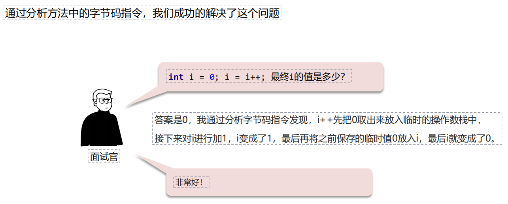

##### 练习：查看字节码文件并解答问题

**问题：** 通过字节码指令分析下面三种 “加一” 的操作性能的高低? 

```java
int i = 0, j = 0,  k = 0;
i++;         // 解释为执行 1 条指令
j = j + 1;   // 解释为执行 4 条指令
k += 1;      // 解释为执行 1 条指令
```

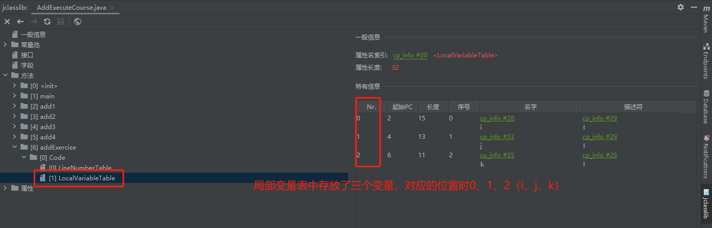

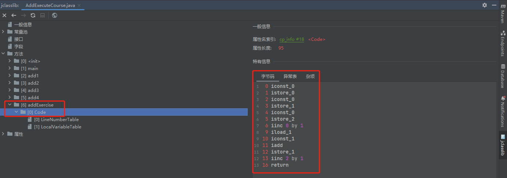

### 2.2.3 玩转字节码常用工具

#### 2.2.3.1 javap-v命令

- javap 是 JDK 自带的反编译工具，可以通过控制台查看字节码文件的内容。<font color=red>适合在服务器上查看字节码文件内容。</font>
- 直接输入javap查看所有参数。
- 输入 <font color=red>javap -v 字节码文件名称 </font> 查看具体的字节码信息。（如果jar包需要先使用 jar –xvf 命令解压）
- 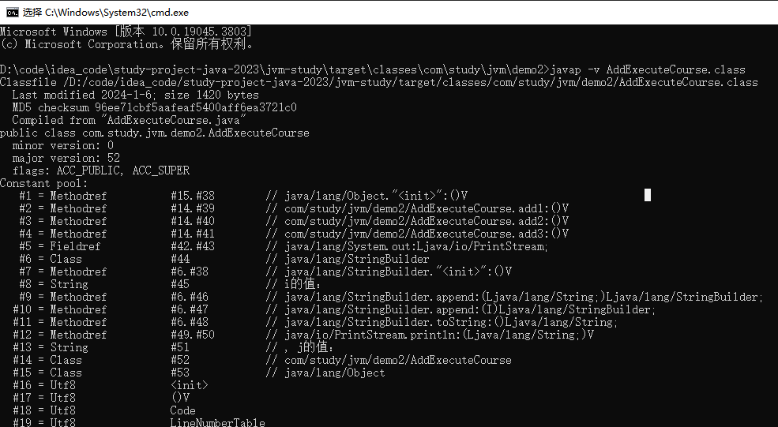

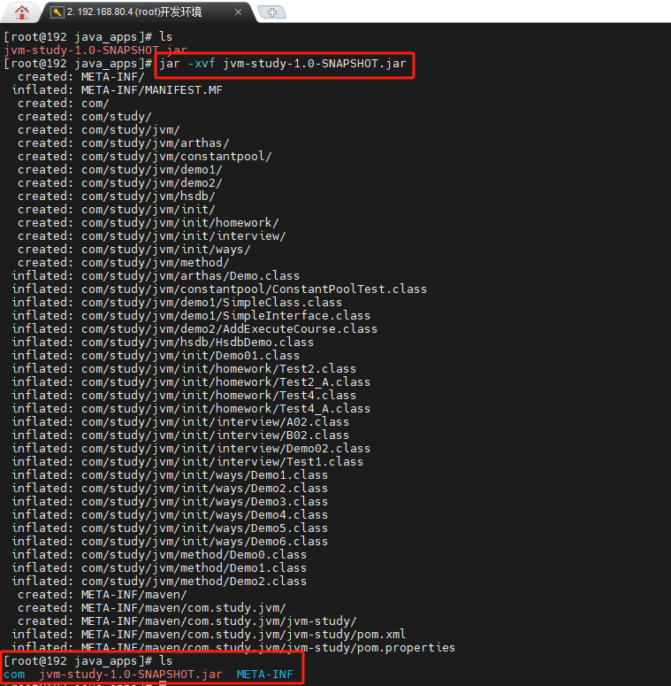

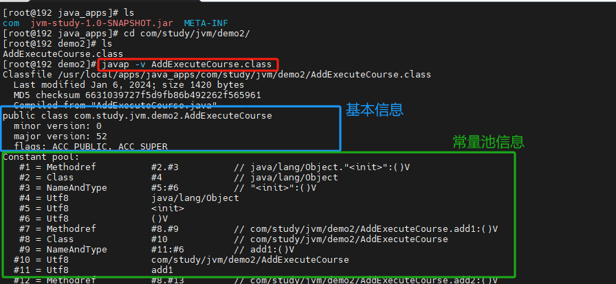

#### 2.2.3.2 jclasslib插件

[Idea中安装jclasslib的插件使用]: 

#### 2.2.3.3 阿里arthas

- Arthas 是一款线上监控诊断产品，通过全局视角实时查看应用 load、内存、gc、线程的状态信息，并能在不修改应用代码的情况下，对业务问题进行诊断，大大提升线上问题排查效率。
- 官网：https://arthas.aliyun.com/doc/ （通过官网查看相应的命令作用）
- dump 类的全限定名：dump已加载类的字节码文件到特定目录。 
- jad 类的全限定名：反编译已加载类的源码。
- 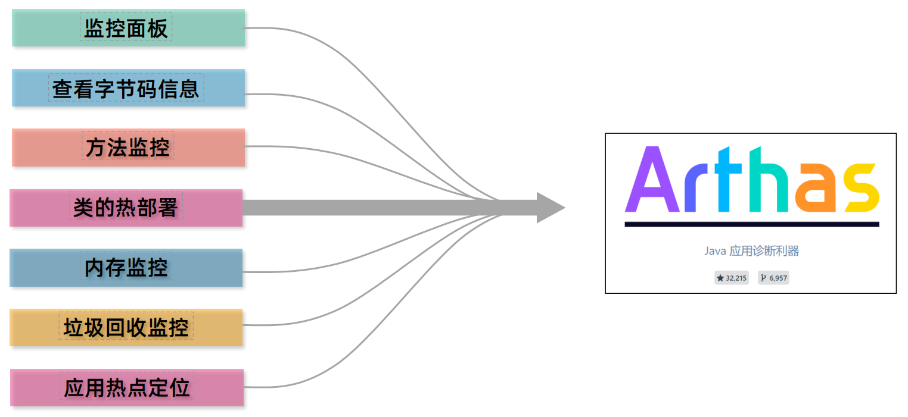

##### 环境准备

1. 启动一个 java程序，此处执行 MainTest.java 的 main方法
   
   ```
   package com.study.jvm.com.study.jvm.theory.demo3;
   
   import java.io.IOException;
   
   // 测试内存情况的程序类
   public class MainTest {
   
       private static final int i1 = 1;
       private static int i2;
       private int i3;
       private static final String str1 = "str1";
       private static String str2;
       private String str3;
   
       public static void main(String[] args) throws IOException {
           i2 = 2;
           str2 = "str2";
   
           // 让程序一直跑着
           System.in.read();
       }
   
   }
   ```

2. 通过java指令执行字节码文件中main方法，会出现 **错误: 找不到或无法加载主类 MainTest** 的错误。
- 原因：jdk 指定的 classpath 中没有当前目录，所以即使当前目录下有该字节码文件，也找不到

- 解决办法：
  
  - windows下：`java -classpath class文件的存放路径（包级别上一层） class文件的全名 `
    
    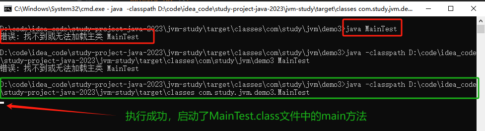
  
  - Linux下：`java -classpath /usr/local/apps/java_apps com.study.jvm.com.study.jvm.theory.demo3.MainTest`
    
    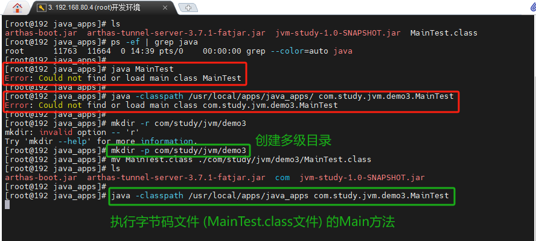

##### 启动 arthas

- 执行 <font color=red>`java -jar arthas-boot.jar`</font> 命令
  
  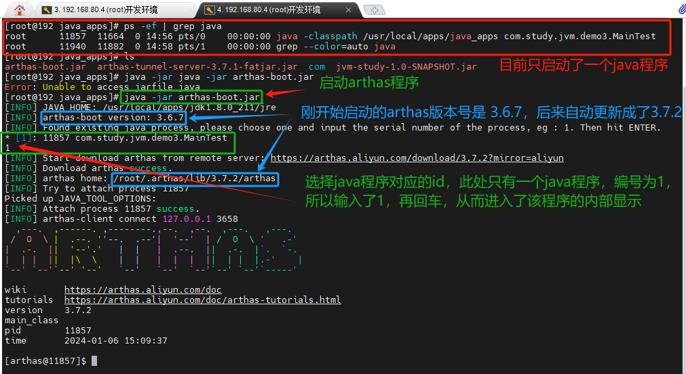
  
  - 从上面日志可知 MainTest 程序的进程id 是 11857

##### 通过 <font color=red>dump命令 将正在运行的字节码文件保存下来</font>

- 命令：`dump -d 生成文件的地址 文件的全限名 `
  
  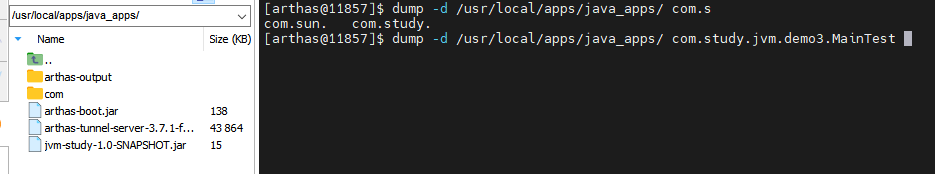
  
  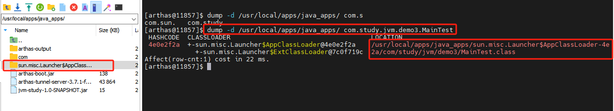

##### 通过 <font color=red>jad命令 反编译加载类的源码 </font>

- 命令：`jad com.study.jvm.com.study.jvm.theory.demo3.MainTest `
  
  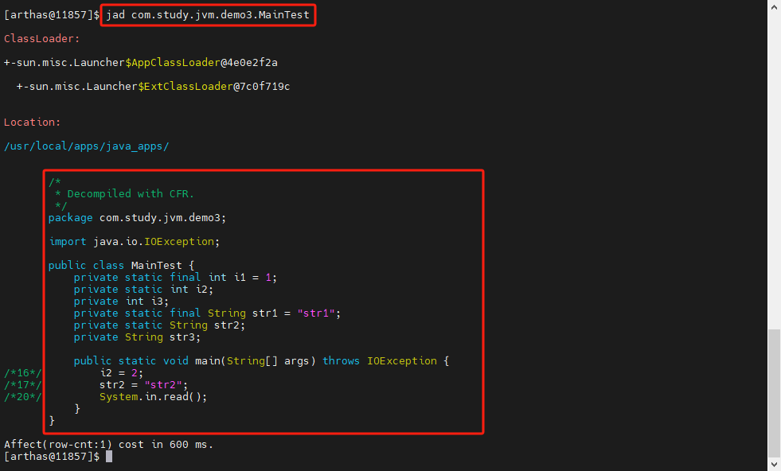    

##### 通过 <font color=red>dashboard命令 查看程序的运行情况 (内存、CPU使用等信息) </font>

- 命令：`dashboard -i 2000 -n 1 `  每隔两秒打印一次结果，总共打印1次
  
  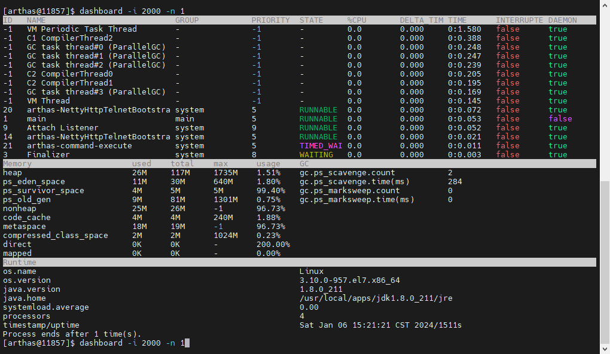

##### 案例：使用阿里arthas定位线上出现的字节码问题

**背景：** 

小李的团队昨天对系统进行了升级修复了某个bug，但是升级完之后发现bug还是存在，小李怀疑是因为没有把最新的字节码文件部署到服务器上，请使用阿里的arthas去确认升级完的字节码文件是不是最新的。 

**思路：** 

1. 在出问题的服务器上部署一个arthas，并启动。 
2. 连接arthas的控制台，使用 jad 命令加上想要查看的类名，反编译出源码。
3. 确认源码是否是最新的。

### 2.2.4 总结

#### 1) 如何查看字节码文件？

- **本地文件可以使用 jclasslib工具查看，开发环境使用 jclasslib 插件。**
  
  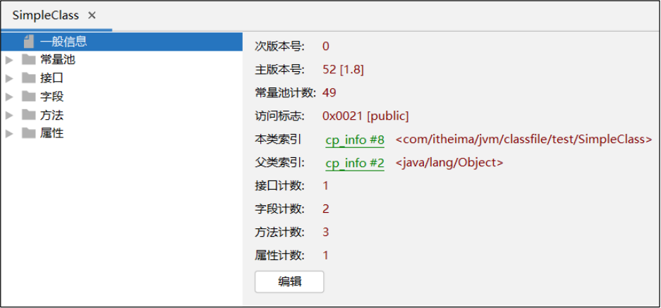

- **服务器上文件使用 javap 命令直接查看，也可以通过 arthas 的 dump 命令导出字节码文件，再查看本地文件。还可以使用 jad 命令反编译出源代码。**
  
      

#### 2) 字节码文件的核心组成有哪些？

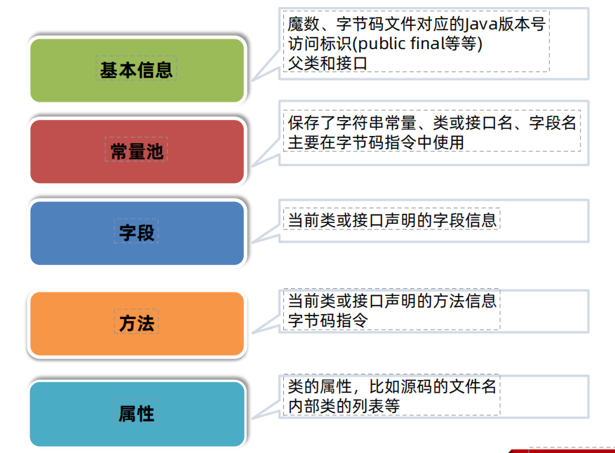

# 3. 类的生命周期

- 类的生命周期描述了一个类加载、使用、卸载的整个过程

- 类的生命周期本身就是一个高频面试题

- 生命周期中的初始化阶段频繁出现在大厂的笔试中

- 作为后续大量知识点的基础
  
  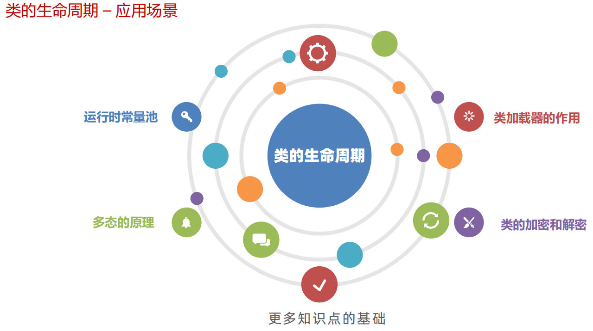

## 3.1 生命周期概述

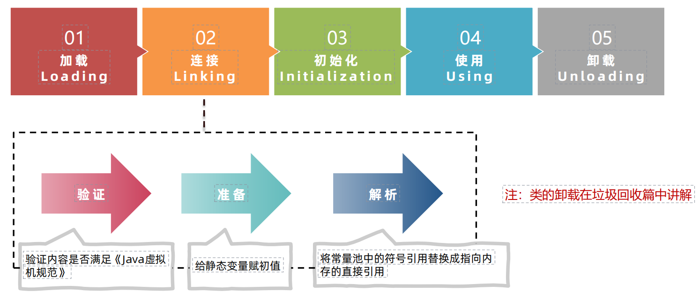

## 3.2 加载阶段

### 3.2.1 加载步骤

1. 加载(Loading)阶段 第一步是类加载器根据类的全限定名通过不同的渠道以二进制流的方式获取字节码信息。
- 程序员可以使用Java代码拓展的不同的渠道。


2. 类加载器在加载完类之后，Java虚拟机会将字节码中的信息保存到方法区中。
- <font color=red>生成一个InstanceKlass对象，保存类的所有信息，里边还包含实现特定功能比如多态的信息。</font>

- 方法区是一个抽象的概念，老版本jdk将方法区放在老年代中，新版本jdk将方法区放在元空间中
  
  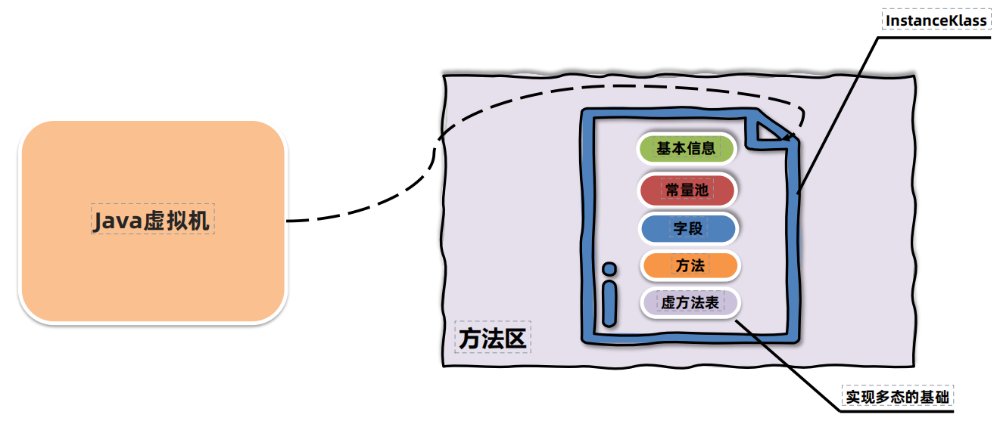
3. 同时，Java虚拟机还会在堆中生成一份与方法区中数据类似的java.lang.Class对象。
- <font color=red>作用是在Java代码中去获取类的信息，以及存储静态字段的数据（JDK8及之后）。</font>
  
    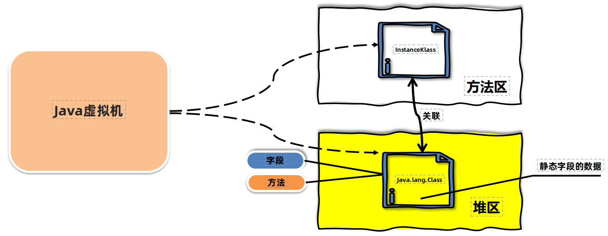
    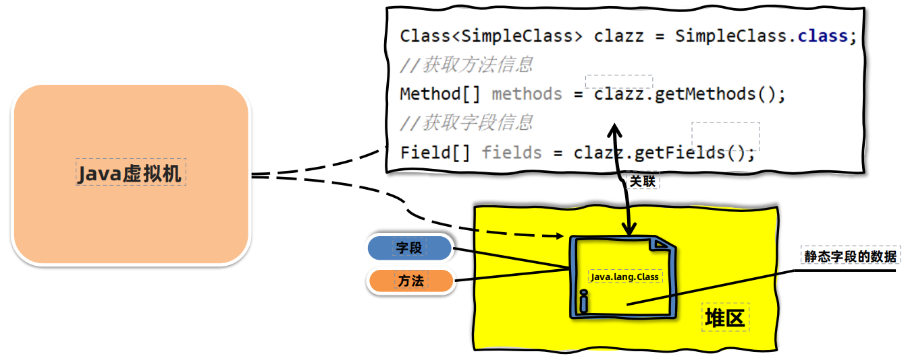

- InstanceKclass是由C++语言开发的，java程序员无法直接访问。

- 对于开发者来说，只需要访问堆中的Class对象，而不需要访问方法区中所有信息。

- 这样Java虚拟机就能很好地控制开发者访问数据的范围。

- 新的版本jdk将静态字段存放在堆中，老版本jdk会有存放在方法区中（不讨论了）

### 3.2.2 查看内存中的对象

- 推荐使用JDK自带的hsdb工具查看Java虚拟机内存信息。工具位于JDK安装目录下lib文件夹中的sa-jdi.jar中。
  
  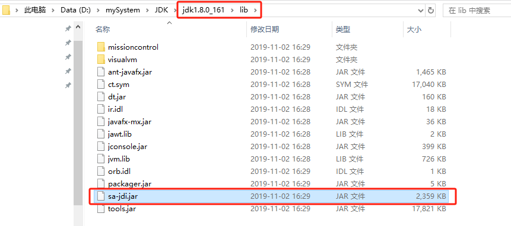

- 启动命令：` java -cp sa-jdi.jar sun.jvm.hotspot.HSDB ` 
  
  - 上述命令表示的含义是，启动类（sun.jvm.hotspot.HSDB）在 sa-jdi.jar 包里面
  
  - -cp 指定 jar包 和 启动类的全限定类名

- 操作步骤：
  
  1. 执行命令
     
     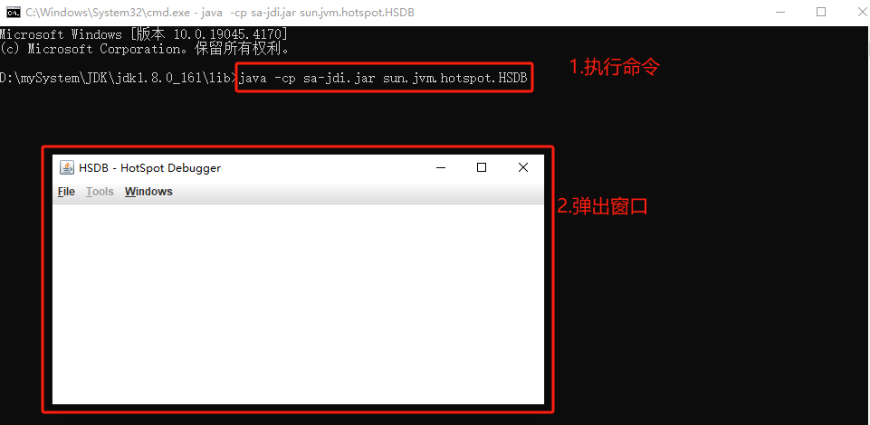
  
  2. 启动准备的测试程序
     
     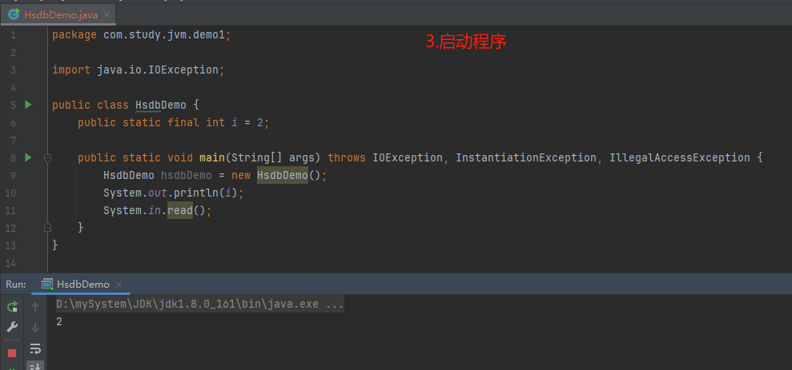
  
  3. 查看该进程的id，在HSDB-HotSpot窗口中打开该进程（File -> Attach to HotSpot Process），填写进程Id，点击OK
     
     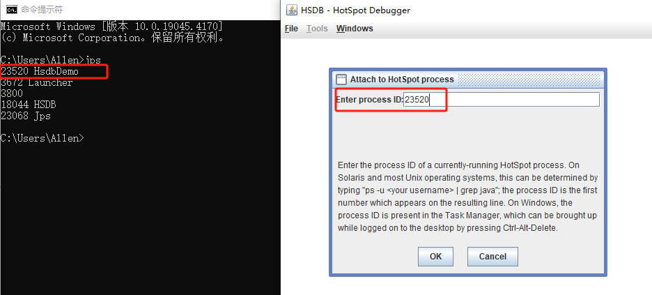
  
  4. Tools -> Object Histogram(对象直方图)，搜索框中输入类名，找到后双击
     
     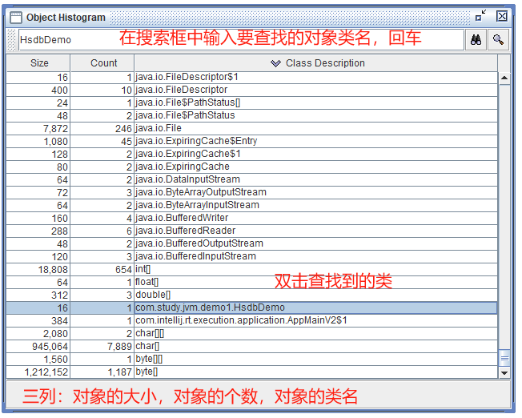
  
  5. 点击Inspect
     
     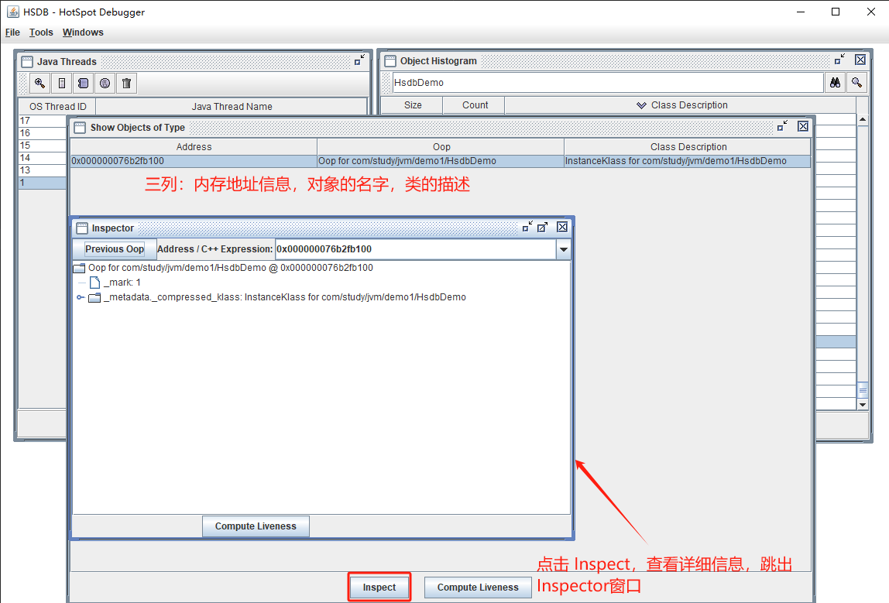
  
  6. 查看 InstanceKlass 与 Class 中是否有 静态变量i 的数据信息
     
     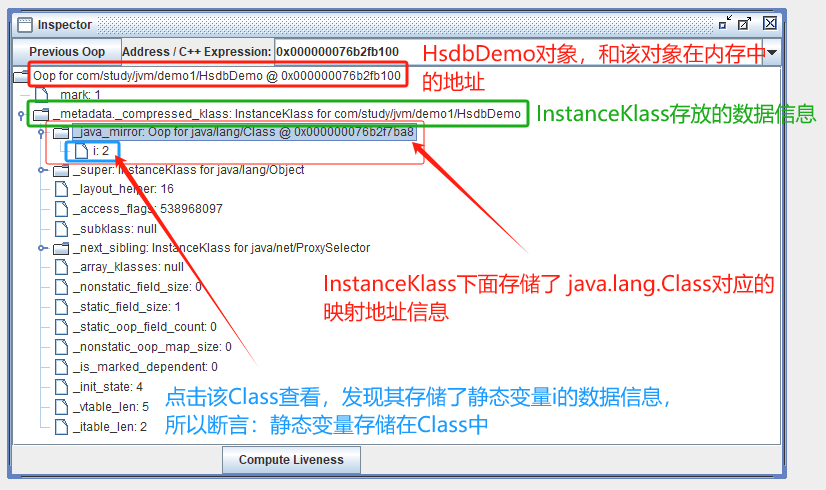

## 3.3 连接阶段

### 3.3.1 连接阶段之验证

- 连接（Linking）阶段的第一个环节是验证，验证的主要目的是检测Java字节码文件是否遵守了《Java虚拟机规范》中的约束。这个阶段一般不需要程序员参与。

- 主要包含如下四部分，具体详见《Java虚拟机规范》
  
  1. 文件格式验证，比如文件是否以 0xCAFEBABE 开头，主次版本号是否满足当前Java虚拟机版本要求。
  
  2. 元信息验证，例如类必须有父类（super不能为空）。
  
  3. 验证程序执行指令的语义，比如方法内的指令执行中跳转到不正确的位置。(下面跳转到2是可以的，但是如果跳转到15就是错的)
     
     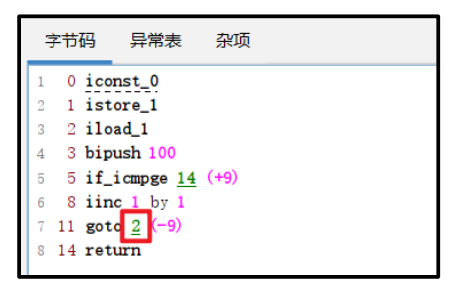
  
  4. 符号引用验证，例如是否访问了其他类中private的方法等。

- 验证案例-版本号的检测：
  
  - Hotspot JDK8中虚拟机源码对版本号检测的代码如下，你能读懂它的含义吗
    
    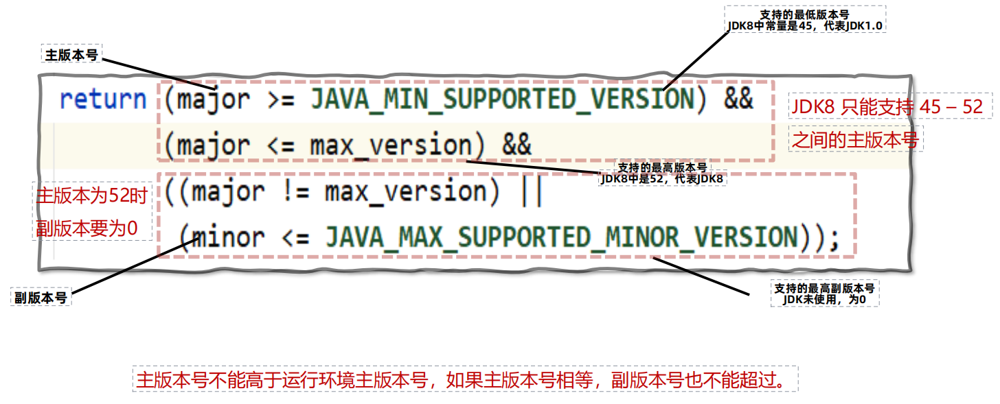

### 3.3.2 连接阶段之准备

- 准备阶段为静态变量（static）分配内存并设置初始值。

- <font color=red>注意：本章涉及到的内存结构只讨论JDK8及之后的版本，8之前的版本后续章节详述。</font>
  
  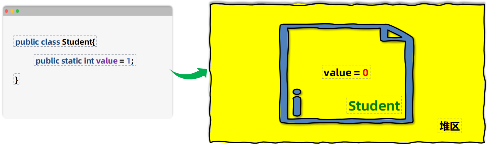

- 上述代码：在加载阶段时，在堆区中准备Class的内存；在连接的准备阶段时，在该Class的内存中的value变量赋初始值，即0。

- 准备阶段只会给静态变量赋初始值，而每一种基本数据类型和引用数据类型都有其初始值。
  
  | 数据类型    | 初始值      |
  |:-------:|:--------:|
  | int     | 0        |
  | long    | 0L       |
  | short   | 0        |
  | char    | '/u0000' |
  | byte    | 0        |
  | boolean | false    |
  | double  | 0.0      |
  | 引用类型    | null     |

- **final修饰** 的 **基本数据类型** 的 **静态变量**，准备阶段直接会将代码中的值进行赋值。
  
  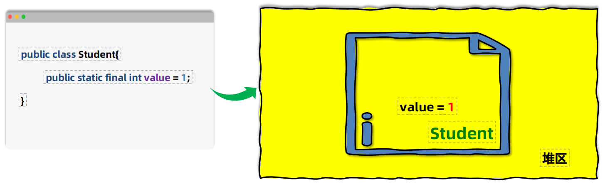

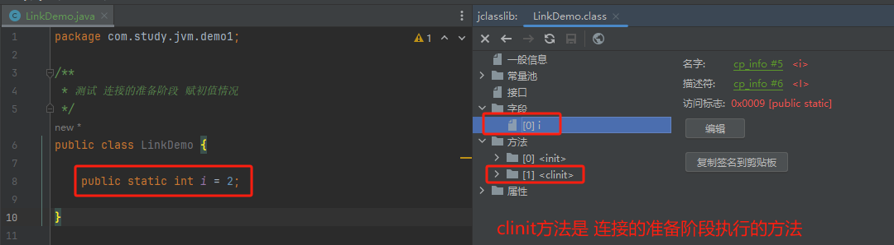

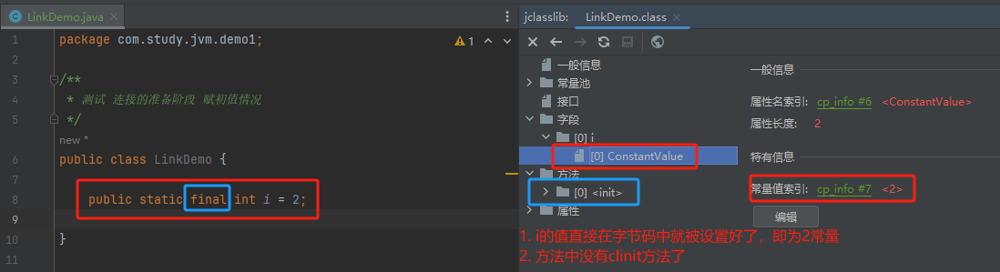

- 上述途中有错误：clinit方法是 class init，表示类的初始化方法，在类的初始化阶段执行

### 3.3.3 连接阶段之解析

- 解析阶段主要是将常量池中的符号引用替换为直接引用。

- <font color=red>符号引用就是在字节码文件中使用编号来访问常量池中的内容。</font>
  
  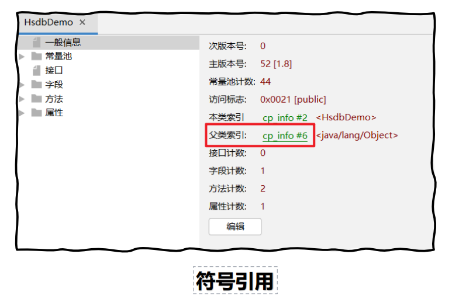

- <font color=red>直接引用不在使用编号，而是使用内存中地址进行访问具体的数据。</font>
  
  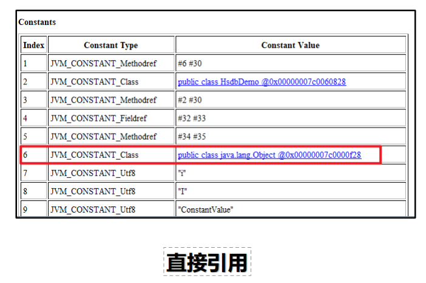

## 3.4 初始化阶段

### 3.4.1 基础知识点

- 初始化阶段会执行<font color=red>静态代码块中的代码</font>，并<font color=red>为静态变量赋值</font>。

- 初始化阶段会执行字节码文件中 <font color=red>clinit</font> 部分的字节码指令。
  
  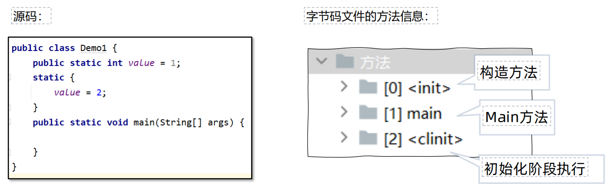
  
  ```java
  package com.study.jvm.methodAreaDemo.clinit;
  
  /**
   * 加载 - 连接 - 初始化 - 使用 - 卸载
   * 类的初始化阶段测试案例
   *
   * 该文件的字节码指令：
   * 0 iconst_1                                                     将常量1放入操作数栈中
   * 1 putstatic #2 <com/study/jvm/methodAreaDemo/clinit/Demo1.value : I>    从操作数栈中获取一个值，将该值设置到静态变量中区（此处的静态变量引用是#2，即value）
   * 4 iconst_2                                                     将常量2放入操作数栈中
   * 5 putstatic #2 <com/study/jvm/methodAreaDemo/clinit/Demo1.value : I>    从操作数栈中获取一个值，将该值设置到静态变量中区（此处的静态变量引用是#2，即value）
   * 8 return
   */
  public class Demo1 {
  
      public static int value = 1;
  
      static {
          value = 2;
      }
  
      public static void main(String[] args) {
  
      }
  
  }
  ```
  
  ```java
  package com.study.jvm.methodAreaDemo.clinit;
  
  /**
   * 加载 - 连接 - 初始化 - 使用 - 卸载
   * 类的初始化阶段测试案例
   * 
   * 字节码指令：
   * 0 iconst_2                                                     将常量2放入操作数栈中
   * 1 putstatic #2 <com/study/jvm/methodAreaDemo/clinit/Demo1.value : I>    从操作数栈中获取一个值，将该值设置到静态变量中区（此处的静态变量引用是#2，即value）
   * 4 iconst_1                                                     将常量1放入操作数栈中
   * 5 putstatic #2 <com/study/jvm/methodAreaDemo/clinit/Demo1.value : I>    从操作数栈中获取一个值，将该值设置到静态变量中区（此处的静态变量引用是#2，即value）
   * 8 return
   */
  public class Demo2 {
  
      static {
          value = 2;
      }
  
      public static int value = 1;
  
      public static void main(String[] args) {
  
      }
  
  }
  ```

- <font color=red>clinit方法中的执行顺序与Java中编写的顺序是一致的。</font>

- 以下几种方式会导致类的初始化：
  
  1. 访问一个类的静态变量或者静态方法，注意: 变量是final修饰的，并且等号右边是常量不会触发初始化。
  
  2. 调用Class.forName(String className)。
  
  3. new一个该类的对象时。
  
  4. 执行Main方法的当前类。

- 添加 ` -XX:+TraceClassLoading ` 参数，可以打印出加载并初始化的类

### 3.4.2 面试题

1. 代码1：
   
   ```java
   package com.study.jvm.methodAreaDemo.interview;
   
   /**
    * 初始化阶段相关面试题
    */
   public class ClinitDemo1 {
       public static void main(String[] args) {
           System.out.println("A");
           new ClinitDemo1();
           new ClinitDemo1();
           // 打印结果(预期)：D A B C B C
           // 打印结果(实际)：D A C B C B
       }
   
       public ClinitDemo1() {
           System.out.println("B");
       }
   
       {
           System.out.println("C");
       }
   
       static {
           System.out.println("D");
       }
   }
   ```
- 解析：
  
  ```java
  clinit方法的字节码指令：
  0 getstatic #1 <java/lang/System.out : Ljava/io/PrintStream;>
  3 ldc #9 <D>
  5 invokevirtual #3 <java/io/PrintStream.println : (Ljava/lang/String;)V>
  8 return
  ```
  
  - `3 ldc #9 <D>` ：第三行指令，从常量池中将字符串D加载到操作数栈中
  
  - `5 invokevirtual #3 <java/io/PrintStream.println : (Ljava/lang/String;)V> `：调用Println方法打印操作数栈上弹出一个元素的内容
  
  ```java
  init方法的字节码指令：（即该类对应的构造方法的字节码指令）
   0 aload_0
   1 invokespecial #6 <java/lang/Object.<init> : ()V>
   4 getstatic #1 <java/lang/System.out : Ljava/io/PrintStream;>
   7 ldc #7 <C>
   9 invokevirtual #3 <java/io/PrintStream.println : (Ljava/lang/String;)V>
  12 getstatic #1 <java/lang/System.out : Ljava/io/PrintStream;>
  15 ldc #8 <B>
  17 invokevirtual #3 <java/io/PrintStream.println : (Ljava/lang/String;)V>
  20 return
  ```

### 3.4.3 补充知识点

- clinit指令在特定情况下不会出现，比如：如下几种情况是不会进行初始化指令执行的。
  
  1. 无静态代码块且无静态变量赋值语句。
  
  2. 有静态变量的声明，但是没有赋值语句。
     
     ```java
     public static int a;
     ```
  
  3. 静态变量的定义使用final关键字，并被赋值为常量，这类变量会在准备阶段直接进行初始化。
     
     ```java
     public static final int a = 10;
     ```

- **直接访问父类的静态变量，不会触发子类的初始化**。
  
  ```java
  package com.study.jvm.methodAreaDemo.clinit;
  
  public class Demo9 {
      public static void main(String[] args) {
          // 即使此刻是通过Child访问静态变量a的，但是该变量是Parent，所以只会执行Parent的clinit方法
          System.out.println(Child.a); // 打印结果：1
      }
  }
  
  class Parent {
      static int a = 0;
  
      static {
          a = 1;
          System.out.println("执行 Parent 的 clinit方法 ... ");
      }
  }
  
  class Child extends Parent {
      static {
          a = 2;
          System.out.println("执行 Child 的 clinit方法 ... ");
      }
  }
  ```

- 子类的初始化clinit调用之前，会先调用父类的clinit初始化方法。
  
  ```java
  package com.study.jvm.methodAreaDemo.clinit;
  
  public class Demo9 {
      public static void main(String[] args) {
          new Child();
          System.out.println(Child.a); // 打印结果：2
      }
  }
  
  class Parent {
      static int a = 0;
  
      static {
          a = 1;
          System.out.println("执行 Parent 的 clinit方法 ... ");
      }
  }
  
  class Child extends Parent {
      static {
          a = 2;
          System.out.println("执行 Child 的 clinit方法 ... ");
      }
  }
  ```

- <font color=red>数组中的类创建，不会导致数组中元素的类进行初始化</font>
  
  ```java
  package com.study.jvm.methodAreaDemo.interview;
  
  /**
   * 初始化阶段相关面试题
   * 不会执行Test_A的初始化方法
   */
  public class ClinitDemo2 {
      public static void main(String[] args) {
          Test_A[] arr = new Test_A[10];
      }
  }
  class Test_A {
      static {
          System.out.println("的静态代码块运行了，即 Test_A clinit 方法执行了 ... ");
      }
  }
  ```

- <font color=red>final修饰的变量如果赋值的内容需要执行指令才能得出结果，会执行clinit方法进行初始化</font>
  
  ```java
  package com.study.jvm.methodAreaDemo.interview;
  
  /**
   * 初始化阶段相关面试题
   * 会执行Test3_A的初始化方法
   */
  public class ClinitDemo3 {
      public static void main(String[] args) {
          System.out.println(Test3_A.a);
      }
  }
  class Test3_A {
      public static final int a = Integer.valueOf(1);
  
      static {
          System.out.println("静态代码块运行了，即 Test3_A clinit 方法执行了 ... ");
      }
  }
  ```

## 3.5 总结

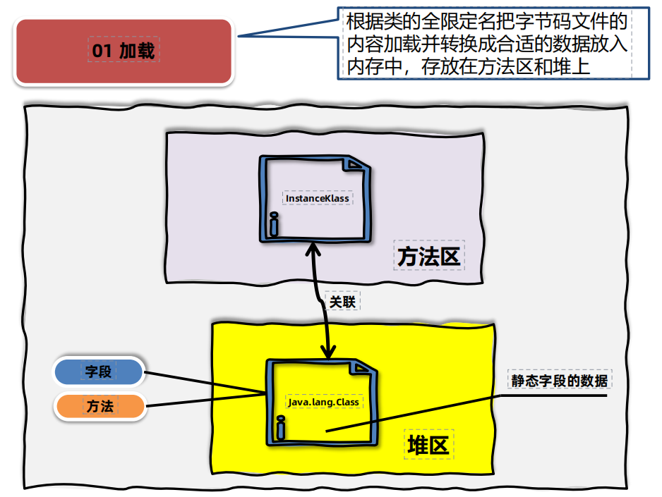

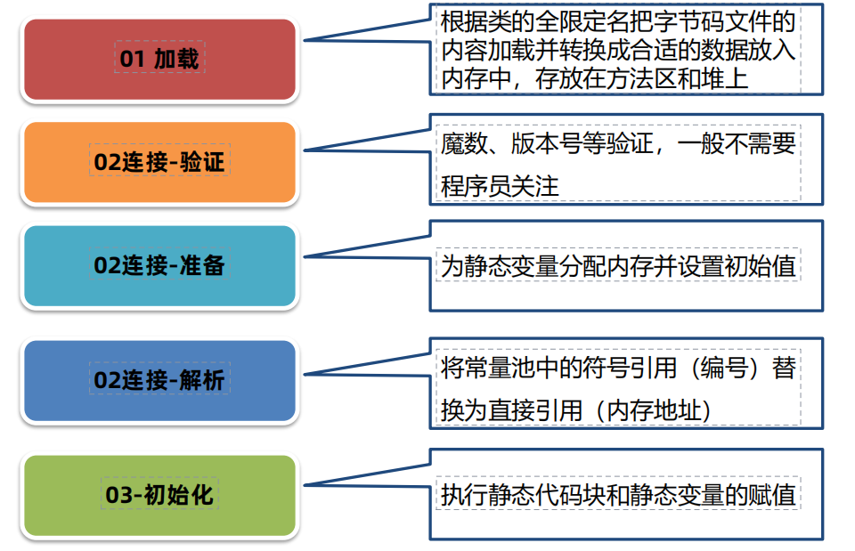

几个要点：

1. 静态变量的定义使用final关键字，并被赋予常量值，这类变量会在准备阶段直接进行初始化（除非要执行方法）。

2. 直接访问父类的静态变量，不会触发子类的初始化。子类的初始化cinit调用之前，会先调用父类的cinit初始化方法。

添加 -XX:+TraceClassLoading 参数可以打印出加载的类

# 4. 类加载器

- 类加载器（ClassLoader）是Java虚拟机提供给应用程序去实现获取类和接口字节码数据的技术。

- 类加载器只参与加载过程中的字节码获取并加载到内存这一部分。
  
  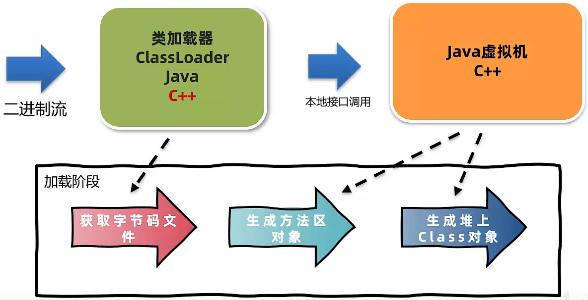

- 应用场景：
  
  - 企业级应用：
    
    - SPI机制
    
    - 类的热部署
    
    - Tomcat类的隔离
  
  - 大量的面试题：
    
    - 什么是类的双亲委派机制
    
    - 打破类的双亲委派机制
    
    - 自定义类加载器
  
  - 解决线上问题：
    
    - 使用Arthas不停机的情况下，解决线上故障，修复bug

## 4.1 类加载器的分类

类加载器分为两类，一类是Java代码中实现的，一类是Java虚拟机底层源码实现的。

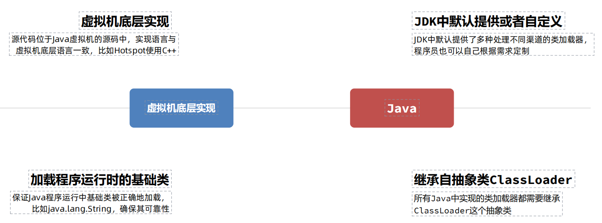

类加载器的设计JDK8和8之后的版本差别较大，JDK8及之前的版本中默认的类加载器有如下几种：

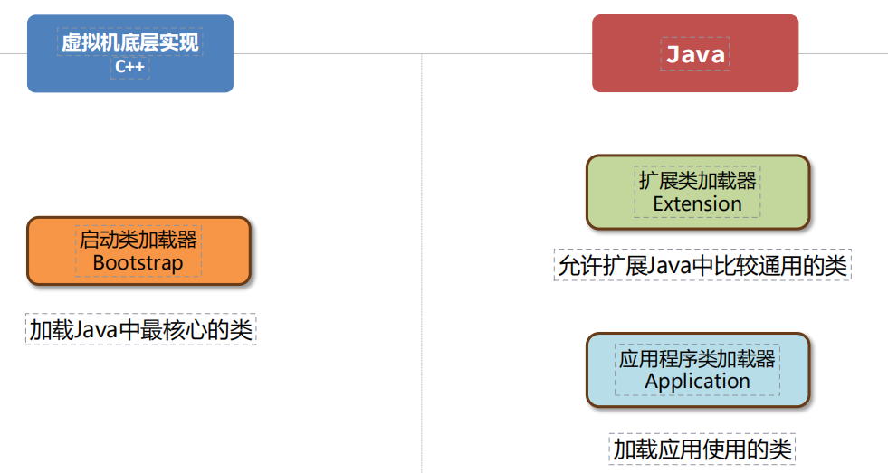

### Arthas中类加载器相关的功能1

- 类加载器的详细信息可以通过 `classloader` 命令查看：

- classloader -查看classloader 的继承树，urls，类加载信息，使用classloader 去 getResource
  
  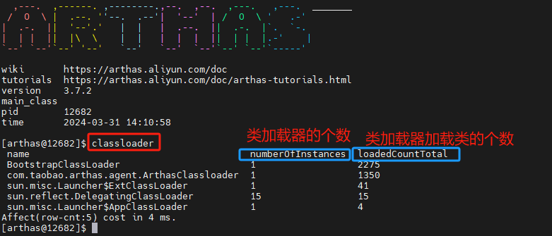

### 4.1.1 启动类加载器

- 启动类加载器（BootstrapClassLoader）是由Hotspot虚拟机提供的、使用C++编写的类加载器。

- 默认加载 Java安装目录 /jre/lib 下的类文件，比如 rt.jar，tools.jar，resources.jar等。
  
  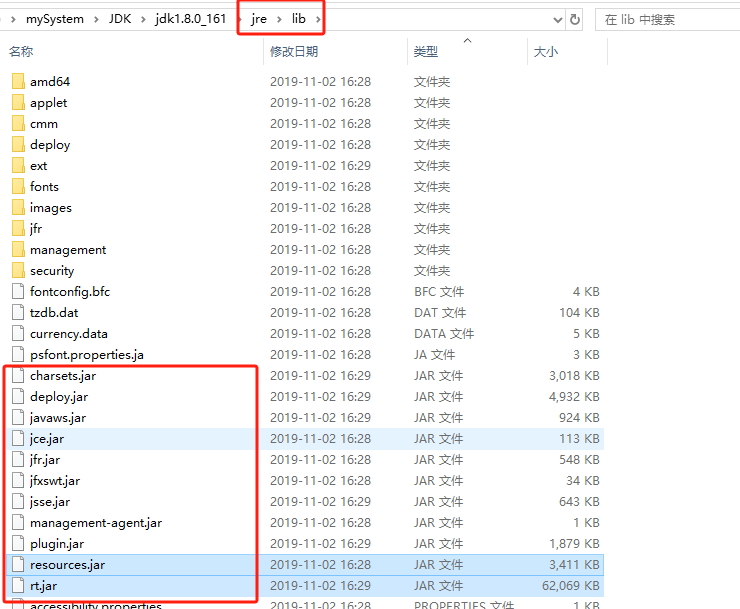

- 通过启动类加载器去加载用户jar包：
  
  1. 放入jre/lib下进行扩展：
  - 不推荐，尽可能不要去更改JDK安装目录中的内容，会出现即使放进去了，但是由于文件名不匹配的问题，导致不会正常地被加载
  2. <font color=red>使用参数进行扩展</font>：
  - 推荐，使用 ` -Xbootclasspath/a:jar包目录/jar包名 ` 进行扩展，其中 `/a` 表示添加路径
    
    ```java
    package com.study.jvm.classloader;
    
    public class MyClassALoaderTest {
        public static void main(String[] args) throws ClassNotFoundException {
            // 通过 -Xbootclasspath/a 测试 启动类加载器加载 MyClassA 类
            Class<?> clazz = Class.forName("com.study.jvm.demo.MyClassA");
            System.out.println(clazz);       // class com.study.jvm.demo.MyClassA
            ClassLoader classLoader = clazz.getClassLoader();
            System.out.println(classLoader); // null
        }
    }
    ```
    
    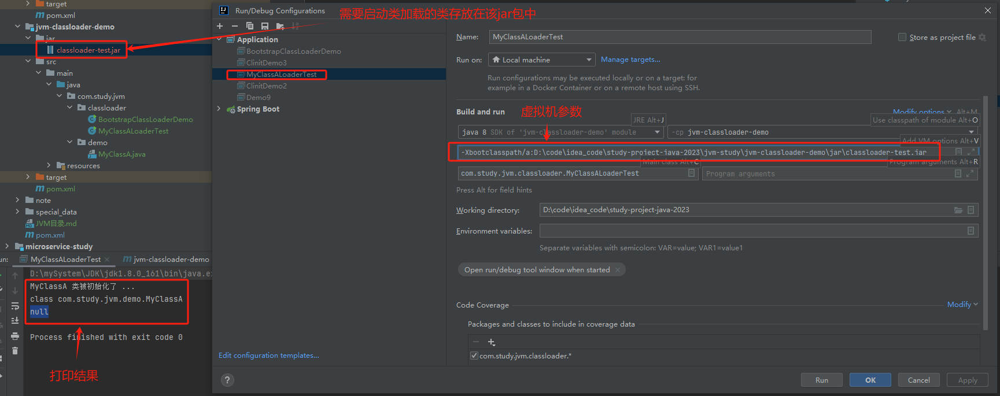
    
    ```xml
    <!-- 打jar包时，只打包 com.study.jvm.demo.MyClassA 类，并且打包的名字设置为classloader-test -->
    <build>
        <finalName>classloader-test</finalName>
        <plugins>
            <plugin>
                <groupId>org.apache.maven.plugins</groupId>
                <artifactId>maven-jar-plugin</artifactId>
                <version>3.2.0</version>
                <configuration>
                    <classesDirectory>${project.build.directory}/classes</classesDirectory>
                    <includes>
                        <include>com/study/jvm/demo/MyClassA.class</include>
                    </includes>
                </configuration>
            </plugin>
        </plugins>
    </build>
    ```

- 查看启动类加载器
  
  ```java
  import java.io.IOException;
  
  public class BootstrapClassLoaderDemo {
      public static void main(String[] args) throws IOException {
          // java.lang.String 的类加载器应该是启动类加载器，但是下面打印结果却是null
          ClassLoader classLoader = String.class.getClassLoader();
          // 因为此程序是偏向于上层的应用，而启动类加载器是JVM底层的应用，上层无法获取下层的信息。可以通过Arthas来确认
          System.out.println(classLoader);
  
          System.in.read();
      }
  }
  ```
  
  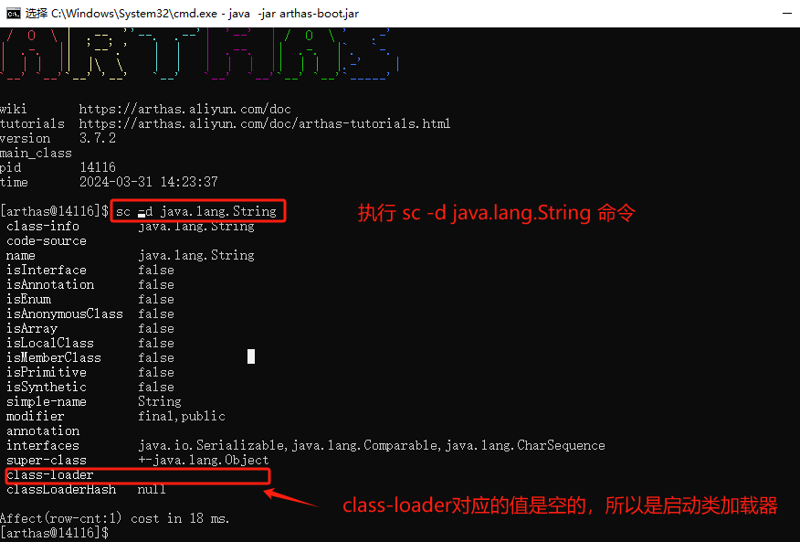

### 4.1.2 Java中的默认类加载器

- 扩展类加载器 和 应用程序类加载器 都是JDK中提供的、使用Java编写的类加载器。

- <font color=red>它们的源码都位于sun.misc.Launcher中，是一个静态内部类。继承自URLClassLoader。具备通过目录或者指定jar包将字节码文件加载到内存中。</font>

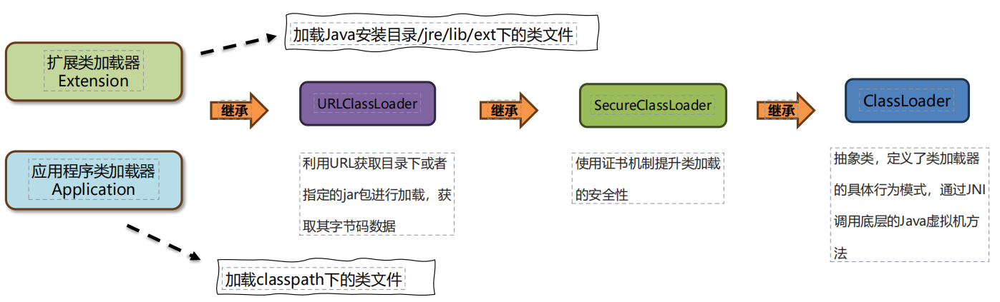

#### 4.1.2.1 扩展类加载器

- 扩展类加载器（Extension Class Loader）是JDK中提供的、使用Java编写的类加载器。

- 默认加载 Java安装目录 /jre/lib/ext 下的类文件。
  
  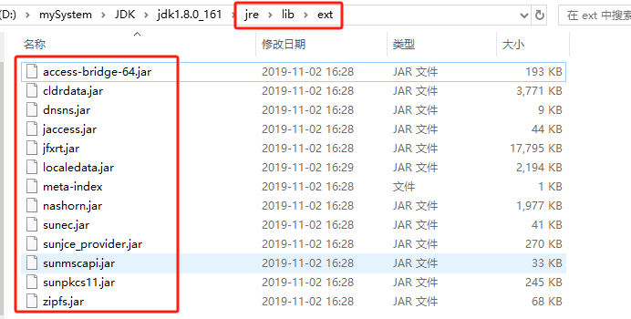

- 通过扩展类加载器去加载用户jar包：
  
  1. 放入/jre/lib/ext下进行扩展
  - 不推荐，尽可能不要去更改 JDK安装目录中的内容
  2. <font color=red>使用参数进行扩展</font>：
  - 推荐，使用 ` -Djava.ext.dirs=jar包目录 ` 进行扩展，这种方式会覆盖掉原始目录，可以用 ;(windows) :(macos/linux) 追加上原始目录
    
    ```java
    import jdk.nashorn.internal.runtime.ScriptEnvironment;
    
    public class MyClassALoaderTest2 {
        public static void main(String[] args) throws ClassNotFoundException {
            // 通过 -Djava.ext.dirs 测试 扩展类加载器加载 MyClassA 类
            Class<?> clazz = Class.forName("com.study.jvm.demo.MyClassA");
            System.out.println(clazz);       // class com.study.jvm.demo.MyClassA
            ClassLoader classLoader = clazz.getClassLoader();
            System.out.println(classLoader); // sun.misc.Launcher$ExtClassLoader@2503dbd3
    
            classLoader = ScriptEnvironment.class.getClassLoader();
            System.out.println(classLoader); // sun.misc.Launcher$ExtClassLoader@2503dbd3
        }
    }
    ```
    
    - 启动时，添加VM参数：`-Djava.ext.dirs=D:/jvm-classloader-demo/jar;D:/jdk1.8.0_161/jre/lib/ext`

#### 4.1.2.2 应用程序类加载器

```java
package com.study.jvm.classloader;

import com.study.jvm.demo.MyClassB;
import org.apache.commons.io.FileUtils;

/**
 * 应用程序类加载器测试
 */
public class AppClassLoaderDemo {
    public static void main(String[] args) {
        // 当前项目中创建当前项目中的MyClassB类对象
        MyClassB myClassB = new MyClassB();
        ClassLoader classLoader = myClassB.getClass().getClassLoader();
        System.out.println(classLoader); // sun.misc.Launcher$AppClassLoader@18b4aac2

        // 加载Maven依赖中包含的类
        classLoader = FileUtils.class.getClassLoader();
        System.out.println(classLoader); // sun.misc.Launcher$AppClassLoader@18b4aac2
    }
}
```

### Arthas中类加载器相关的功能2

- 类加载器的加载路径可以通过 ` classloader -c hash值 ` 查看

- 实践步骤：
  
  1. 执行 `classloader -l` 查看类加载器的hash码
  
  2. 执行 `classloaser -c hash码值` 
     
     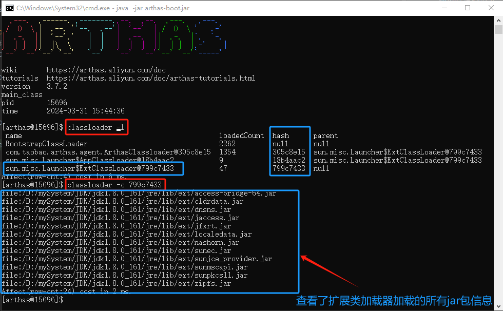
     
     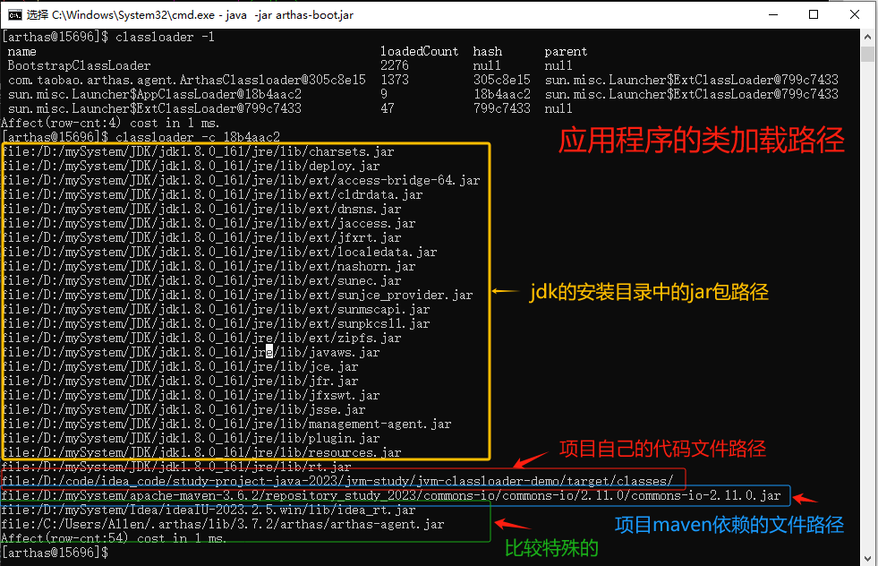

## 4.2 双亲委派机制

### 4.2.1 双亲委派原理

1. 在Java中如何使用代码的方式去主动加载一个类呢？
- 方式1：使用Class.forName方法，使用当前类的类加载器去加载指定的类。

- 方式2：获取到类加载器，通过类加载器的loadClass方法指定某个类加载器加载。

```java
// 获取main方法所在类的类加载器，应用程序类加载器
ClassLoader classLoader = LoadClassDemo2.class.getClassLoader();
System.out.println(classLoader);

// 使用应用程序类加载器加载
Class<?> clazz = classLoader.loadClass("java.lang.String");
// 无法获取到加载“java.lang.String”类的了加载器，因为它是通过启动类加载器加载的
System.out.println(clazz.getClassLoader()); // null
```

2. 每个Java实现的类加载器中，保存了一个成员变量叫“父”（Parent）类加载器，可以理解为它的上级，并不是继承关系。
- 应用程序类加载器的parent父类加载器是扩展类加载器，而扩展类加载器的parent是空。

- 启动类加载器使用C++编写，没有上级类加载器。
  
  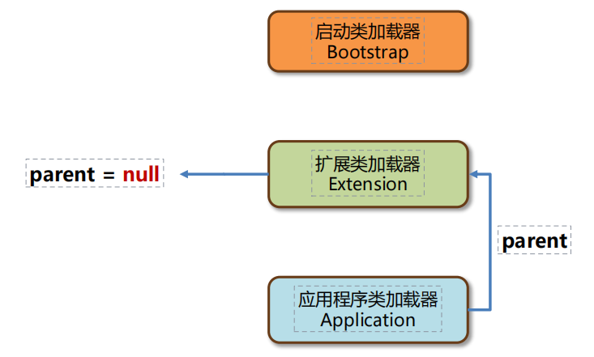
3. 类加载步骤：
   
   1）在类加载的过程中，每个类加载器都会先检查是否已经加载了该类，如果已经加载则直接返回，否则会将加载请求委派给父类加载器。
   
   2）<font color=red>如果类加载的parent为null，则会提交给启动类加载器处理。</font>
   
   3）如果所有的父类加载器都无法加载该类，则由当前类加载器自己尝试加载。所以看上去是自顶向下尝试加载。
   
   4）第二次再去加载相同的类，仍然会向上进行委派，如果某个类加载器加载过就会直接返回。

4. 双亲委派机制指的是：<font color=red>自底向上查找是否加载过，再由顶向下进行加载</font>。
   
   - 向下委派加载起到了一个加载优先级的作用。
   
   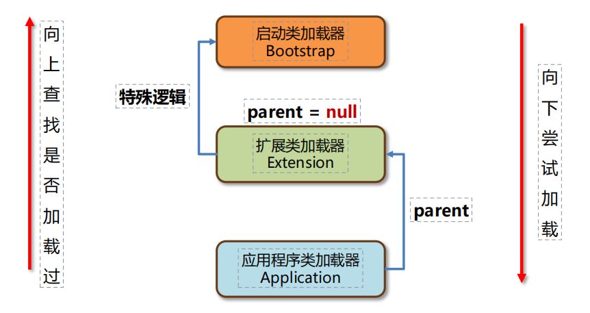

### Arthas中类加载器相关的功能3

- 类加载器的继承关系可以通过classloader–t 查看：
  
  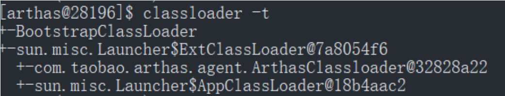

### 4.2.2 三个问题

1. 重复的类
- 如果一个类重复出现在三个类加载器的加载位置，应该由谁来加载？

- 启动类加载器加载，根据双亲委派机制，它的优先级是最高的
2. String类能覆盖吗
- 在自己的项目中去创建一个java.lang.String类，会被加载吗？

- 不能，会交由启动类加载器加载在rt.jar包中的String类
3. 类加载器的关系
- 这几个类加载器彼此之间存在关系吗？

- 应用类加载器的父类加载器是扩展类加载器，扩展类加载器没有父类加载器，但是会委派给启动类加载器加载

### 4.2.3 双亲委派机制的作用

1. 保证类加载的安全性
- 通过双亲委派机制，让顶层的类加载器去加载核心类，避免恶意代码替换JDK中的核心类库
- 比如java.lang.String，确保核心类库的完整性和安全性。
2. 避免重复加载
- 双亲委派机制可以避免同一个类被多次加载，上层的类加载器如果加载过类，就会直接返回该类，避免重复加载。

### 4.2.4 面试题

问题：双亲委派机制是什么？（从下面三个角度回答）

1. 当一个类加载器去加载某个类的时候，会自底向上查找是否加载过，如果加载过就直接返回，如果一直到最顶层的类加载器都没有加载过，那么再自顶向下进行加载。

2. 应用程序类加载器的父类加载器（父级加载器）是扩展类加载器，扩展类加载器的父类加载器（）是启动类加载器。

3. 双亲委派机制的好处：
   
   - 第一是避免恶意代码替换JDK的核心类库，比如java.lang.String，确保核心类库的完整性和安全性。
   
   - 第二是避免一个类被重复地加载。

## 4.3 打破双亲委派机制

- 自定义类加载器
  
  - 自定义类加载器并且重写loadClass方法，就可以将双亲委派机制的代码去除
  
  - Tomcat通过这种方式实现应用之间类隔离，《面试篇》中分享它的做法

- 线程上下文类加载器
  
  - 利用上下文类加载器加载类，比如JDBC和JNDI等

- Osgi框架的类加载器
  
  - 历史上Osgi框架实现了一套新的类加载器机制，允许同级之间委托进行类的加载

### 4.3.1 第一种方法：自定义类加载器

- 一个Tomcat程序中是可以运行多个Web应用的，如果这两个应用中出现了相同限定名的类，比如Servlet类，Tomcat要保证这两个类都能加载并且它们应该是不同的类。

- 如果不打破双亲委派机制，当应用类加载器加载Web应用1中的MyServlet之后，Web应用2中相同限定名的MyServlet类就无法被加载了。

- Tomcat使用了自定义类加载器来实现应用之间类的隔离。每一个应用会有一个独立的类加载器加载对应的类。

- 先来分析ClassLoader的原理，ClassLoader中包含了4个核心方法。

- 双亲委派机制的核心代码就位于loadClass方法中。
  
  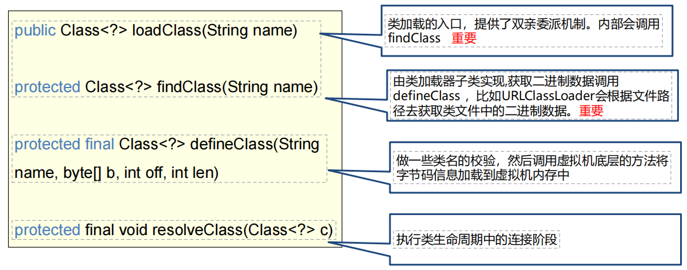

- 阅读双亲委派机制的核心代码，分析如何通过自定义的类加载器打破双亲委派机制。

- 打破双亲委派机制的核心就是将下边这一段代码重新实现。
  
  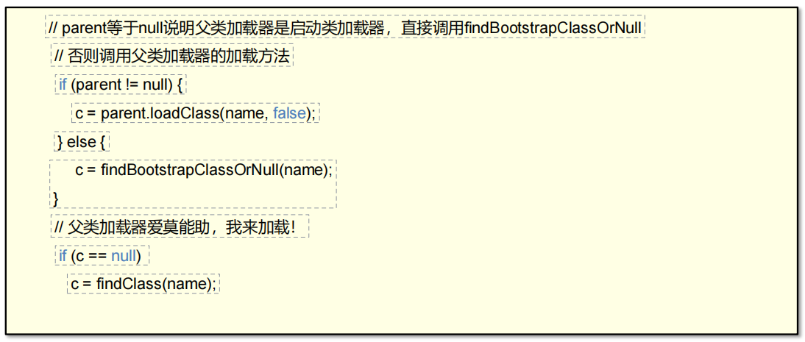
1. 自定义类加载器默认的父类加载器 
- 自定义类加载器父类怎么是AppClassLoader呢？
  
  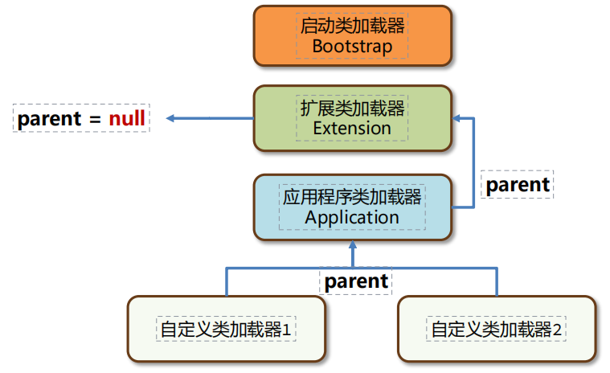

- 以Jdk8为例，ClassLoader类中提供了构造方法设置parent的内容：
  
  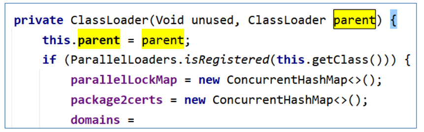

- 这个构造方法由另外一个构造方法调用，其中父类加载器由getSystemClassLoader方法设置，该方法返回的是AppClassLoader。
  
  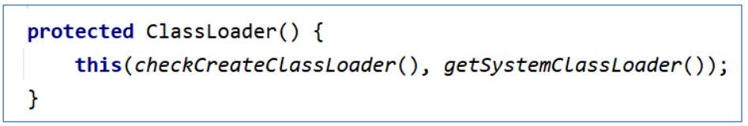
2. 两个自定义类加载器加载相同限定名的类，不会冲突吗？
- <font color=red>不会冲突</font>，在同一个Java虚拟机中，只有<font color=red>相同类加载器+相同的类限定名</font>才会被认为是同一个类。

- 在Arthas中使用sc–d 类名的方式查看具体的情况。
3. 正确的去实现一个自定义类加载器的方式是重写<font color=red>findClass</font>方法，这样不会破坏双亲委派机制。
   
   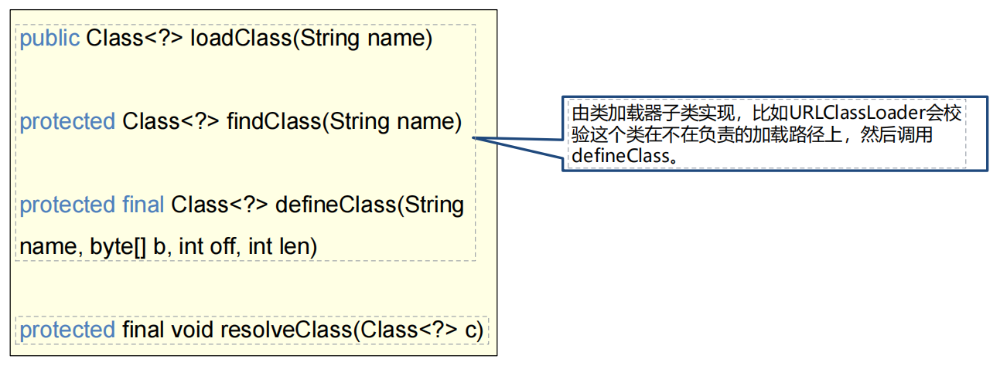

上述知识点，通过以下代码解析：

```java
package com.study.jvm.broken;

import org.apache.commons.io.IOUtils;

import java.io.File;
import java.io.FileInputStream;
import java.io.IOException;
import java.util.regex.Matcher;

/**
 * 打破双亲委派机制 - 自定义类加载器
 */
public class CustomizedClassLoader extends ClassLoader {

    private String basePath;
    private final static String FILE_EXT = ".class";

    public void setBasePath(String basePath) {
        this.basePath = basePath;
    }

    private byte[] loadClassData(String name) {
        try {
            String tempName = name.replaceAll("//.", Matcher.quoteReplacement(File.separator));
            FileInputStream fis = new FileInputStream(basePath + tempName + FILE_EXT);
            try {
                return IOUtils.toByteArray(fis);
            } finally {
                IOUtils.closeQuietly(fis);
            }

        } catch (Exception e) {
            System.out.println("自定义类加载器加载失败，错误原因：" + e.getMessage());
            return null;
        }
    }

    @Override
    public Class<?> loadClass(String name) throws ClassNotFoundException {
        // 如果这个类是jdk环境的（jdk核心类库的），就使用默认的类加载器，即启动类加载器
        if (name.startsWith("java.")) {
            return super.loadClass(name);
        }
        // 通过类的名字，找到该类，然后写入到data数组中
        byte[] data = loadClassData(name);
        // 直接使用defineClass方法加载自己写的类，将其加载到内存中去（没有经过双亲委派）
        return defineClass(name, data, 0, data.length);
    }

    public static void main(String[] args) throws ClassNotFoundException, InstantiationException, IllegalAccessException, IOException {
        // 创建自定义的类加载器对象
        CustomizedClassLoader classLoader1 = new CustomizedClassLoader();
        classLoader1.setBasePath("D://code//idea_code//study-project-java-2023//jvm-study//jvm-classloader-demo//lib//");
        Class<?> clazz1 = classLoader1.loadClass("com.study.jvm.demo.MyClassA");
        System.out.println("MyClassA 的类加载器是：" + clazz1.getClassLoader());

        CustomizedClassLoader classLoader2 = new CustomizedClassLoader();
        classLoader2.setBasePath("D://code//idea_code//study-project-java-2023//jvm-study//jvm-classloader-demo//lib//");
        Class<?> clazz2 = classLoader2.loadClass("com.study.jvm.demo.MyClassA");
        System.out.println("MyClassA 的类加载器是：" + clazz2.getClassLoader());

        // 判断加载同一个类（com.study.jvm.demo.MyClassA）的两个类加载器是否是同一个对象
        System.out.println(clazz1 == clazz2); // false

        // 当前线程的类加载器是：sun.misc.Launcher$AppClassLoader@18b4aac2
        System.out.println("当前线程的类加载器是：" + Thread.currentThread().getContextClassLoader());
        Thread.currentThread().setContextClassLoader(classLoader1);
        // 当前线程的类加载器是：com.study.jvm.broken.CustomizedClassLoader@9807454
        System.out.println("当前线程的类加载器是：" + Thread.currentThread().getContextClassLoader());

        // 自定义的类加载器默认的父类加载器是：sun.misc.Launcher$AppClassLoader@18b4aac2
        System.out.println("自定义的类加载器默认的父类加载器是：" + classLoader1.getParent());

        System.in.read();
    }
}
```

### 4.3.2 第二种方法：JDBC案例 (也可以认为没有打破)

- JDBC中使用了DriverManager来管理项目中引入的不同数据库的驱动，比如mysql驱动、oracle驱动。
  
  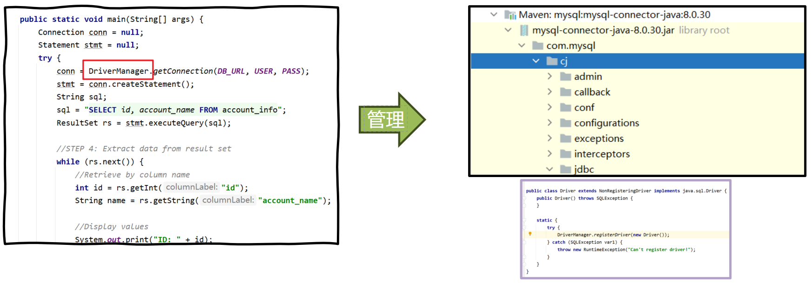

- DriverManager类位于rt.jar包中，由启动类加载器加载。
  
  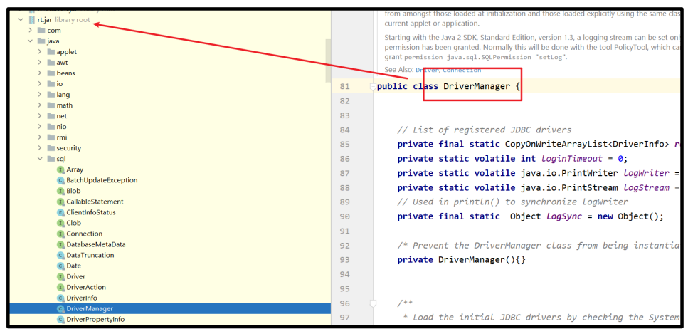

- 依赖中的mysql驱动对应的类，由应用程序类加载器来加载。
  
  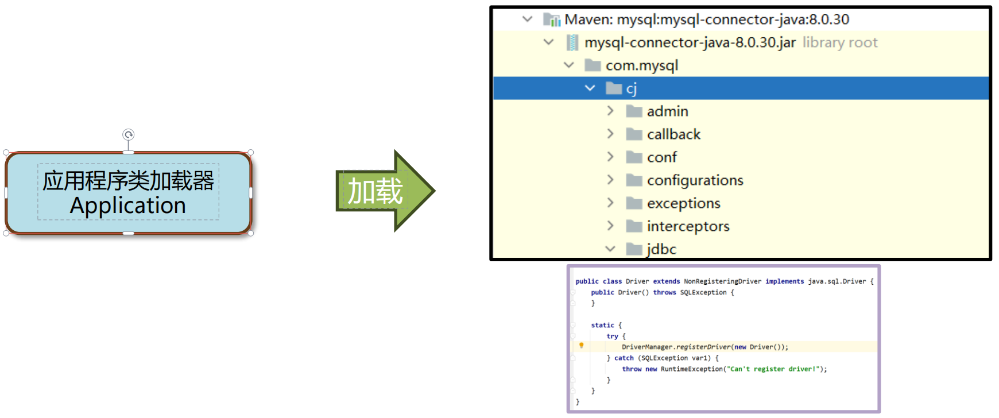

- DriverManager属于rt.jar是启动类加载器加载的。而用户jar包中的驱动需要由应用类加载器加载，这就违反了双亲委派机制。
  
  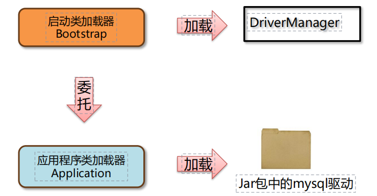

#### 4.3.2.1 JDBC案例之SPI机制

- SPI 全称为 Service Provider Interface，是JDK内置的一种服务提供发现机制

- SPI的工作原理：
  
  1. 在 ClassPath路径下的 META-INF/services 文件夹中，以接口的全限定名来命名文件名，对应的文件里面写该接口的实现。
     
     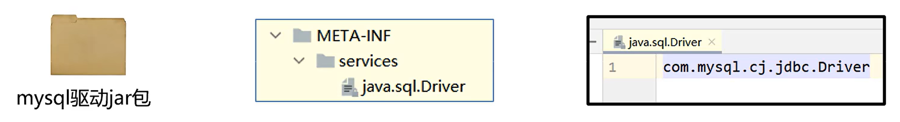
  
  2. 使用ServiceLoader加载实现类。
     
     

#### 4.3.2.2 DriverManager怎么知道jar包中要加载的驱动在哪儿

1. 通过 `conn = DriverManager.getConnection(DB_URL, USER, PASS);` 获取连接对象时，getConnection是DriverManager类的静态方法，调用该方法一定会导致DriverManager类的初始化(clinit)方法被执行。
   
   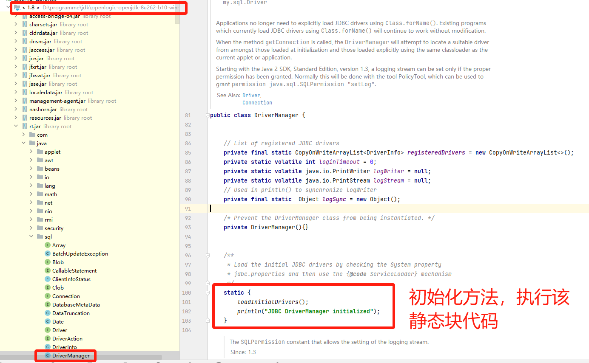

2. SPI机制加载实现类，即加载驱动实现类
   
   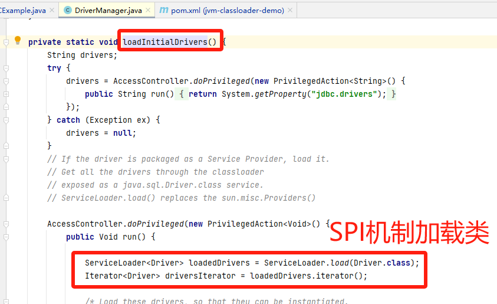

3. MySql的驱动jar包中，配置了相应的SPI信息，如下图所示：
   
   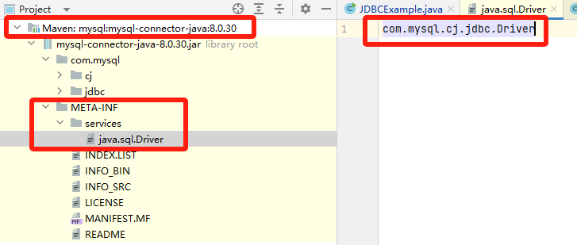

4. `loadInitialDrviers()`方法中，会通过 `ServiceLoader.load(Driver.class)`获取项目中所有 `java.sql.Driver` 接口的实现类迭代器，然后依次遍历
   
   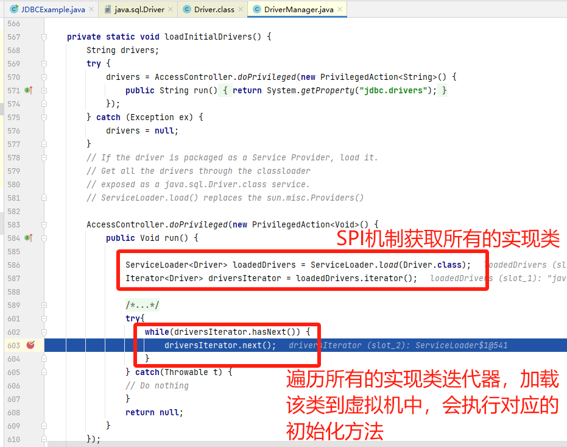
   
   - `ServiceLoader.load` 方法内部会通过获取当前线程的上下文类加载器，即应用程序类加载器，在后续使用该类加载器加载实现类。
     
     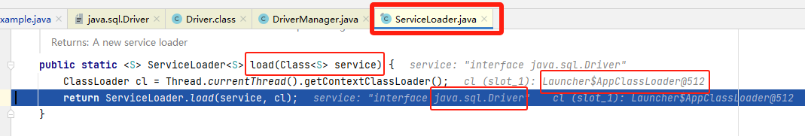
   
   - 在 `driversIterator.next()` 方法中，会调用 `Class.forName`方法，导致实现类的初始化(clinit)方法被调用
     
     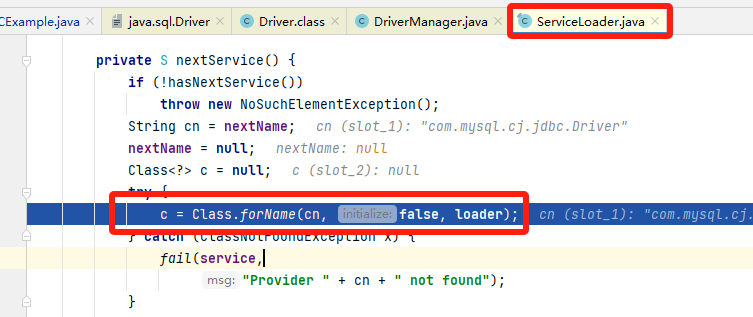

5. MySql驱动包的实现类被加载，并执行对应的初始化方法
   
   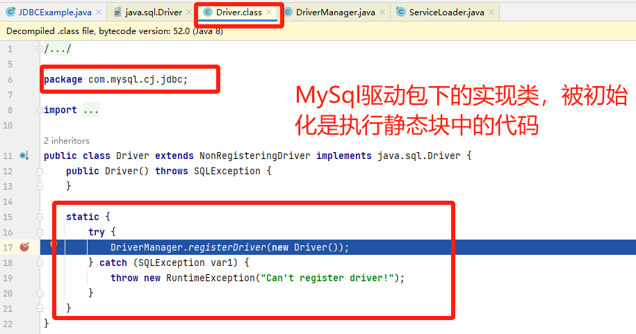

#### 4.3.2.3 总结

1. 启动类加载器加载DriverManager。

2. 在初始化DriverManager时，通过SPI机制加载jar包中的myql驱动。

3. SPI中利用了线程上下文类加载器（应用程序类加载器）去加载类并创建对象 (Driver的具体实现类对象)。
- <font color=red>这种由启动类加载器加载的类，委派应用程序类加载器去加载类的方式，打破了双亲委派机制。</font>
  
  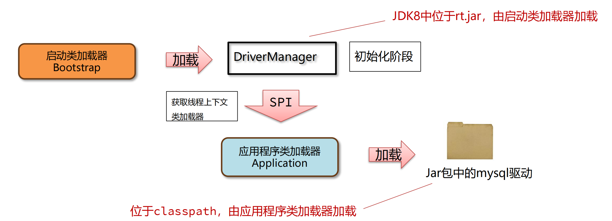

### 4.3.3 第三种方法：Osgi框架(已经不用了)

- 历史上，OSGi模块化框架。它存在同级之间的类加载器的委托加载。OSGi还使用类加载器实现了热部署的功能。

- 热部署指的是在服务不停止的情况下，动态地更新字节码文件到内存中。

### 使用阿里arthas不停机解决线上问题

#### 背景

- 小李的团队将代码上线之后，发现存在一个小bug，但是用户急着使用，如果重新打包再发布需要一个多小时的时间，所以希望能使用arthas尽快的将这个问题修复。

#### 思路

1. 在出问题的服务器上部署一个 arthas，并启动。

2. <font color=red>jad --source-only 类全限定名 > 目录/文件名.java</font>
- jad 命令反编译，然后可以用其它编译器，比如 vim 来修改源码
3. <font color=red>mc –c 类加载器的hashcode 目录/文件名.java -d 输出目录</font>
- mc 命令用来编译修改过的代码，必须通过类加载器来编译，否则会报找不到许多类的错误
4. <font color=red>retransform class文件所在目录/xxx.class</font>
- 用 retransform 命令加载新的字节码

#### 注意事项

1. 程序重启之后，字节码文件会恢复，除非将class文件放入jar包中进行更新。

2. 使用retransform不能添加方法或者字段，也不能更新正在执行中的方法。

## 4.4 JDK9之后的类加载器(了解)

### 4.4.1 JDK8及之前的类加载器

- JDK8及之前的版本中，扩展类加载器和应用程序类加载器的源码位于rt.jar包中的sun.misc.Launcher.java。

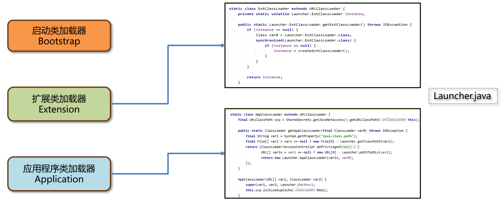

### 4.4.2 JDK8之后的类加载器

- 由于JDK9引入了module的概念，类加载器在设计上发生了很多变化。
  
  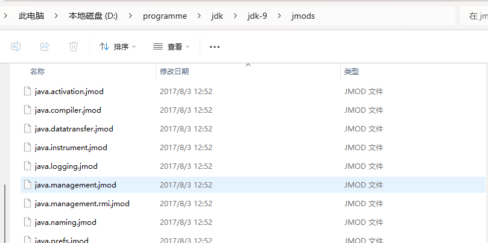
1. 启动类加载器使用Java编写，位于 jdk.internal.loader.ClassLoaders 类中。
   
   - Java中的BootClassLoader 继承自 BuiltinClassLoader，实现从模块中找到要加载的字节码资源文件。
   
   - <font color=red>启动类加载器依然无法通过java代码获取到，返回的仍然是null，保持了统一。</font>避免用户操作启动类加载器
     
     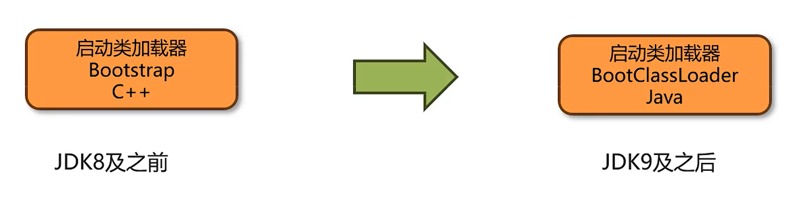

2. 扩展类加载器被替换成了平台类加载器（Platform Class Loader）。
   
   - 平台类加载器遵循模块化方式加载字节码文件，所以继承关系从URLClassLoader变成了BuiltinClassLoader。
   
   - BuiltinClassLoader实现了从模块中加载字节码文件。
   
   - <font color=red>平台类加载器的存在更多的是为了与老版本的设计方案兼容，自身没有特殊的逻辑。</font>
     
     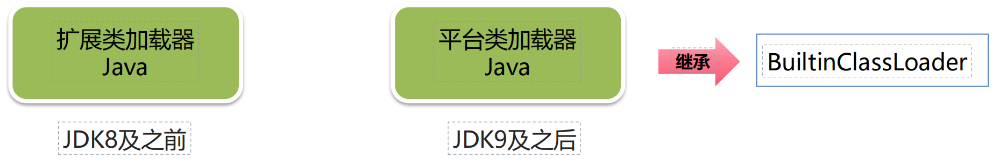

## 4.5 总结

1. 类加载器的作用是什么？
- 类加载器（ClassLoader）负责在类加载过程中的字节码获取并加载到内存这一部分。

- 通过加载字节码数据放入内存转换成byte[]，接下来调用虚拟机底层方法将byte[]转换成方法区和堆中的数据。
2. 有几种类加载器？
   
   1. 启动类加载器（BootstrapClassLoader）加载核心类
   
   2. 扩展类加载器（Extension ClassLoader）加载扩展类
   
   3. 应用程序类加载器（Application ClassLoader）加载应用classpath中的类
   
   4. 自定义类加载器，重写findClass方法。
- JDK9及之后扩展类加载器（Extension ClassLoader）变成了平台类加载器（PlatformClassLoader）
3. 什么是双亲委派机制？
- 每个Java实现的类加载器中保存了一个成员变量叫“父”（Parent）类加载器。

- 自底向上查找是否加载过，再由顶向下进行加载。

- 避免了核心类被应用程序重写并覆盖的问题，提升了安全性。
4. 怎么打破双亲委派机制？
   
   1. 重写loadClass方法，不再实现双亲委派机制。
   
   2. JNDI、JDBC、JCE、JAXB和JBI等框架使用了SPI机制+线程上下文类加载器。
   
   3. OSGi实现了一整套类加载机制，允许同级类加载器之间互相调用。
