# JVM运行时数据区

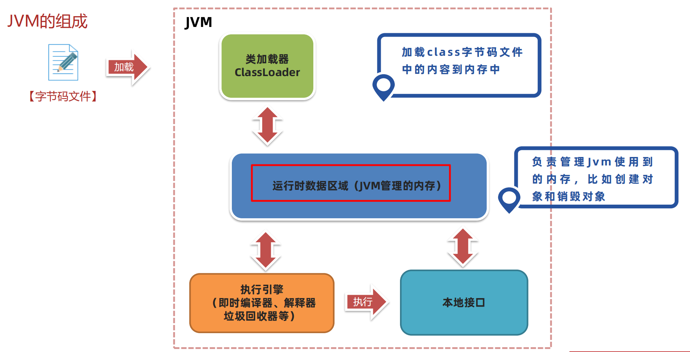

## 0. 概述

- Java虚拟机在运行Java程序过程中管理的内存区域，称之为<font color=red>运行时数据区</font>。

- 《Java虚拟机规范》中规定了每一部分的作用。

- 运行时数据区划分为 线程共享的 和 线程不共享的的区域：
  
  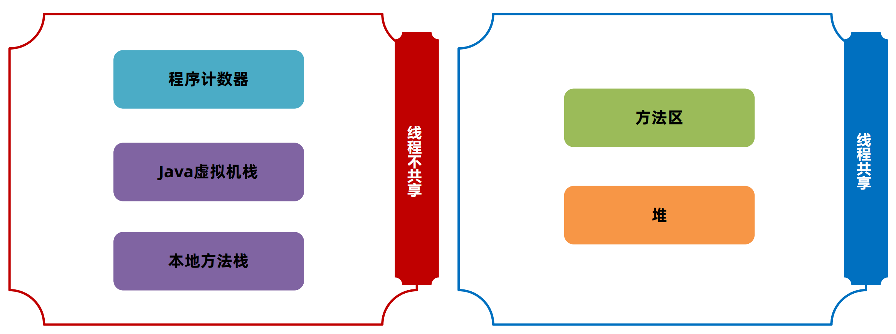
1. 面试题
   
   1. Java的内存分成哪几部分？详细介绍一下吧
   
   2. Java内存中哪些部分会内存溢出？
   
   3. JDK7和8中在内存结构上的区别是什么？

2. 工作中的实际问题 – 内存溢出
   
   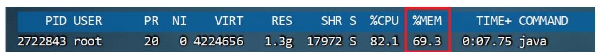
   
   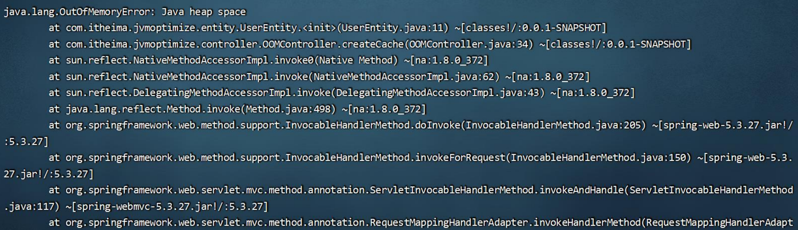

3. 内存调优学习路线
   
   1. 了解运行时内存结构
   - 了解JVM运行过程中每一部分的内存结构，以及哪些部分容易出现内存溢出
   2. 掌握内存问题的产生原因
   - 学习代码中常见的几种内存泄漏、性能问题的常见原因
   3. 掌握内存调优的基本方法
   - 学习内存泄漏、性能问题 等常见JVM问题的常规解决方案

## 1. 程序计数器

- 程序计数器（Program Counter Register）也叫PC寄存器，每个线程会通过程序计数器记录当前要执行的的字节码指令的地址。

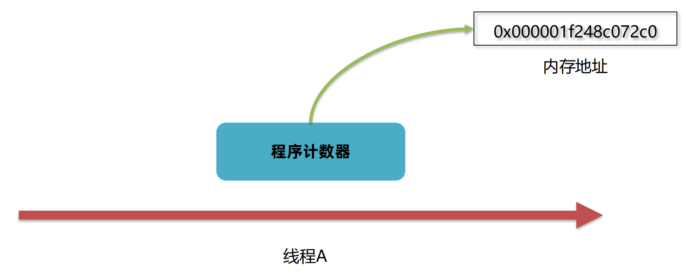

- 一个程序计数器的具体案例：
  
  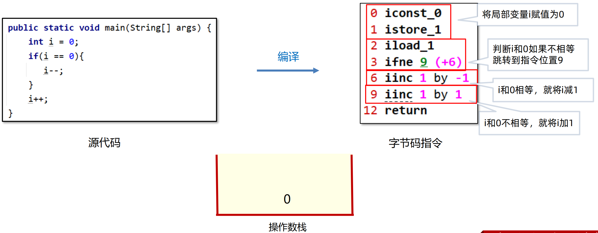

- 在加载阶段，虚拟机将字节码文件中的指令读取到内存之后，会将原文件中的偏移量转换成内存地址。每一条字节码指令都会拥有一个内存地址
  
  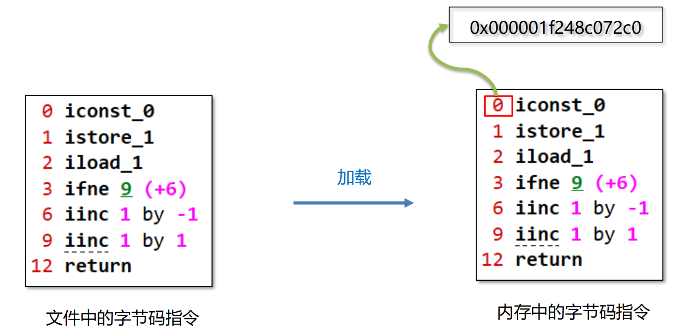

- 在代码执行过程中，程序计数器会记录下一行字节码指令的地址。执行完当前指令之后，虚拟机的执行引擎根据程序计数器执行下一行指令。

- 程序计数器可以控制程序指令的进行，实现分支、跳转、异常等逻辑。

- 在多线程执行情况下，Java虚拟机需要通过程序计数器记录CPU切换前解释执行到那一句指令并继续解释运行。
  
  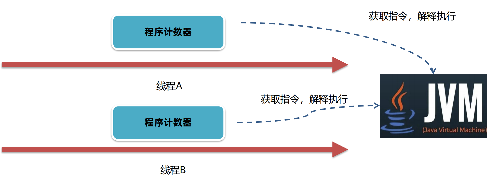

- 程序计数器在运行中会出现内存溢出吗？
  
  - <mark>内存溢出</mark>指的是程序在使用某一块内存区域时，存放的数据需要占用的内存大小超过了虚拟机能提供的内存上限。溢出的。
  
  - 因为每个线程只存储一个固定长度的内存地址，程序计数器是不会发生内存
  
  - 程序员无需对程序计数器做任何处理。

# 2. 栈

Java虚拟机栈 和 本地方法栈，一个存放java编写的方法数据，一个存放native修饰的方法数据，HotSpot虚拟机中认为都是方法，统一存在栈中

## 2.1 Java虚拟机栈

Java虚拟机栈（Java Virtual Machine Stack）采用栈的数据结构来管理方法调用中的基本数据，先进后出（First In Last Out），每一个方法的调用都使用一个栈帧(Stack Frame) 来保存。

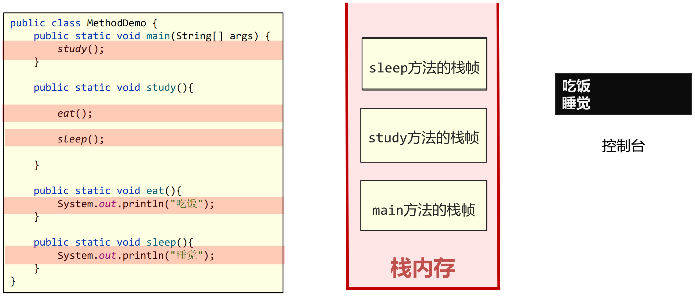

案例：通过Idea的debug工具查看栈帧的内容

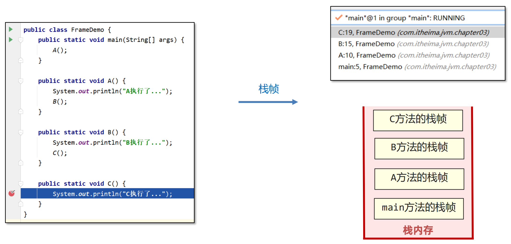

- Java虚拟机栈随着线程的创建而创建，而回收则会在线程的销毁时进行。由于方法可能会在不同线程中执行，每个线程都会包含一个自己的虚拟机栈
  
  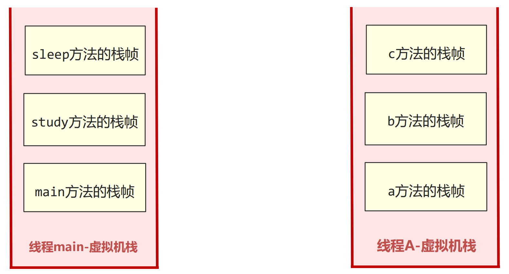

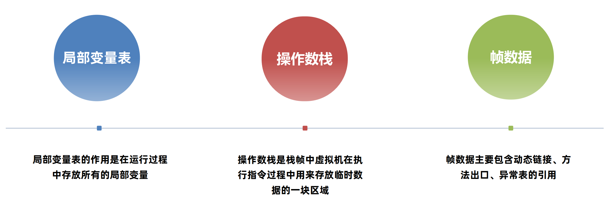

### 2.1.1 局部变量表

- 局部变量表的作用是在方法执行过程中，存放所有的局部变量。编译成字节码文件时，就可以确定局部变量表的内容。
  
  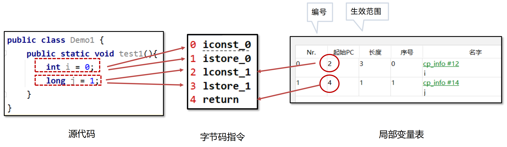
  
  - 局部变量表的第一个变量，通过偏移量为 0 和 1 的两条指令完成初始化，起始PC 和 长度 确定该变量的生效范围，有安全校验作用；
  
  - 起始PC值为2：表示该变量的使用范围必须从偏移量为2的那行指令开始；
  
  - 长度值为3：表示有3条指令可以使用该变量，即偏移量为2、3、4 的三条指令

- <font color=blue>**栈帧中的局部变量表是一个数组**</font>，数组中每一个位置称之为槽(slot) ，long和double类型占用两个槽，其他类型占用一个槽。
  
  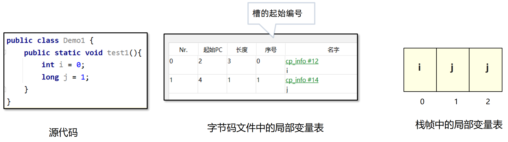
  
  - i 变量是int类型的，存储只占用一个槽，其对应的的起始下标是0，所以局部量表中该变量的序号为0
  
  - j 变量是long类型的，存储需要占用两个槽，其对应的起始下标是1，所以局部量表中该变量的序号为1，但是它占用了下标1和2的两个位置。

- 实例方法中的序号为0的位置存放的是this，指的是当前调用方法的对象，运行时会在内存中存放实例对象的地址。
  
  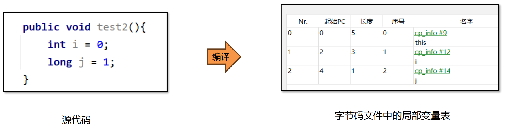

- 方法参数也会保存在局部变量表中，其顺序与方法中参数定义的顺序一致。

- 局部变量表保存的内容有：实例方法的this对象，方法的参数，方法体中声明的局部变量
  
  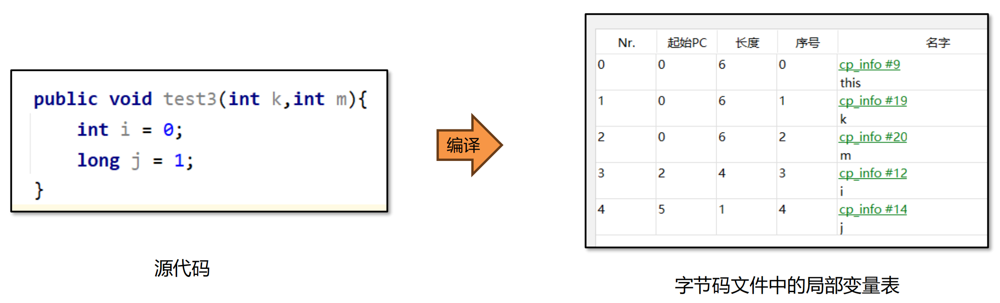

### 练习题：以下代码的局部变量表中会占用几个槽？

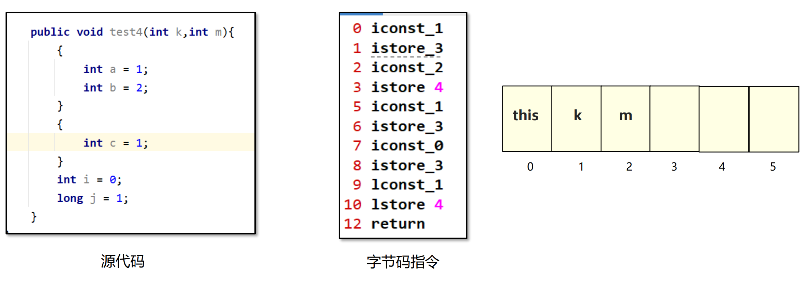

- 上述代码，局部变量最大槽数是 6

- 为了节省空间，**局部变量表中的槽是可以复用的**，一旦某个局部变量不再生效，当前槽就可以再次被使用。

- 字节码指令执行逻辑：
  
  1. 将 this、k、m 放入槽的0、1、2三个位置，占用三个槽的位置
  
  2. 执行字节码偏移量为0至3的命令：将 a 和 b 放入槽的3和4位置上，占用两个位置
  
  3. 执行字节码偏移量为5和6的命令：将 c 放入槽的4位置上，占用一个值（已经开始复用了，a 等于被删除了）
  
  4. 执行字节码偏移量为7至10的命令：将 i 和 j 放入槽的3和4位置上，占用三个位置（因为j是long类型的，占用两个槽）
  
  5. 命令执行完成后，统计发现只是用了6个空间的槽

### 2.1.2 操作数栈

- 操作数栈是栈帧中虚拟机在执行指令过程中用来存放中间数据的一块区域。他是一种栈式的数据结构，如果一条指令将一个值压入操作数栈，则后面的指令可以弹出并使用该值。

- 在 <font color=red>编译期</font> 就可以确定操作数栈的最大深度，从而在执行时正确的分配内存大小。
  
  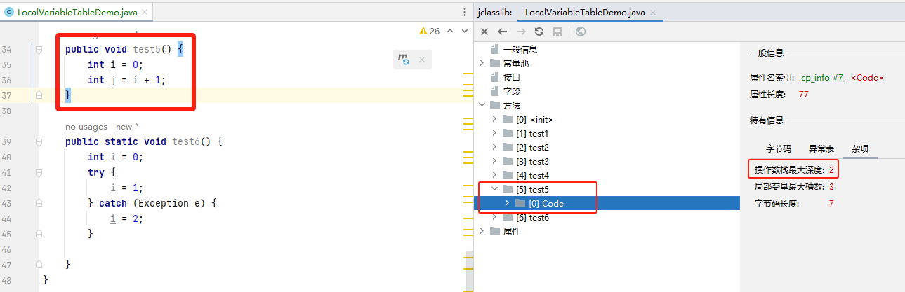

- 操作数栈的深度是2，通过字节码指令执行流程需要的临时空间确定

### 2.1.3 帧数据

- 当前类的字节码指令引用了其他类的属性或者方法时，需要将符号引用（编号）转换成对应的<font color=red>运行时常量池中的内存地址</font>。动态链接就保存了编号到运行时常量池的内存地址的映射关系。
  
  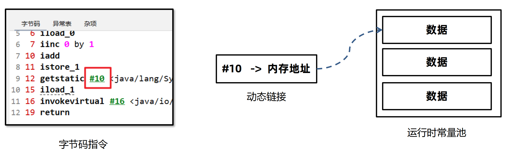
  
  - 指令 `getstatic #10` 表示获取某个类的静态变量，#10 就是那个类
  
  - 理论上在 连接的解析 阶段，会将 #10 替换为该变量的内存地址，但是因为该变量不是在此类中，无法直接确定地址，所以不会替换
  
  - 会通过 #10 动态链接到 运行时常量池中的 该变量

- 方法出口指的是方法在正确或者异常结束时，当前栈帧会被弹出，同时程序计数器应该指向上一个栈帧中的下一条指令的地址。所以在当前栈帧中，需要存储此方法出口的地址。

- 异常表存放的是代码中异常的处理信息，包含了异常捕获的生效范围，以及异常发生后跳转到的字节码指令位置。
  
  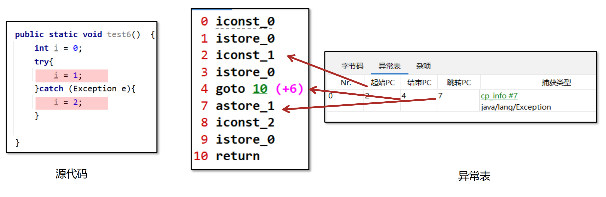
  
  - 偏移量7对应的指令 `astore_1` 表示将异常信息存储到局部变量表的1的位置

### 2.1.4 栈内存溢出

- Java虚拟机栈如果栈帧过多，占用内存超过栈内存可以分配的最大大小就会出现内存溢出。

- Java虚拟机栈内存溢出时会出现StackOverflowError的错误

- Java虚拟机栈 – 默认大小
  
  - 如果我们不指定栈的大小，JVM 将创建一个具有默认大小的栈。大小取决于操作系统和计算机的体系结构。
    
    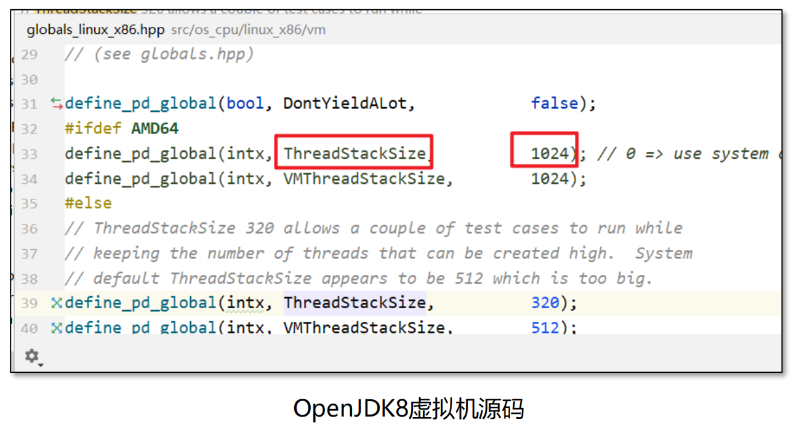

- 栈内存溢出模拟
  
  - 需求：使用递归让方法调用自身，但是不设置退出条件。定义调用次数的变量，每一次调用让变量加1。查看错误发生时总调用的次数。
  
  - 代码：
    
    ```java
    public static int count = 0;
    
    // 递归调用自己，测试虚拟机栈的大小
    public static void recursion() {
        System.out.println(++count);
        recursion();
    }
    ```

- 要修改Java虚拟机栈的大小，可以使用虚拟机参数 -Xss 。
  
  - 语法：-Xss栈大小
  
  - 单位：字节（默认，必须是 1024 的倍数）、k或者K(KB)、m或者M(MB)、g或者G(GB)

### 2.1.5 注意事项

1. 与-Xss类似，也可以使用 -XX:ThreadStackSize 调整标志来配置堆栈大小。
   
   - 格式为： -XX:ThreadStackSize=1024

2. HotSpot JVM对栈大小的最大值和最小值有要求，比如测试如下两个参数:
   
   - -Xss1k
   
   - -Xss1025m
- Windows（64位）下的 JDK8 测试最小值为180k，最大值为1024m。
3. 局部变量过多、操作数栈深度过大也会影响栈内存的大小。

<font color=red>一般情况下，工作中即便使用了递归进行操作，栈的深度最多也只能到几百,不会出现栈的溢出。所以此参数可以手动指定为-Xss256k节省内存</font>。

## 2.2 本地方法栈

- Java虚拟机栈存储了Java方法调用时的栈帧，而本地方法栈存储的是native本地方法的栈帧。

- 在Hotspot虚拟机中，<font color=red>Java虚拟机栈和本地方法栈实现上使用了同一个栈空间</font>。本地方法栈会在栈内存上生成一个栈帧，临时保存方法的参数同时方便出现异常时也把本地方法的栈信息打印出来。
  
  
  
  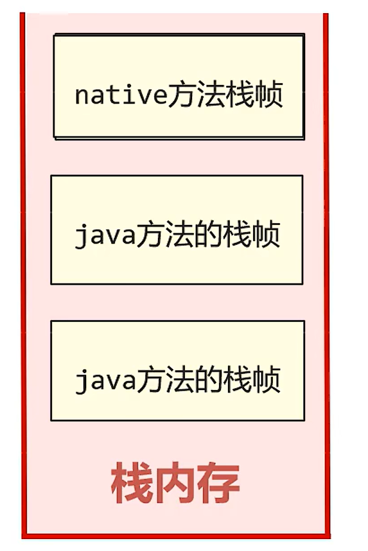

# 3. Java堆

- 一般Java程序中堆内存是空间最大的一块内存区域，创建出来的对象都存在于堆上。

- 栈的局部变量表中，可以存放堆上对象的引用。静态变量也可以存放堆对象的引用，通过静态变量就可以实现对象在线程之间共享。
  
  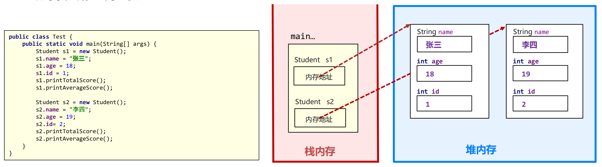

## 3.1 模拟堆区的溢出

需求：

- 通过new关键字不停创建对象，放入集合中，模拟堆内存的溢出，观察堆溢出之后的异常信息。

现象：

- 堆内存大小是有上限的，当对象一直向堆中放入对象达到上限之后，就会抛出 OutOfMemory 错误。
  
  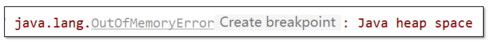

堆空间有三个需要关注的值，used total max。

used指的是当前已使用的堆内存，total是java虚拟机已经分配的可用堆内存，max是java虚拟机可以分配的最大堆内存。

## 3.2 arthas中堆内存相关的功能

- 堆内存used total max三个值可以通过dashboard命令看到。

- 手动指定刷新频率（不指定默认5秒一次）：dashboard –i 刷新频率(毫秒)
  
  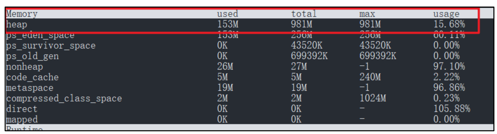

- 随着堆中的对象增多，当total可以使用的内存即将不足时，java虚拟机会继续分配内存给堆。

- 如果堆内存不足，java虚拟机就会不断的分配内存，total值会变大。total最多只能与max相等。

问题：是不是当 used = max = total 的时候，堆内存就溢出了呢？

- 不是，堆内存溢出的判断条件比较复杂，在下一章《垃圾回收器》中会详细介绍。

如果不设置任何的虚拟机参数，max默认是系统内存的1/4，total默认是系统内存的1/64。在实际应用中一般都需要设置total和max的值。

Oracle官方文档：https://docs.oracle.com/javase/8/docs/technotes/tools/unix/java.html

## 3.3 设置大小

- 要修改堆的大小，可以使用虚拟机参数 –Xmx（max最大值）和 -Xms (初始的total)。

- 语法：`-Xmx值 -Xms值`

- 单位：字节（默认，必须是 1024 的倍数）、k或者K(KB)、m或者M(MB)、g或者G(GB)

- 限制：Xmx必须大于 2 MB，Xms必须大于1MB

问题：为什么arthas中显示的heap堆大小与设置的值不一样呢？

- arthas中的heap堆内存使用了JMX技术中内存获取方式，这种方式与垃圾回收器有关，计算的是可以分配对象的内存，而不是整个内存。

## 3.4 建议

- Java服务端程序开发时，<font color=red>建议将-Xmx和-Xms设置为相同的值</font>，这样在程序启动之后可使用的总内存就是最大内存，而无需向java虚拟机再次申请，减少了申请并分配内存时间上的开销，同时也不会出现内存过剩之后堆收缩的情况。

- -Xmx具体设置的值与实际的应用程序运行环境有关，在《实战篇》中会给出设置方案。

# 4. 方法区（Method Area）

方法区是存放基础信息的位置，线程共享，主要包含三部分内容：

- 类的元信息：保存了所有类的基本信息

- 运行时常量池：保存了字节码文件中的常量池内容

- 字符串常量池：保存了字符串常量

方法区是用来存储每个类的基本信息（元信息），一般称之为**InstanceKlass对象**。在类的<font color=red>加载阶段</font>完成。

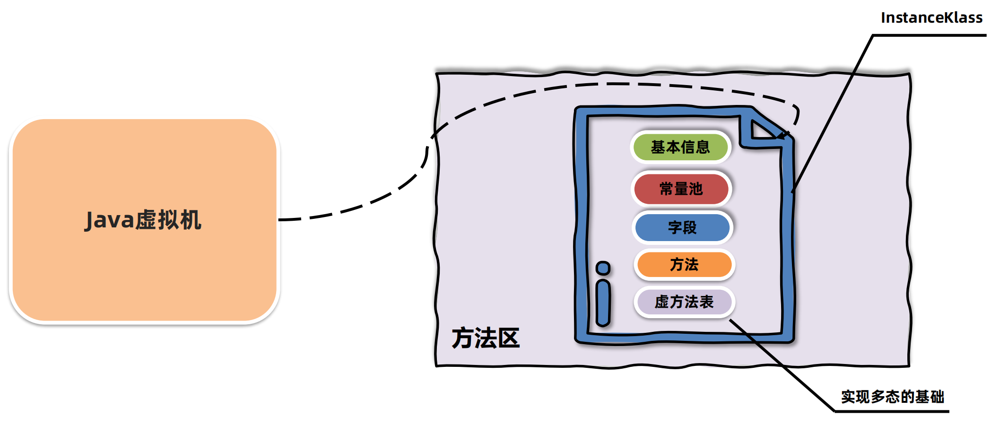

方法区除了存储类的元信息之外，还存放了运行时常量池，常量池中存放的是字节码中的常量池内容。

字节码文件中通过编号查表的方式找到常量，这种常量池称为<font color=red>静态常量池</font>。当常量池加载到内存中之后，可以通过内存地址快速的定位到常量池中的内容，这种常量池称为<font color=red>运行时常量池</font>。

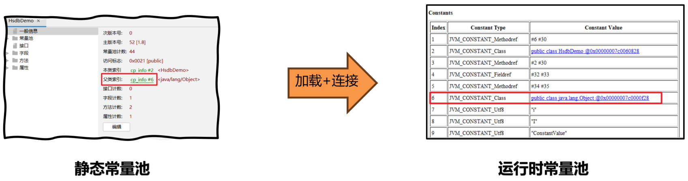

方法区是《Java虚拟机规范》中设计的虚拟概念，每款Java虚拟机在实现上都各不相同。Hotspot设计如下：

- <font color=red>JDK7及之前的版本</font>将方法区存放在<font color=red>堆区域中的永久代空间</font>，堆的大小由虚拟机参数来控制。

- <font color=red>JDK8及之后的版本</font>将方法区存放在<font color=red>元空间</font>中，元空间位于操作系统维护的直接内存中，默认情况下只要不超过操作系统承受的上限，可以一直分配。

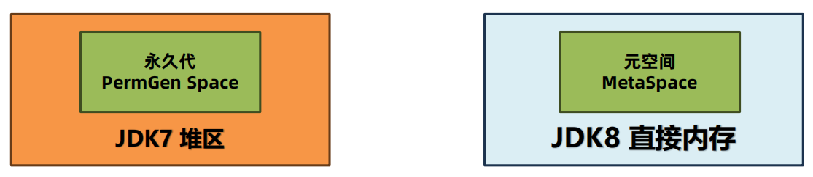

## arthas中查看方法区

- 使用memory打印出内存情况，JDK7及之前的版本查看ps_perm_gen属性。

- JDK8及之后的版本查看metaspace属性。

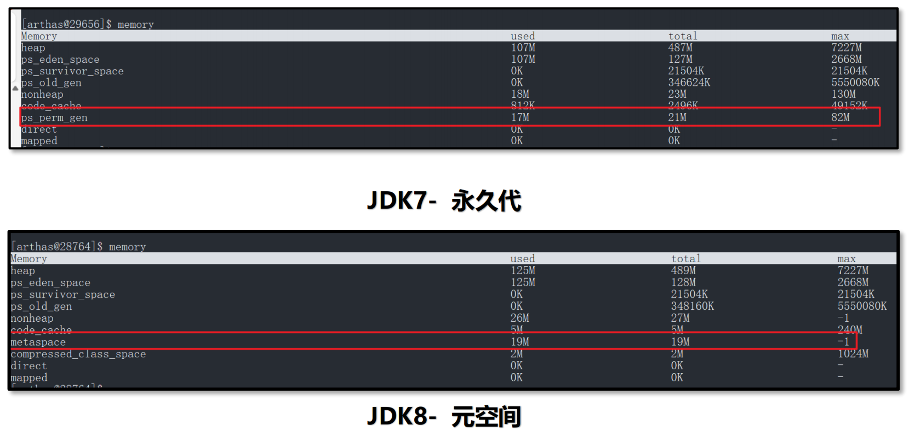

## 案例：模拟方法区的溢出

需求：

- 通过ByteBuddy框架，动态生成字节码数据，加载到内存中。通过死循环不停地加载到方法区，观察方法区是否会出现内存溢出的情况。

- 分别在JDK7和JDK8上运行上述代码。

### ByteBuddy框架的基本使用方法

ByteBuddy是一个基于Java的开源库，用于生成和操作Java字节码。

1. 引入依赖
   
   ```xml
   <dependency>
       <groupId>net.bytebuddy</groupId>
       <artifactId>byte-buddy</artifactId>
       <version>1.12.23</version>
   </dependency>
   ```

2. 创建ClassWriter对象
   
   ```java
   ClassWriter classWriter = new ClassWriter(0);
   ```

3. 调用visit方法，创建字节码数据
   
   ```java
   // 第一个参数：JDK版本(主版本和副版本号)；
   // 第三个参数：类的全限定名
   // 其余参数照着写，不能漏
   classWriter.visit(Opcodes.V1_8, Opcodes.ACC_PUBLIC, name, null, "java/lang/Object", null);
   // 拿到字节码数据
   byte[] bytes = classWriter.toByteArray();
   ```

实验发现，JDK7上运行大概十几万次，就出现了错误。在JDK8上运行百万次，程序都没有出现任何错误，但是内存会直线升高。这说明JDK7和JDK8在方法区的存放上，采用了不同的设计。

- JDK7将方法区存放在<font color=red>堆区域中的永久代空间</font>，堆的大小由虚拟机参数 <font color=red>-XX:MaxPermSize=值 </font>来控制。

- JDK8将方法区存放在<font color=red>元空间</font>中，元空间位于操作系统维护的直接内存中，默认情况下只要不超过操作系统承受的上限，可以一直分配。
  
  可以使用<font color=red> -XX:MaxMetaspaceSize=值 </font>将元空间最大大小进行限制。

## 字符串常量池

方法区中除了类的元信息、运行时常量池之外，还有一块区域叫字符串常量池 (**StringTable**)。

字符串常量池存储在代码中定义的常量字符串内容。比如“123” 这个123就会被放入字符串常量池。

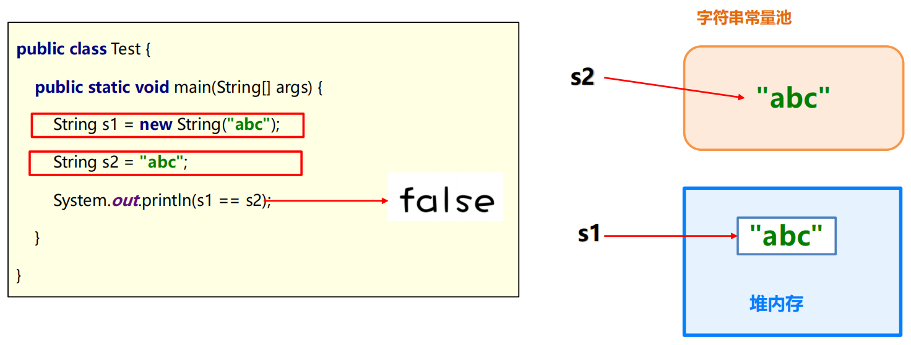

字符串常量池和运行时常量池有什么关系？

早期设计时，字符串常量池是属于运行时常量池的一部分，他们存储的位置也是一致的。后续做出了调整，将字符串常量池和运行时常量池做了拆分.

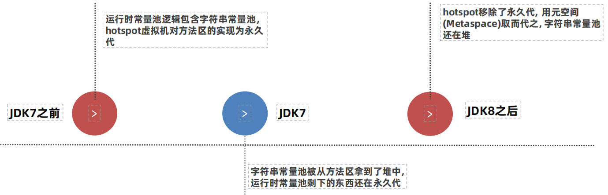

- JDK8 之后，运行时常量池还在方法区中，方法区放在了元空间中，即类的基本信息和运行时常量池都在元空间中，而字符串常量池还放在堆中。

练习题1：通过字节码指令如下代码的运行结果

```java
public static void main(String[] args) {
    String a = "1";
    String b = "2";
    String c = "12";
    String d = a + b;
    System.out.println(c == d); // false
}
```

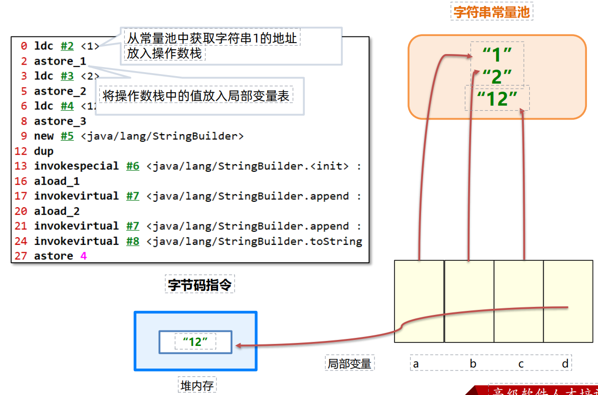

- 字符串相加，底层使用的是 StringBuilder对象处理
- 9 至 27 对应的指令就是 `String d = a + b` 的实现
  - aload命令：表示将局部变量表1和2位置对应的数据拿到，即 “1” 和 "2" 字符串放到操作数栈中，
  - append方法：将 “1” 和 “2” 连接在一起，得到 “12”
  - toString方法：将 “12” 转为 String 类型，即在堆内存中创建了 “12” 的字符串对象
  - astore命令：将上一步中的字符串对象地址 放到 局部变量表4位置处，即d

练习题2：通过字节码指令如下代码的运行结果

```java
public static void main(String[] args) {
    String a = "1";
    String b = "2";
    String c = "12";
    String d = "1" + "2";
    System.out.println(c == d); // true
}
```

- 常量，编译阶段直接连接，d的值来自于字符串常量池中，所以和c 指向同一个地址

### String 的 intern方法

```java
public static void main(String[] args) {
    Scanner scanner = new Scanner(System.in);
    // 接受字符串，并将其保存到常量池中，input1就是常量池中该字符串的地址
    String input1 = scanner.next().intern();
    String input2 = scanner.next().intern();

    // 如果两次输入的字符串是一样的，那么input1和input2会指向常量池中的同一个字符串
    System.out.println(input1 == input2);
}
```

需求：

- String.intern()方法是可以手动将字符串放入字符串常量池中，分别在 JDK6 和 JDK8 下执行代码

- JDK6 中结果是 false false，JDK8 中结果是 true false
  
  ```java
  public static void main(String[] args) {
      String s1 = new StringBuilder().append("think").append("123").toString();
      System.out.println(s1.intern() == s1); 
  
      String s2 = new StringBuilder().append("ja").append("va").toString();
      System.out.println(s2.intern() == s2);
  }
  ```

分析：

JDK6版本中 `intern()` 方法会把第一次遇到的字符串实例复制到永久代的字符串常量池中，返回的也是永久代里面这个字符串实例的引用。字符串“java”是JDK内部就有的字符串，所以JVM启动时就会把java加入到常量池中。字符串常量池在方法区中，方法区存放在永久代中。上述代码执行逻辑：

1. 在堆中创建 "think123" 的字符串对象，s1指向它，假设 s1 为 0x0001

2. 执行 `s1.intern()` ，将 "think123" 复制一份存放到字符串常量池中，并返回该地址，假设 `s1.intern()` 为 0x0010

3. 所以 s1 不等于 `s1.intern()`

4. 在堆中创建 "java" 的字符串对象，s2指向它，假设 s2 为 0x0002

5. 因为 JVM 启动时，字符串常量池中就会生成对应的 "java" 字符串，所以 `s2.intern()` 就直接获取了字符串常量池中该字符串的地址，假设 0x0011

6. 所以 s2 不等于 `s2.intern()`

JDK7及之后版本中由于字符串常量池在堆上，所以 `intern()` 方法会把第一次遇到的字符串的引用放入字符串常量池。上述代码执行逻辑：

1. 在堆中创建 "think123" 的字符串对象，s1指向它，假设 s1 为 0x0001

2. 执行 `s1.intern()` ，将 "think123" 的地址复制到字符串常量池中，并返回该地址，假设 `s1.intern()` 为 0x0001

3. 所以 s1 等于 `s1.intern()`

4. 在堆中创建 "java" 的字符串对象，s2指向它，假设 s2 为 0x0002

5. 因为 JVM 启动时，字符串常量池中就会生成对应的 "java" 字符串，所以 `s2.intern()` 就直接获取了字符串常量池中该字符串的地址，假设 0x0011

6. 所以 s2 不等于 `s2.intern()`
   
   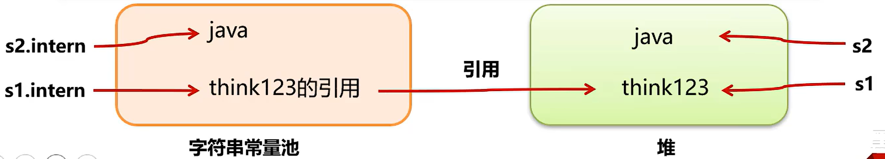

### 静态变量的存储

运行时数据区都学完了，静态变量存储在哪里呢？

- JDK6及之前的版本中，静态变量是存放在方法区中的，也就是永久代。
  
  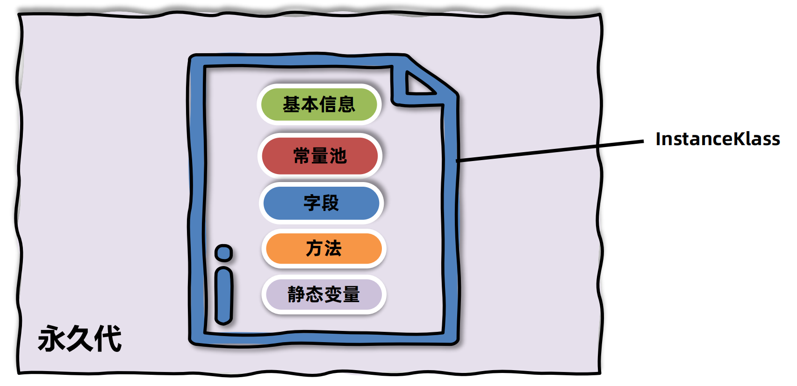

- JDK7及之后的版本中，静态变量是存放在堆中的Class对象中，脱离了永久代。具体源码可参考虚拟机源码：BytecodeInterpreter针对putstatic指令的处理。
  
  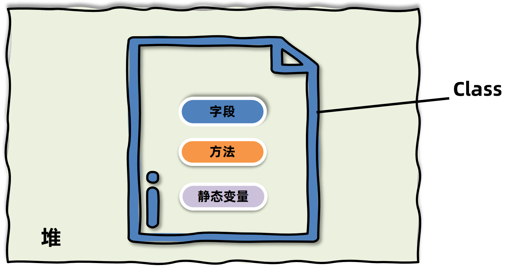

# 5. 直接内存

直接内存（Direct Memory）并不在《Java虚拟机规范》中存在，所以并不属于Java运行时的内存区域。

在 JDK 1.4 中引入了NIO 机制，使用了直接内存，主要为了解决以下两个问题:

1、Java堆中的对象如果不再使用要回收，回收时会影响对象的创建和使用。

2、IO操作比如读文件，需要先把文件读入直接内存（缓冲区）再把数据复制到Java堆中。

现在直接放入直接内存即可，同时Java堆上维护直接内存的引用，减少了数据复制的开销。写文件也是类似的思路。

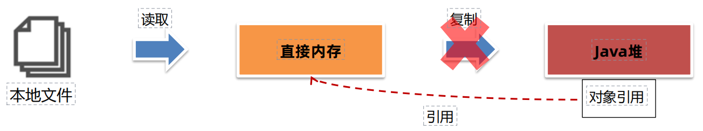

- 要创建直接内存上的数据，可以使用ByteBuffer。

- 语法：ByteBufferdirectBuffer= ByteBuffer.allocateDirect(size);

- 注意事项：arthas的memory命令可以查看直接内存大小，属性名direct。

- 代码：
  
  ```java
  public static void main(String[] args) throws InterruptedException, IOException {
      // 等待第一次输入后，开始向直接内存中放数据（等待arthas启动，监控该进程）
      System.in.read();
      while (true) {
          ByteBuffer directBuffer = ByteBuffer.allocateDirect(size);
          list.add(directBuffer);
          System.out.println(++count);
          Thread.sleep(5000);
      }
  }
  ```
  
  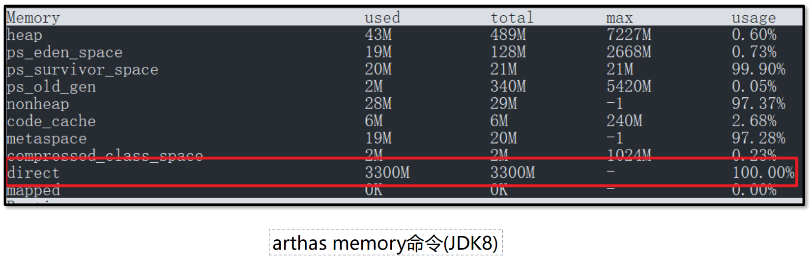  

- 如果需要手动调整直接内存的大小，可以使用-XX:MaxDirectMemorySize=大小
  
  单位k或K表示千字节，m或M表示兆字节，g或G表示千兆字节。默认不设置该参数情况下，JVM自动选择最大分配的大小。
  
  以下示例，以不同的单位说明如何将直接内存大小设置为1024 KB：
  
  - -XX:MaxDirectMemorySize=1m
  
  - -XX:MaxDirectMemorySize=1024k
  
  - -XX:MaxDirectMemorySize=1048576

# 6. 总结

1、运行时数据区分成哪几部分，每一部分的作用是什么？

2、不同JDK版本之间运行时数据区域的区别是什么？

- JDK6：
  
  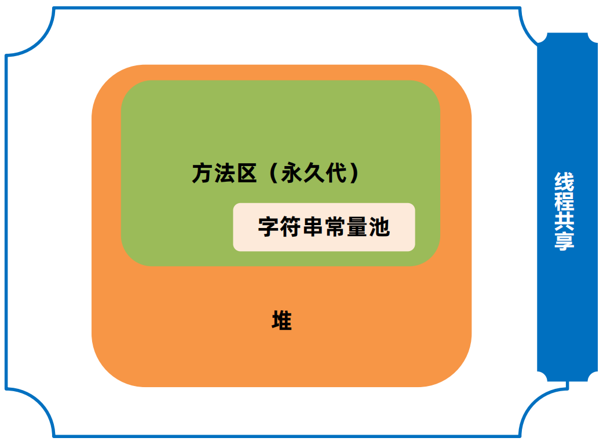

- JDK7：
  
  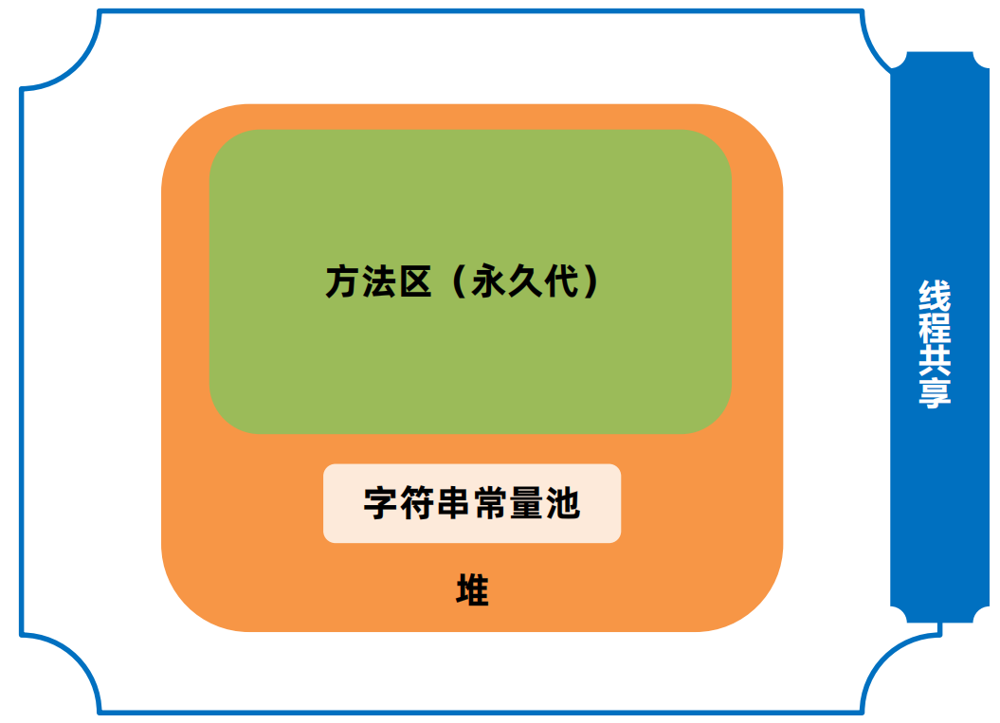

- JDK8：
  
  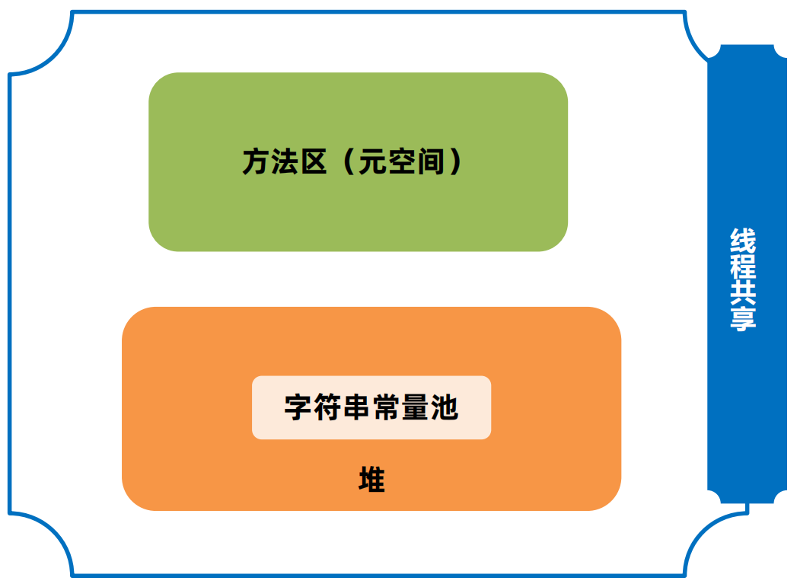
