# 1. 自动垃圾回收

## 1.1 C/C++的内存管理

在C/C++这类没有自动垃圾回收机制的语言中，一个对象如果不再使用，需要手动释放，否则就会出现<font color=red>内存泄漏</font>。我们称这种释放对象的过程为垃圾回收，而需要程序员编写代码进行回收的方式为手动回收。

<font color=red>内存泄漏</font>指的是不再使用的对象在系统中未被回收，内存泄漏的积累可能会导致<font color=red>内存溢出</font>。

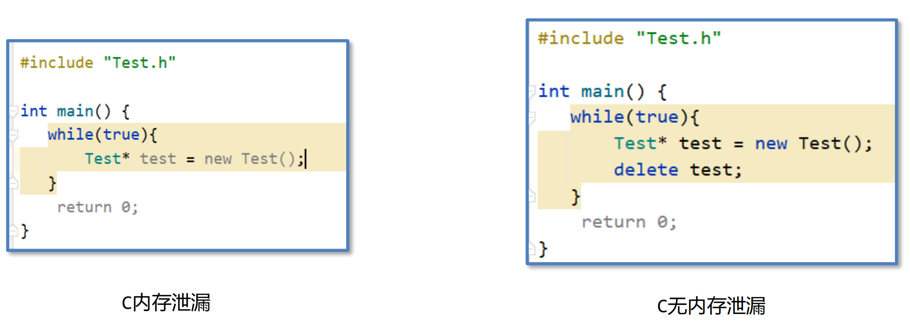

## 1.2 Java的内存管理

Java中为了简化对象的释放，引入了自动的<font color=red>垃圾回收（Garbage Collection简称GC）</font>机制。通过垃圾回收器来对不再使用的对象完成自动的回收，垃圾回收器主要负责对堆上的内存进行回收。其他很多现代语言比如C#、Python、Go都拥有自己的垃圾回收器。

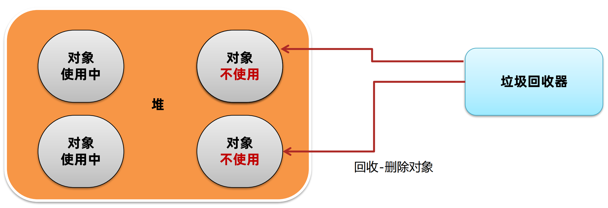

## 1.3 垃圾回收对比

自动垃圾回收（Java）：自动根据对象是否使用由虚拟机来回收对象

- <font color=green>优点：降低程序员实现难度、降低对象回收bug的可能性</font>

- <font color=red>缺点：程序员无法控制内存回收的及时性</font>

手动垃圾回收（C/C++）：由程序员编程实现对象的删除

- <font color=green>优点：回收及时性高，由程序员把控回收的时机</font>

- <font color=red>缺点：编写不当容易出现悬空指针、重复释放、内存泄漏等问题</font>

## 1.4 应用场景

1. 解决系统僵死的问题
   
   - 大厂的系统出现的许多系统僵死问题，都与频繁的垃圾回收有关

2. 性能优化
   
   - 对垃圾回收器进行合理的设置，可以有效地提升程序的执行性能

3. 高频面试题
   
   - 常见的垃圾回收器
   
   - 常见的垃圾回收算法
   
   - 四种引用
   
   - 项目中用了哪一种垃圾回收器

## 1.5 Java的内存管理和自动垃圾回收

- 线程不共享的部分，都是<font color=red>伴随着线程的创建而创建，线程的销毁而销毁</font>。

- 方法的栈帧在执行完方法之后，就会自动弹出栈并释放掉对应的内存。

- 所以县城不共享部分的区域是不需要垃圾回收器管理的  
  
  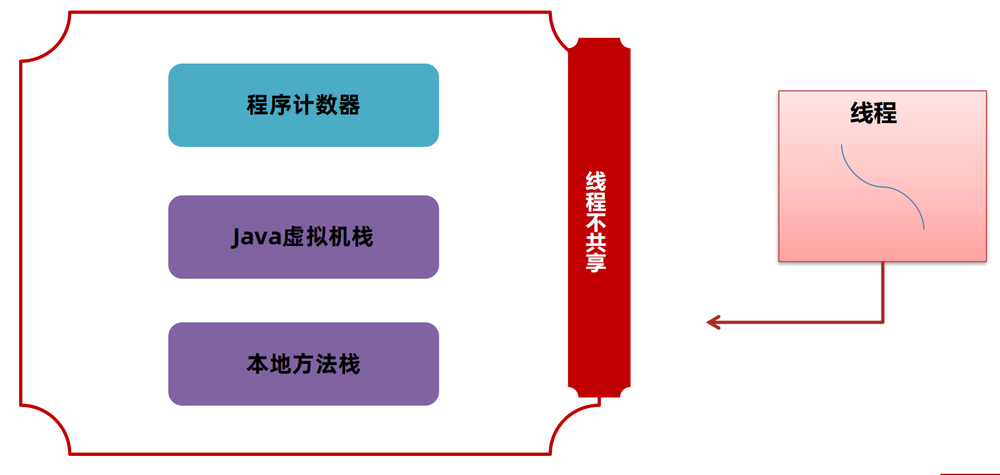

# 2. 方法区的回收

## 2.1 回收内容

方法区中能回收的内容主要就是不再使用的类。

<mark>判定一个**类可以被卸载**</mark>，需要同时满足下面三个条件：

1. 此类所有实例对象都已经被回收，在堆中不存在任何该类的实例对象以及子类对象。
   
   ```java
   Class<?> clazz = loader.loadClass("com.study.jvm.demo.MyClassA");
   Object object = clazz.newInstance();
   o = null;
   ```

2. 加载该类的类加载器已经被回收。
   
   ```java
   URLClassLoader loader = new URLClassLoader(new URL[]{new URL("file:D:\\lib\\")});
   loader = null;
   ```

3. 该类对应的 java.lang.Class 对象没有在任何地方被引用。
   
   ```java
   Class<?> clazz = loader.loadClass("com.study.jvm.demo.MyClassA");
   clazz = null;
   ```

<font color=red>开发中此类场景一般很少出现，主要在如 OSGi、JSP 的热部署等应用场景中。每个jsp文件对应一个唯一的类加载器，当一个jsp文件修改了，就直接卸载这个jsp类加载器。重新创建类加载器，重新加载jsp文件</font>。

示例：

```java
package com.study.jvm.gc;

import java.net.URL;
import java.net.URLClassLoader;
import java.util.ArrayList;

/**
 * 类的卸载
 * 测试类会在什么情况下被回收
 * 启动时添加VM参数：-XX:+TraceClassLoading -XX:+TraceClassUnloading，查看加载的类和卸载的类
 */
public class ClassUnload {
    public static void main(String[] args) throws InterruptedException {
        try {
            ArrayList<Class<?>> classes = new ArrayList<>();
            ArrayList<URLClassLoader> loaders = new ArrayList<>();
            ArrayList<Object> objs = new ArrayList<>();
            while (true) {
                // 当循环进入到下一次后，以下三个对象就没人再使用了，JVM会将其回收掉
                URLClassLoader loader = new URLClassLoader(new URL[]{new URL("file:D:\\programme\\idea\\idea_workspace\\study-project-java-2023\\jvm-study\\jvm-classloader-demo\\lib\\")});
                Class<?> clazz = loader.loadClass("com.study.jvm.demo.MyClassA");
                Object o = clazz.newInstance();

                // 第一个条件：将对象添加到集合中，不会再被回收
//                objs.add(o);
                // 第二个条件：将类加载器对象添加到集合中，类加载器不会再被回收
//                loaders.add(loader);
                // 第三个条件：该类对应的 java.lang.Class对象被引用，并放到集合中，不会被回收
//                classes.add(clazz);

                // 手动触发垃圾回收
                System.gc();
            }
        } catch (Exception e) {
            e.printStackTrace();
        }
    }
}

```

## 2.2 手动触发回收

- 如果需要手动触发垃圾回收，可以调用 System.gc() 方法。

- 语法： System.gc()

- 注意事项：
  
  调用System.gc()方法并不一定会立即回收垃圾，仅仅是向Java虚拟机发送一个垃圾回收的请求，具体是否需要执行垃圾回收Java虚拟机会自行判断。

# 3. 堆回收

1. 如何判断堆上的对象可以回收？
- Java中的对象是否能被回收，是根据对象是否被引用来决定的。如果对象被引用了，说明该对象还在使用，不允许被回收。
2. 如何判断堆上的对象没有被引用？
- 常见的有两种判断方法：引用计数法 和 可达性分析法。

## 3.1 引用计数法和可达性分析法

### 3.1.1 引用计数法

引用计数法会为每个对象维护一个引用计数器，初始值是0，当对象被引用时加1，取消引用时减1。

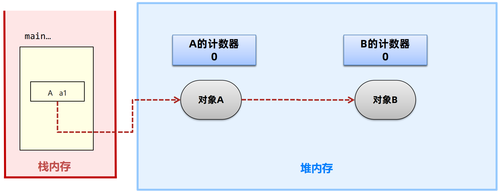

### 3.1.2 引用计数法缺点：循环引用

引用计数法的优点是实现简单，C++中的智能指针就采用了引用计数法，但是它也存在缺点，主要有两点：

1. 每次引用和取消引用都需要维护计数器，对系统性能会有一定的影响

2. 存在循环引用问题，所谓循环引用就是当A引用B，B同时引用A时会出现对象无法回收的问题。

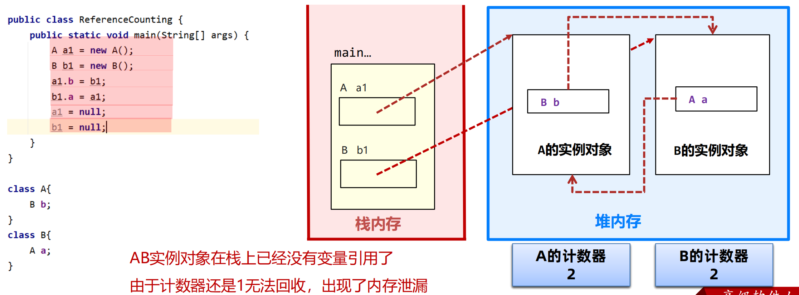

### 补充：查看垃圾回收日志

- 如果想要查看垃圾回收的信息，可以使用 -verbose:gc 参数。

- 语法： -verbose:gc
  
  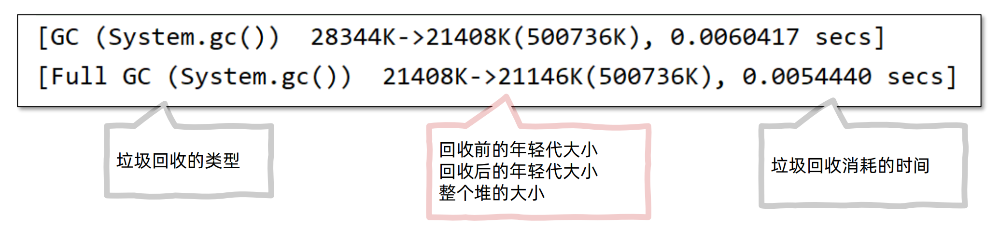

- 示例：
  
  ```java
  package com.study.jvm.reference;
  
  /**
   * 引用计数
   * 启动时，添加VM参数：-verbose:gc，打印对应垃圾回收日志
   * 发现打印的日志中，gc回收完，年轻代中的占用内存数量级没有变化，没有发生内存泄漏，所以a1和b1一定都被回收了
   */
  public class ReferenceCountingDemo {
      public static void main(String[] args) {
          while (true) {
              A a1 = new A();
              B b1 = new B();
              a1.b = b1;
              b1.a = a1;
              a1 = null;
              b1 = null;
              System.gc();
          }
      }
  }
  class A {
      B b;
  }
  class B {
      A a;
  }
  ```

### 3.1.3 可达性分析算法

#### 3.1.3.1 核心思想

Java使用的是<font color=red>可达性分析算法</font>来判断对象是否可以被回收。

可达性分析将对象分为两类：垃圾回收的根对象（GC Root）和普通对象，对象与对象之间存在引用关系。

下图中A到B，再到C和D，形成了一个引用链，可达性分析算法指的是如果从某个到GC Root对象是可达的，对象就不可被回收。

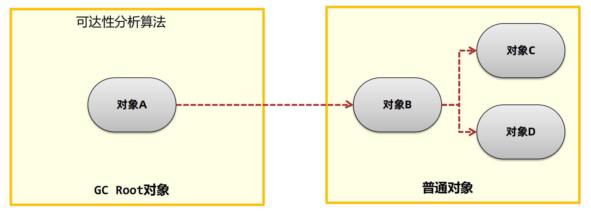

#### 3.1.3.2 GC Root对象

哪些对象被称之为GC Root对象呢（四大类）？

- <font color=red>线程Thread对象，引用线程栈帧中的方法参数、局部变量等</font>
  
  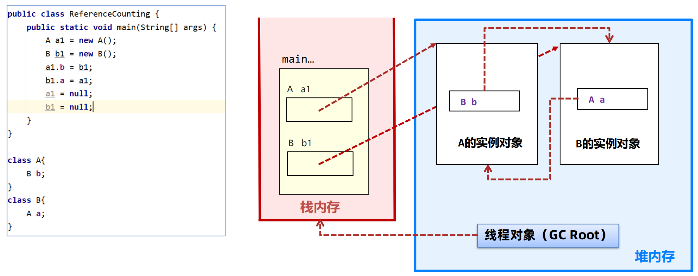

- 系统类加载器加载的java.lang.Class对象，引用类中的静态变量
  
  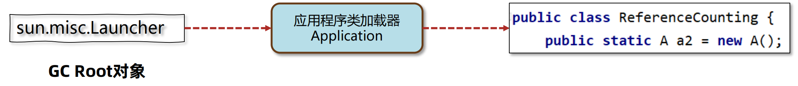
  
  - 系统类加载器就是一个GC Root对象，如上图所示的 sun.misc.Launcher 类加载器，它有两个静态类(应用程序类加载器，扩展类加载器)，可以指向它们两个，而它们两个又可以找到对应加载的类对象，即java.lang.Class对象。上图中ReferenceCounting类中的a2变量是静态变量，该类对应的java.lang.Class可以找到该变量(a2)。这就是一个GC Root的引用链。

- 监视器对象，用来保存同步锁synchronized关键字持有的对象
  
  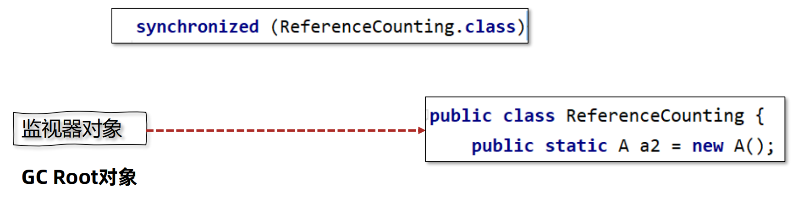
  
  - 使用 synchronized 包裹起来的类，会被虚拟机的监视器对象引用，监视器对象是GC Root。

- 本地方法调用时使用的全局对象。

#### 3.1.3.3 查看 GC Root

通过 arthas 和 eclipse Memory Analyzer (MAT) 工具可以查看GC Root，MAT工具是eclipse推出的Java堆内存检测工具。具体操作步骤如下：

1. 使用arthas的heapdump命令将堆内存快照保存到本地磁盘中。

2. 使用MAT工具打开堆内存快照文件。

3. 选择GC Roots功能查看所有的GC Root。

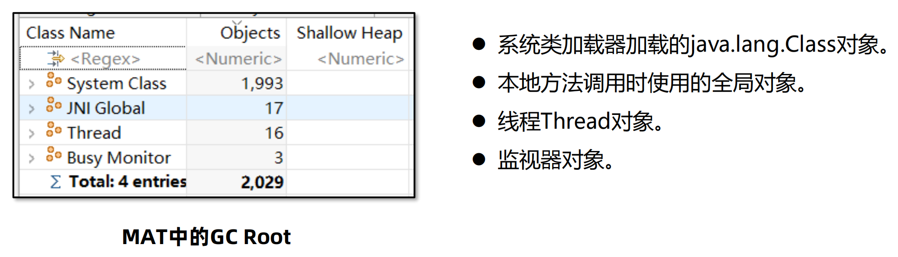

示例：

```java
package com.study.jvm.reference;

import java.io.IOException;

/**
 * 查看GC Root对象案例
 */
public class ReferenceCountingDemo2 {
    public static A a2 = null;

    public static void main(String[] args) throws IOException {
        A a1 = new A();
        B b1 = new B();
        a1.b = b1;
        b1.a = a1;
        a2 = a1;
        // 让程序阻塞在这里，方便arthas进入该进程，进行相关操作
        System.in.read();
    }
}
```

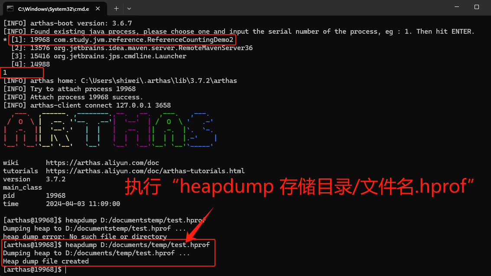


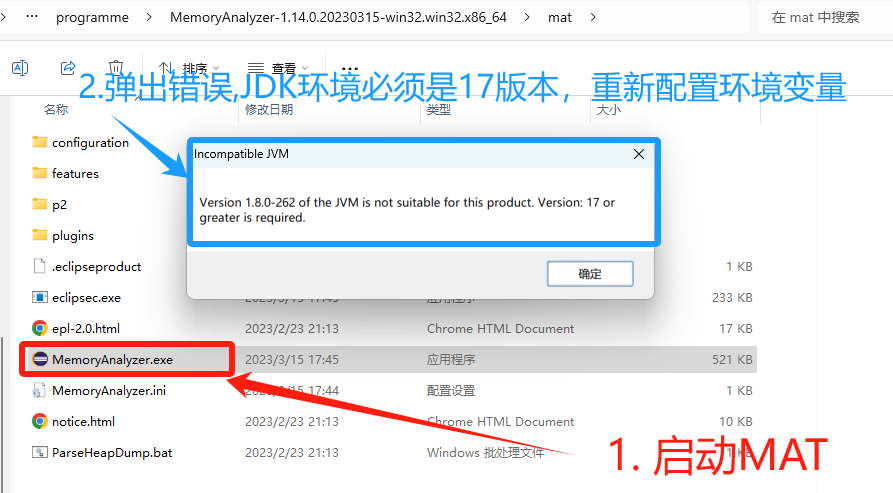

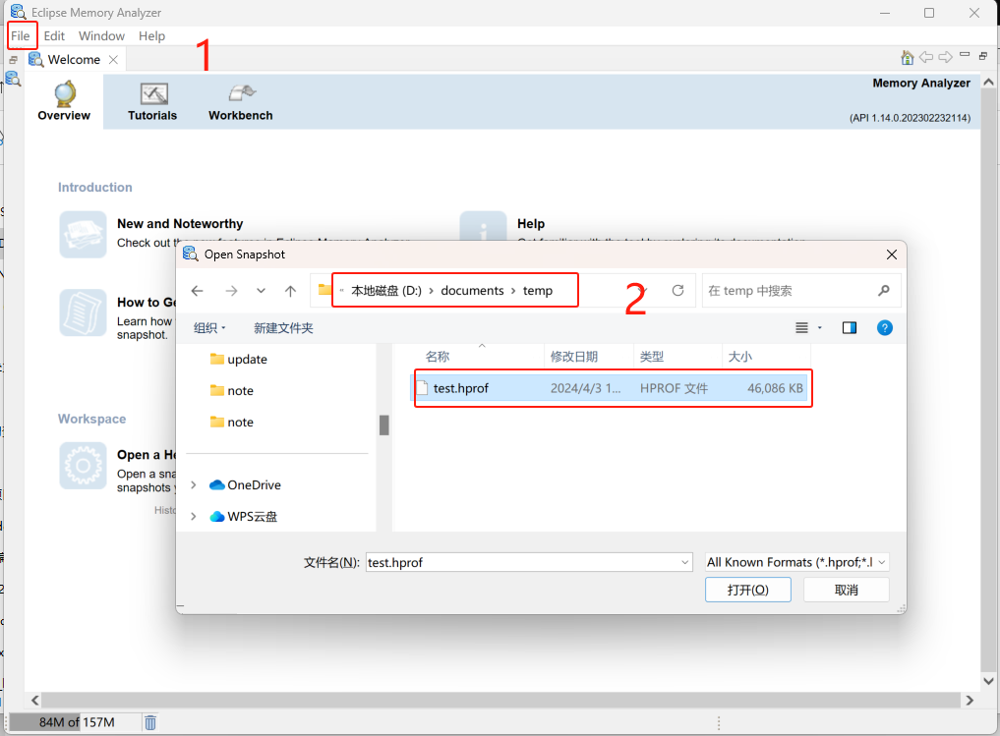

- 启动 MAT 后，选择 File -> Open Heap Dump ，然后选择对应的文件打开

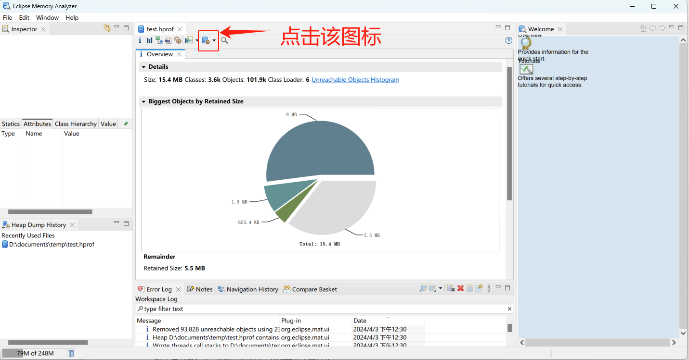

- 点击上述图标，选择 Java Basics -> GC Roots，弹出下面的具体GC Root信息

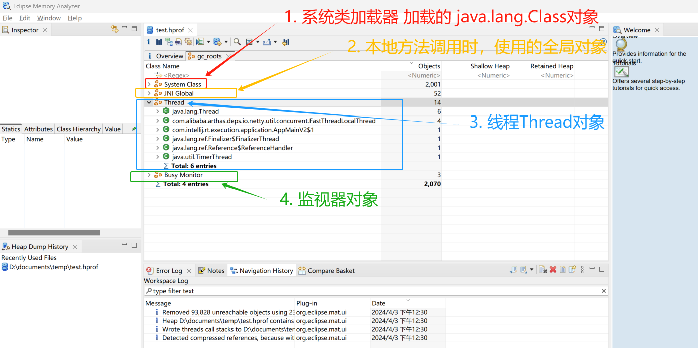


- 从上图的层级关系可以看出：蓝框中标出来的局部变量 都是 main 线程对象里的，并且其中有 A 和 B 对象的引用，即存储了对应的堆中的地址

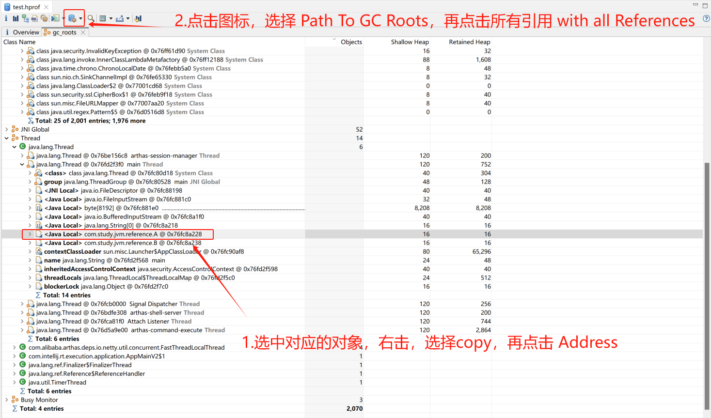

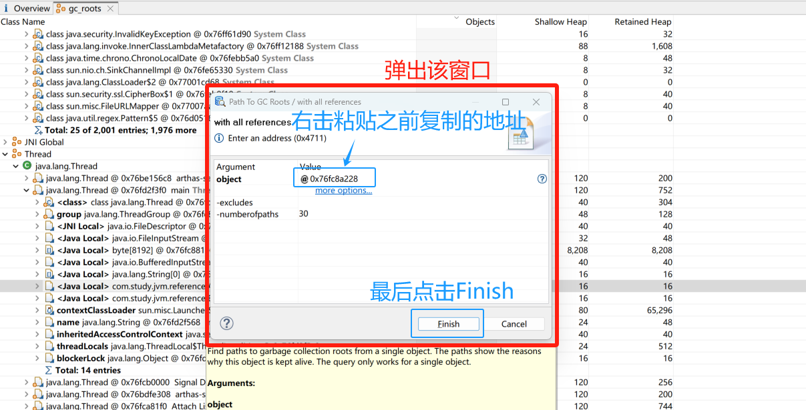


## 3.2 五种对象引用

可达性算法中描述的对象引用，一般指的是强引用，即是GCRoot对象对普通对象有引用关系，只要这层关系存在，普通对象就不会被回收。

除了强引用之外，Java中还设计了几种其他引用方式：

- 软引用

- 弱引用

- 虚引用

- 终结器引用

### 3.2.1 软引用

软引用相对于强引用是一种比较弱的引用关系，如果一个对象只有软引用关联到它，<font color=red>当程序内存不足时，就会将软引用中的数据进行回收</font>。

在 JDK 1.2 版之后提供了SoftReference类来实现软引用，软引用常用于缓存中。

#### 软引用的执行过程如下

1. 将对象使用软引用包装起来，**new SoftReference<对象类型>(对象)** 。

2. 内存不足时，虚拟机尝试进行垃圾回收。

3. 如果垃圾回收仍不能解决内存不足的问题，回收软引用中的对象。

4. 如果依然内存不足，抛出OutOfMemory异常。

#### 软引用使用示例

将100m的数据放入软引用中

```java
byte[] bytes = new byte[1024 * 1024 * 100];
SoftReference<byte[]> softReference = new SoftReference<byte[]>(bytes);
```

软引用中的对象如果在内存不足时回收，SoftReference对象本身也需要被回收。如何知道哪些SoftReference对象需要回收呢？

SoftReference提供了一套队列机制：

1. 软引用创建时，通过构造器传入引用队列

2. 在软引用中包含的对象被回收时，该软引用对象会被放入引用队列

3. 通过代码遍历引用队列，将SoftReference的强引用删除

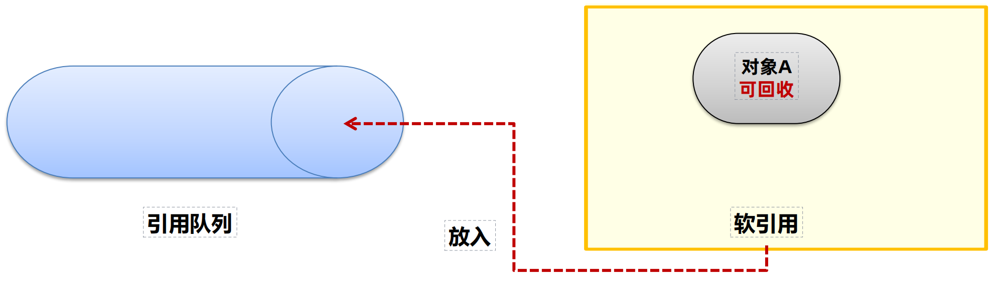

```java
package com.study.jvm.reference.soft;


import java.io.IOException;
import java.lang.ref.ReferenceQueue;
import java.lang.ref.SoftReference;
import java.util.ArrayList;

/**
 * 软引用案例3 - 引用队列使用
 * 启动时，设置最大堆内存：-Xmx200m
 */
public class SoftReferenceDemo3 {

    public static void main(String[] args) throws IOException {
        ArrayList<SoftReference> softReferences = new ArrayList<>();
        ReferenceQueue<byte[]> queues = new ReferenceQueue<byte[]>();
        /*
            因为堆内存最大设置为200M，即实际对中能存放数据的空间小于200M，所以每创建100M大小的数组bytes时，之前软引用包裹的数组会被回收掉，并将该引用放到queues队列中。
            因为循环了10次，所以最终queues中会有9个软引用对象，第十次循环创建的软引用包裹的空间不用回收，所以没有放到queues队列中。
         */
        for (int i = 0; i < 10; i++) {
            byte[] bytes = new byte[1024 * 1024 * 100];
            SoftReference studentRef = new SoftReference<byte[]>(bytes, queues);
            softReferences.add(studentRef);
        }

        SoftReference<byte[]> ref = null;
        int count = 0;
        while ((ref = (SoftReference<byte[]>) queues.poll()) != null) {
            count++;
        }
        System.out.println(count);
    }
}


```

#### 软引用的使用场景-缓存

软引用也可以使用继承自SoftReference类的方式来实现，StudentRef类就是一个软引用对象。

通过构造器传入软引用包含的对象，以及引用队列。

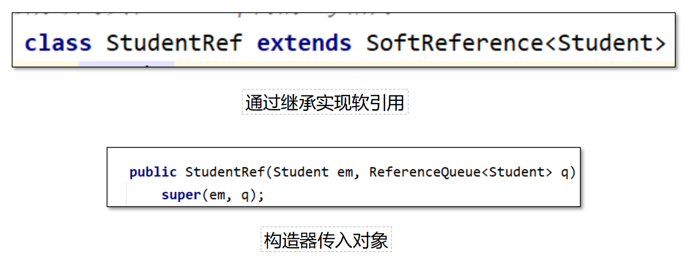

使用软引用实现学生数据的缓存，下图是设计方案：

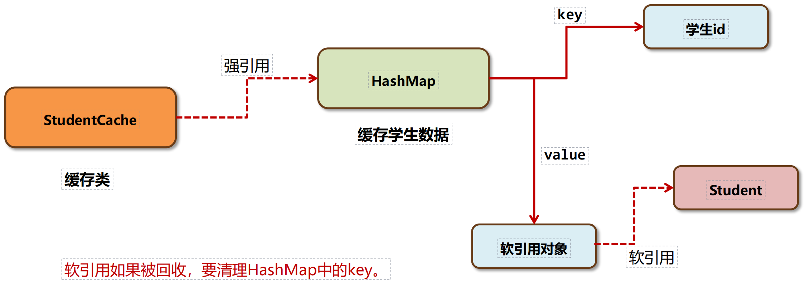

详细代码：

```java
package com.study.jvm.reference.soft;

import java.lang.ref.ReferenceQueue;
import java.lang.ref.SoftReference;
import java.util.HashMap;
import java.util.Map;

/**
 * 软引用案例4 - 学生信息的缓存
 */
public class StudentCache {

    private static StudentCache cache = new StudentCache();

    public static void main(String[] args) {
        for (int i = 0; ; i++) {
            StudentCache.getInstance().cacheStudent(new Student(i, String.valueOf(i)));
        }
    }

    private Map<Integer, StudentRef> StudentRefs;// 用于Cache内容的存储
    private ReferenceQueue<Student> q;// 垃圾Reference的队列

    // 继承SoftReference，使得每一个实例都具有可识别的标识。
    // 并且该标识与其在HashMap内的key相同。
    private class StudentRef extends SoftReference<Student> {
        private Integer _key = null;

        public StudentRef(Student em, ReferenceQueue<Student> q) {
            super(em, q);
            _key = em.getId();
        }
    }

    // 构建一个缓存器实例
    private StudentCache() {
        StudentRefs = new HashMap<Integer, StudentRef>();
        q = new ReferenceQueue<Student>();
    }

    // 取得缓存器实例
    public static StudentCache getInstance() {
        return cache;
    }

    // 以软引用的方式对一个Student对象的实例进行引用并保存该引用
    private void cacheStudent(Student em) {
        cleanCache();// 清除垃圾引用
        StudentRef ref = new StudentRef(em, q);
        StudentRefs.put(em.getId(), ref);
        System.out.println(StudentRefs.size());
    }

    // 依据所指定的ID号，重新获取相应Student对象的实例
    public Student getStudent(Integer id) {
        Student em = null;
        // 缓存中是否有该Student实例的软引用，如果有，从软引用中取得。
        if (StudentRefs.containsKey(id)) {
            StudentRef ref = StudentRefs.get(id);
            em = ref.get();
        }
        // 如果没有软引用，或者从软引用中得到的实例是null，重新构建一个实例，并保存对这个新建实例的软引用
        if (em == null) {
            em = new Student(id, String.valueOf(id));
            System.out.println("Retrieve From StudentInfoCenter. ID=" + id);
            this.cacheStudent(em);
        }
        return em;
    }

    // 清除那些所软引用的Student对象已经被回收的StudentRef对象
    private void cleanCache() {
        StudentRef ref = null;
        while ((ref = (StudentRef) q.poll()) != null) {
            StudentRefs.remove(ref._key);
        }
    }

//    // 清除Cache内的全部内容
//    public void clearCache() {
//        cleanCache();
//        StudentRefs.clear();
//        //System.gc();
//        //System.runFinalization();
//    }
}

class Student {
    int id;
    String name;

    public Student(int id, String name) {
        this.id = id;
        this.name = name;
    }

    public int getId() {
        return id;
    }

    public void setId(int id) {
        this.id = id;
    }

    public String getName() {
        return name;
    }

    public void setName(String name) {
        this.name = name;
    }
}
```

### 3.2.2 弱引用

弱引用的整体机制和软引用基本一致，区别在于弱引用包含的对象在垃圾回收时，不管内存够不够都会直接被回收。

在 JDK 1.2 版之后提供了 WeakReference 类来实现弱引用，弱引用主要在 ThreadLocal 中使用。

弱引用对象本身也可以使用引用队列进行回收。

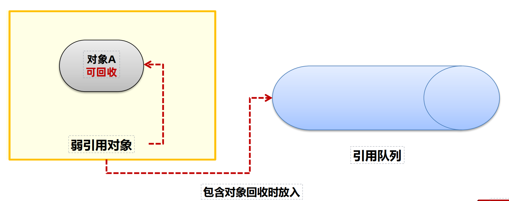

```java
package com.study.jvm.reference.weak;

import java.io.IOException;
import java.lang.ref.WeakReference;

/**
 * 弱引用案例 - 基本使用
 */
public class WeakReferenceDemo {
    public static void main(String[] args) throws IOException {

        byte[] bytes = new byte[1024 * 1024 * 100];
        WeakReference<byte[]> weakReference = new WeakReference<byte[]>(bytes);
        bytes = null;
        System.out.println(weakReference.get()); // 打印结果是有数据的

        // 执行一次垃圾回收
        System.gc();

        System.out.println(weakReference.get()); // 打印结果为null
    }
}

```

### 3.2.3 虚引用和终结器引用

- 这两种引用在常规开发中是不会使用的。

- 虚引用也叫幽灵引用/幻影引用，不能通过虚引用对象获取到包含的对象。虚引用唯一的用途是：当对象被垃圾回收器回收时，可以接收到对应的通知。Java中使用 PhantomReference 实现了虚引用，直接内存中为了及时知道直接内存对象不再使用，从而回收内存，使用了虚引用来实现。

- 终结器引用指的是在对象需要被回收时，终结器引用会关联对象并放置在Finalizer类中的引用队列中，在稍后由一条由FinalizerThread线程从队列中获取对象，然后执行对象的finalize方法，在对象第二次被回收时，该对象才真正的被回收。在这个过程中可以在finalize方法中再将自身对象使用强引用关联上，但是不建议这样做。

## 3.3 垃圾回收算法 - 核心思想

Java是如何实现垃圾回收的呢？简单来说，垃圾回收要做的有两件事：

1. 找到内存中存活的对象

2. 释放不再存活对象的内存，使得程序能再次利用这部分空间

### 3.3.1 垃圾回收算法的历史和分类

- 1960年John McCarthy发布了第一个GC算法：标记-清除算法。

- 1963年Marvin L. Minsky 发布了复制算法。

本质上后续所有的垃圾回收算法，都是在上述两种算法的基础上优化而来。

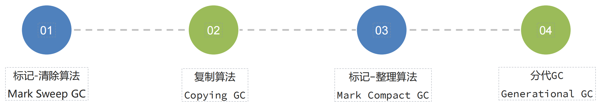

### 3.3.2 垃圾回收算法的评价标准

Java垃圾回收过程会通过单独的GC线程来完成，但是不管使用哪一种GC算法，都会有部分阶段需要停止所有的用户线程。

这个过程被称之为 Stop The World，简称STW，如果STW时间过长，则会影响用户的使用。

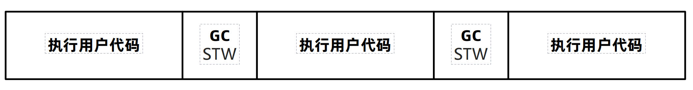

所以判断GC算法是否优秀，可以从三个方面来考虑：吞吐量、最大暂停时间、堆使用效率。

#### 3.3.2.1 吞吐量

吞吐量指的是 CPU 用于执行用户代码的时间 与 CPU 总执行时间的比值，即吞吐量 = 执行用户代码时间/(执行用户代码时间 + GC时间）。

吞吐量数值越高，垃圾回收的效率就越高。

比如：虚拟机总共运行了100 分钟，其中GC花掉1 分钟，那么吞吐量就是99%

#### 3.3.2.2 最大暂停时间

最大暂停时间指的是所有在垃圾回收过程中的STW时间最大值。比如下图中，黄色部分的STW就是最大暂停时间，显而易见上面的图比下面的图拥有更少的最大暂停时间。最大暂停时间越短，用户使用系统时受到的影响就越短。

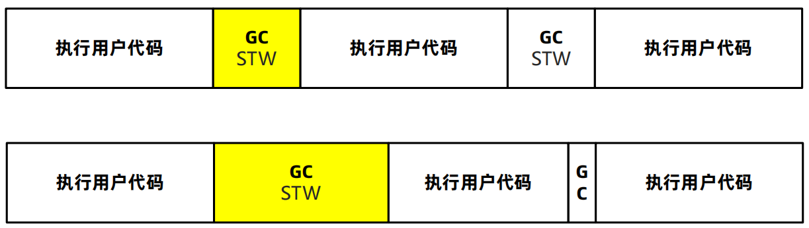

#### 3.3.2.3 堆使用效率

不同垃圾回收算法，对堆内存的使用方式是不同的。比如标记清除算法，可以使用完整的堆内存。

而复制算法会将堆内存一分为二，每次只能使用一半内存。

从堆使用效率上来说，标记清除算法要优于复制算法。

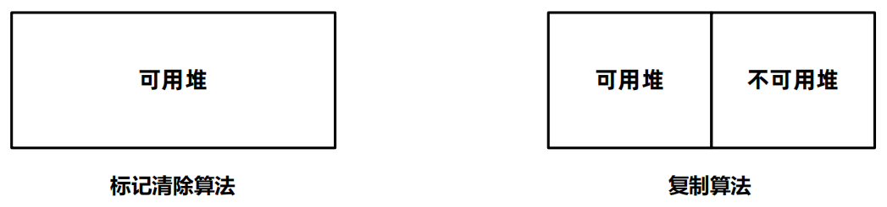

#### 3.3.2.4 总结

上述三种评价标准：堆使用效率、吞吐量，以及最大暂停时间不可兼得。

一般来说，堆内存越大，最大暂停时间就越长。想要减少最大暂停时间，就会降低吞吐量。

不同的垃圾回收算法，适用于不同的场景。

### 3.3.3 标记清除算法

#### 3.3.3.1 核心思想

标记清除算法的核心思想分为两个阶段：

1. 标记阶段，将所有存活的对象进行标记。Java中使用可达性分析算法，从GC Root开始通过引用链遍历出所有存活对象。

2. 清除阶段，从内存中删除没有被标记，也就是非存活对象

#### 3.3.3.2 优缺点

优点：实现简单，只需要在第一阶段给每个对象维护标志位，第二阶段删除对象即可。

缺点：

1. 碎片化问题
- 由于内存是连续的，所以在对象被删除之后，内存中会出现很多细小的可用内存单元。如果我们需要的是一个比较大的空间，很有可能这些内存单元的大小过小无法进行分配。
  
  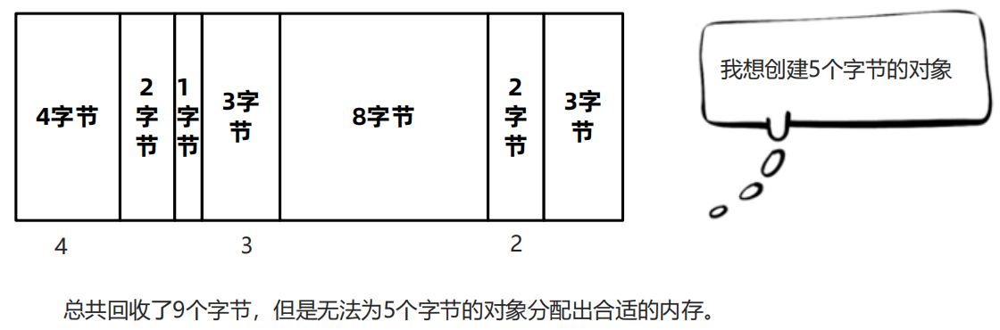
2. 分配速度慢
- 由于内存碎片的存在，需要维护一个<mark>空闲链表</mark>，极有可能发生每次需要遍历到链表的最后才能获得合适的内存空间。
  
  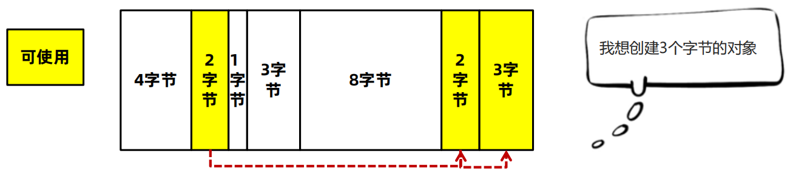

### 3.3.4 复制算法

#### 3.3.4.1 核心思想

复制算法的核心思想是：

1. 准备两块空间 From空间 和 To空间，每次在对象分配阶段，只能使用其中一块空间（From空间）。

2. 在垃圾回收GC阶段，将From中存活对象复制到To空间。

3. 将两块空间的 From 和 To 名字互换。

完整的复制算法的例子：

1. 将堆内存分割成两块 From空间、To空间，对象分配阶段，创建对象。

2. GC阶段开始，将GC Root搬运到To空间

3. 将GC Root关联的对象，搬运到To空间

4. 清理From空间，并把空间的名称互换
   
   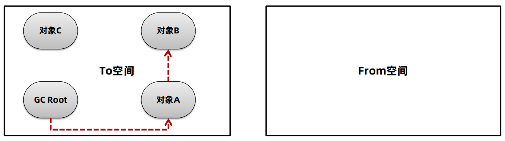

#### 3.3.4.2 优缺点

1. 吞吐量高
- 复制算法只需要遍历一次存活对象复制到To空间即可，比<mark>标记-整理算法</mark>少了一次遍历的过程，因而性能较好，但是不如<mark>标记-清除算法</mark>，因为标记清除算法不需要进行对象的移动。
2. 不会发生碎片化
- 复制算法在复制之后就会将对象按顺序放入To空间中，所以对象以外的区域都是可用空间，不存在碎片化内存空间
3. 内存使用效率低
- 每次只能让一半的内存空间来为创建对象使用

### 3.3.5 标记整理算法

标记整理算法也叫标记压缩算法，是对标记清理算法中容易产生内存碎片问题的一种解决方案。

#### 3.3.5.1 核心思想

核心思想分为两个阶段：

1. 标记阶段，将所有存活的对象进行标记。Java中使用可达性分析算法，从GC Root开始通过引用链遍历出所有存活对象。

2. 整理阶段，将存活对象移动到堆的一端。清理掉存活对象的内存空间。

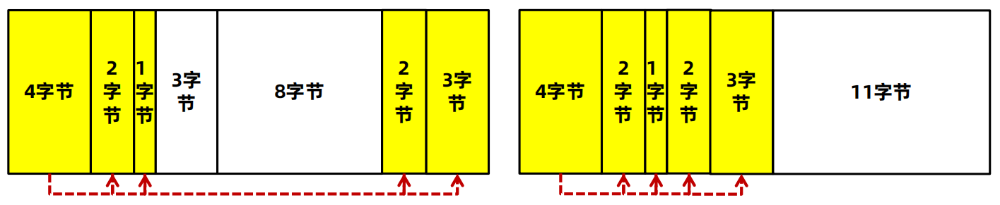

#### 3.3.5.2 优缺点

1. 内存使用效率高
- 整个堆内存都可以使用，不会像复制算法只能使用半个堆内存
2. 不会发生碎片化
- 在整理阶段可以将对象往内存的一侧进行移动，剩下的空间都是可以分配对象的有效空间
3. 整理阶段的效率不高
- 整理算法有很多种，比如Lisp2整理算法需要对整个堆中的对象搜索3次，整体性能不佳。

- 可以通过TwoFinger、表格算法、ImmixGC等高效的整理算法优化此阶段的性能

### 3.3.6 分代垃圾回收算法

#### 3.3.6.1 核心思想

现代优秀的垃圾回收算法，会将上述描述的垃圾回收算法组合进行使用，其中应用最广的就是分代垃圾回收算法(Generational GC)。

分代垃圾回收将整个内存区域划分为年轻代和老年代：

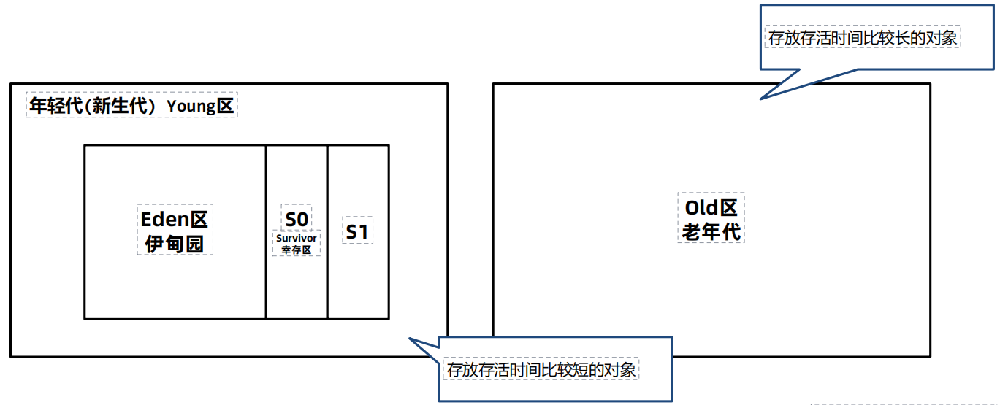

arthas查看分代之后的内存情况

在 JDK8 中，添加 -XX:+UseSerialGC 参数 使用分代回收的垃圾回收器，运行程序。

在arthas中使用memory命令查看内存，显示出三个区域的内存情况。

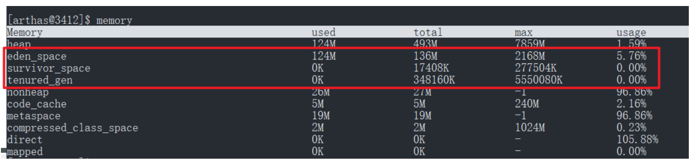

根据以下虚拟机参数，调整堆的大小并观察结果。注意加上-XX:+UseSerialGC

| 参数名                      | 参数含义                                                  | 示例                         |
|:------------------------:|:-----------------------------------------------------:|:--------------------------:|
| -Xms                     | 设置堆的最小和初始大小，必须是1024倍数，且大于1MB                          | 比如初始大小 6MB 的写法：            |
| <br/>-Xms6291456         |                                                       |                            |
| <br/>-Xms6144k           |                                                       |                            |
| <br/>-Xms6m              |                                                       |                            |
| -Xmx                     | 设置最大堆的大小，必须是1024倍数，且大于2MB                             | 比如最大堆 80MB 的写法：            |
| <br/>-Xmx83886080        |                                                       |                            |
| <br/>-Xmx81920k          |                                                       |                            |
| <br/>-Xmx80m             |                                                       |                            |
| -Xmn                     | 新生代的大小                                                | 新生代256 MB的写法：<br/>-Xmn256m |
| <br/>-Xmn262144k         |                                                       |                            |
| <br/>-Xmn268435456       |                                                       |                            |
| -XX:SurvivorRatio        | 伊甸园区和幸存区的比例，默认为8；<br/>新生代1g内存，伊甸园区800MB，S0 和 S1各100MB | 比例调整为4的写法：                 |
| <br/>-XX:SurvivorRatio=4 |                                                       |                            |
| -XX:+PrintGCDetails      |                                                       |                            |
| <br/>verbose:gc          | 打印GC日志                                                |                            |

#### 3.3.6.2 处理步骤

分代回收时，创建出来的对象，首先会被放入Eden伊甸园区。

随着对象在Eden区越来越多，如果Eden区满，新创建的对象已经无法放入，就会触发年轻代的GC，称为 Minor GC 或者 Young GC。

Minor GC会把需要eden中和From需要回收的对象回收，把没有回收的对象放入To区。

接下来，S0会变成To区，S1变成From区。当eden区满时再往里放入对象，依然会发生Minor GC。

此时会回收eden区和S1(from)中的对象，并把eden和from区中剩余的对象放入S0。

注意：每次Minor GC中都会为对象记录他的年龄，初始值为0，每次GC完加1。

如果Minor GC后对象的年龄达到阈值（最大15，默认值和垃圾回收器有关），对象就会被晋升至老年代。

当老年代中空间不足，无法放入新的对象时，先尝试minor gc，如果还是不足，就会触发Full GC，Full GC会对整个堆进行垃圾回收。

如果Full GC依然无法回收掉老年代的对象，那么当对象继续放入老年代时，就会抛出Out Of Memory异常。

#### 3.3.6.3 问题

问题1：下图中的程序为什么会出现OutOfMemory？


从上图可以看到，Full GC无法回收掉老年代的对象，那么当对象继续放入老年代时，就会抛出Out Of Memory异常。

问题2：为什么分代GC算法要把堆分成年轻代和老年代？

- 系统中的大部分对象，都是创建出来之后很快就不再使用，可以被回收的。比如用户获取订单数据，订单数据返回给用户之后就可以释放了。

- 老年代中会存放长期存活的对象，比如Spring的大部分bean对象，在程序启动之后就不会被回收了。

- 在虚拟机的默认设置中，新生代大小要远小于老年代的大小。

分代GC算法将堆分成年轻代和老年代主要原因有：

1. 可以通过调整年轻代和老年代的比例来适应不同类型的应用程序，提高内存的利用率和性能。

2. 新生代和老年代使用不同的垃圾回收算法，新生代一般选择复制算法，老年代可以选择标记-清除和标记-整理算法，由程序员来选择灵活度较高。

3. 分代的设计中允许只回收新生代（minor gc），如果能满足对象分配的要求就不需要对整个堆进行回收(fullgc)，STW时间就会减少。

## 3.4 垃圾回收器

垃圾回收器学习计划：(1和2是基础篇内容，3和4是实战篇内容)

1. 垃圾回收器的种类
- 常见的垃圾回收器及其优点和使用场景
2. 使用垃圾回收器
- 如何使用指定的垃圾回收器，并进行简单的测试
3. 垃圾回收器的实战
- 针对特定应用场景进行垃圾回收器的调优、解决垃圾回收导致的CPU占用率高的问题
4. 垃圾回收器的原理
- 垃圾回收器实现的底层原理

### 3.4.1 垃圾回收器的组合关系

垃圾回收器是垃圾回收算法的具体实现。

由于垃圾回收器分为年轻代和老年代，除了G1之外其他垃圾回收器必须成对组合进行使用。

具体的关系图如下：

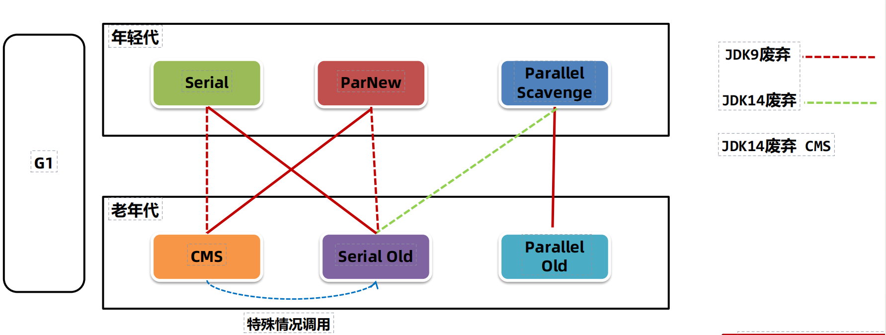

### 3.4.2 年轻代-Serial垃圾回收器

Serial是是一种单线程串行回收年轻代的垃圾回收器。


1. 回收年代和算法
- 年轻代

- 复制算法
2. 优点
- 单CPU处理器下吞吐量非常出色
3. 缺点
- 多CPU下吞吐量不如其他垃圾回收器，堆如果偏大会让用户线程处于长时间的等待
4. 适用场景
- Java编写的客户端程序或者硬件配置有限的场景

### 3.4.3 老年代-SerialOld垃圾回收器

SerialOld是Serial垃圾回收器的老年代版本，采用<font color=red>单线程串行回收</font>

<font color=red>-XX:+UseSerialGC 新生代、老年代都使用串行回收器</font>。


1. 回收年代和算法
- 老年代

- 标记-整理算法
2. 优点
- 单CPU处理器下吞吐量非常出色
3. 缺点
- 多CPU下吞吐量不如其他垃圾回收器，堆如果偏大会让用户线程处于长时间的等待
4. 适用场景
- 与 Serial垃圾回收器 搭配使用，或者在CMS特殊情况下使用

### 3.4.4 年轻代-ParNew垃圾回收器

ParNew垃圾回收器本质上是对Serial在多CPU下的优化，使用<font color=red>多线程</font>进行垃圾回收

<font color=red>-XX:+UseParNewGC 新生代使用ParNew回收器，老年代使用串行回收器</font>


1. 回收年代和算法
- 年轻代

- 复制算法
2. 优点
- 多CPU处理器下停顿时间较短
3. 缺点
- 吞吐量和停顿时间不如G1，所以在JDK9之后不建议使用
4. 适用场景
- JDK8及之前的版本中，与CMS老年代垃圾回收器搭配使用

### 3.4.5 老年代-CMS垃圾回收器

#### 3.4.5.1 概念

CMS，即 Concurrent Mark Sweep 的缩写

CMS垃圾回收器关注的是系统的<font color=red>暂停时间</font>，允许用户线程和垃圾回收线程在某些步骤中同时执行，减少了用户线程的等待时间。

参数：XX:+UseConcMarkSweepGC

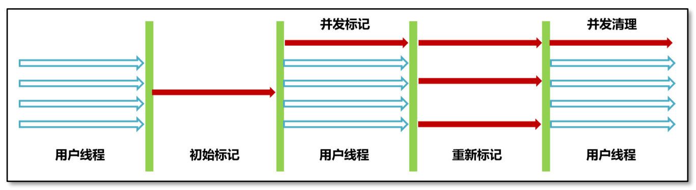

1. 回收年代和算法
- 老年代

- 标记清除算法
2. 优点
- 系统由于垃圾回收出现的停顿时间较短，用户体验好
3. 缺点
- 内存碎片问题

- 退化问题

- 浮动垃圾问题
4. 适用场景
- 大型的互联网系统中用户请求数据量大、频率高的场景，比如订单接口、商品接口等

#### 3.4.5.2 CMS执行步骤

1. 初始标记，用极短的时间标记出GCRoots能直接关联到的对象。

2. 并发标记, 标记所有的对象，用户线程不需要暂停。

3. 重新标记，由于并发标记阶段有些对象会发生了变化，存在错标、漏标等情况，需要重新标记。

4. 并发清理，清理死亡的对象，用户线程不需要暂停。

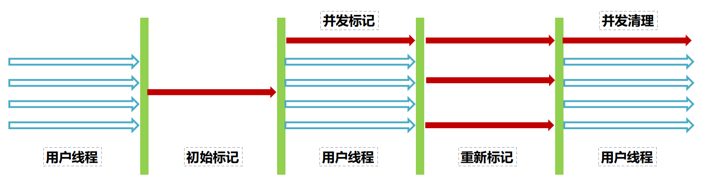

#### 3.4.5.3 CMS垃圾回收器存在的问题

缺点：

1. CMS使用了标记-清除算法，在垃圾收集结束之后会出现大量的内存碎片，CMS会在Full GC时进行碎片的整理。这样会导致用户线程暂停，可以使用-XX:CMSFullGCsBeforeCompaction=N 参数（默认0）调整N次Full GC之后再整理。

2. 无法处理在并发清理过程中产生的“浮动垃圾”，不能做到完全的垃圾回收。

3. 如果老年代内存不足无法分配对象，CMS就会退化成Serial Old单线程回收老年代。

线程资源争抢问题：

- 在CMS中并发阶段，运行时的线程数可以通过 **-XX:ConcGCThreads** 参数设置，默认值为0，由系统计算得出。

- 计算公式为 (-XX:ParallelGCThreads定义的线程数+ 3) / 4，ParallelGCThreads是STW停顿之后的并行线程数

- ParallelGCThreads是由处理器核数决定的：
  
  1. 当cpu核数小于8时，ParallelGCThreads = CPU核数
  
  2. 否则 ParallelGCThreads = 8 + (CPU核数 – 8 )*5/8

- 由于CPU的核心数有限，就会影响用户线程执行的性能。

### 3.4.6 年轻代-Parallel Scavenge垃圾回收器

Parallel Scavenge是 JDK8 默认的年轻代垃圾回收器，多线程并行回收，关注的是系统的吞吐量。具备自动调整堆内存大小的特点。

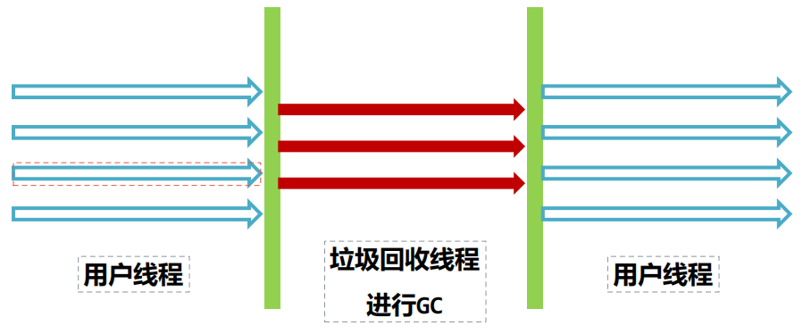

1. 回收年代和算法
- 年轻代

- 复制算法
2. 优点
- 吞吐量高，而且手动可控。为了提高吞吐量，虚拟机会动态调整堆的参数
3. 缺点
- 不能保证单次的停顿时间
4. 适用场景
- 后台任务，不需要与用户交互，并且容易产生大量的对象
- 比如：大数据的处理，大文件导出

Parallel Scavenge允许手动设置最大暂停时间和吞吐量。

Oracle官方建议在使用这个组合时，不要设置堆内存的最大值，垃圾回收器会根据最大暂停时间和吞吐量自动调整内存大小。

1. 最大暂停时间
- -XX:MaxGCPauseMillis=n，设置每次垃圾回收时的最大停顿毫秒数
2. 吞吐量
- -XX:GCTimeRatio=n
3. 自动调整内存大小
- -XX:+UseAdaptiveSizePolicy 设置可以让垃圾回收器根据吞吐量和最大停顿的毫秒数自动调整内存大小

### 3.4.7 老年代-Parallel Old垃圾回收器

Parallel Old是为Parallel Scavenge收集器设计的老年代版本，利用多线程并发收集。

参数：-XX:+UseParallelGC 或 -XX:+UseParallelOldGC 可以使用 Parallel Scavenge + Parallel Old这种组合。

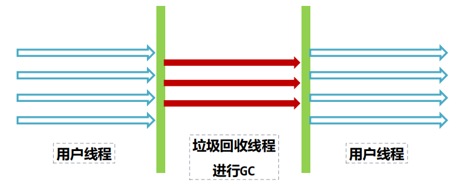

1. 回收年代和算法
- 老年代

- 标记-整理算法
2. 优点
- 并发收集，在多核CPU下效率较高
3. 缺点
- 暂停时间会比较长
4. 适用场景
- 与Parallel Scavenge配套使用

### 3.4.8 G1垃圾回收器

JDK9之后默认的垃圾回收器是G1（Garbage First）垃圾回收器。

Parallel Scavenge关注吞吐量，允许用户设置最大暂停时间，但是会减少年轻代可用空间的大小。

CMS关注暂停时间，但是吞吐量方面会下降。

而G1设计目标就是将上述两种垃圾回收器的优点融合：

1. 支持巨大的堆空间回收，并有较高的吞吐量。

2. 支持多CPU并行垃圾回收。

3. 允许用户设置最大暂停时间。

<font color=red>JDK9之后强烈建议使用G1垃圾回收器</font>。

#### 3.4.8.2 内存结构

G1出现之前的垃圾回收器，内存结构一般是连续的，如下图：

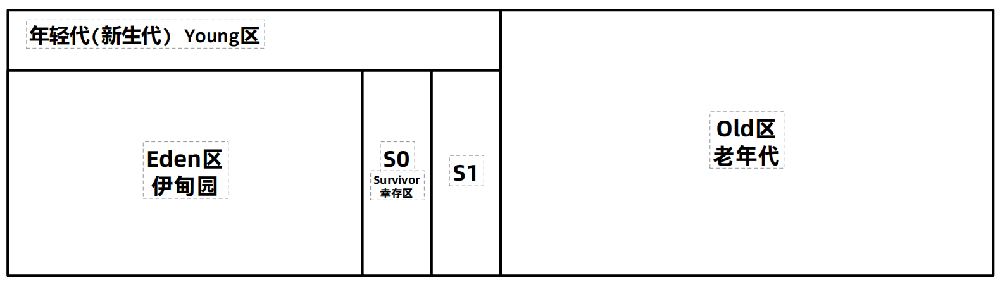

G1的整个堆会被划分成多个大小相等的区域，称之为区Region，区域不要求是连续的。分为Eden、Survivor、Old区。Region的大小通过堆空间大小/2048计算得到，也可以通过参数-XX:G1HeapRegionSize=32m指定(其中32m指定region大小为32M)，Region size必须是2的指数幂，取值范围从1M到32M。

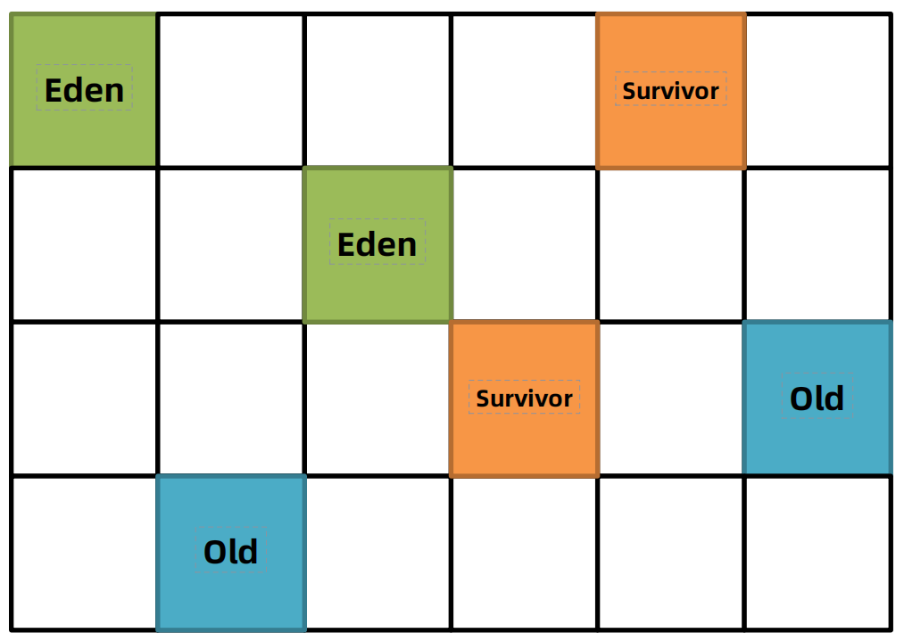

G1垃圾回收有两种方式：

1、年轻代回收（Young GC）

2、混合回收（Mixed GC）

#### 3.4.8.3 G1垃圾回收器–年轻代回收

年轻代回收（Young GC），回收Eden区和Survivor区中不用的对象。会导致STW，G1中可以通过参数 -XX:MaxGCPauseMillis=n（默认200）设置每次垃圾回收时的最大暂停时间毫秒数，G1垃圾回收器会尽可能地保证暂停时间。

执行流程

1、新创建的对象会存放在Eden区。当G1判断年轻代区不足（max默认60%），无法分配对象时需要回收时会执行

Young GC。

2、标记出Eden和Survivor区域中的存活对象，

3、根据配置的最大暂停时间选择某些区域将存活对象复制到一个新的Survivor区中（年龄+1），清空这些区域。

G1在进行Young GC的过程中会去记录每次垃圾回收时每个Eden区和Survivor区的平均耗时，以作为下次回收时的参考依据。这样就可以根据配置的最大暂停时间计算出本次回收时最多能回收多少个Region区域了。

比如-XX:MaxGCPauseMillis=n（默认200），每个Region回收耗时40ms，那么这次回收最多只能回收4个Region。

4、后续Young GC时与之前相同，只不过Survivor区中存活对象会被搬运到另一个Survivor区。

5、当某个存活对象的年龄到达阈值（默认15），将被放入老年代。

6、部分对象如果大小超过Region的一半，会直接放入老年代，这类老年代被称为Humongous区。比如堆内存是4G，每个Region是2M，只要一个大对象超过了1M就被放入Humongous区，如果对象过大会横跨多个Region。

7、多次回收之后，会出现很多Old老年代区，此时总堆占有率达到阈值时

（-XX:InitiatingHeapOccupancyPercent默认45%）会触发混合回收MixedGC。回收所有年轻代和

部分老年代的对象以及大对象区。采用复制算法来完成。

#### 3.4.8.4 G1垃圾回收器–混合回收

混合回收分为：初始标记（initial mark）、并发标记（concurrent mark）、最终标记（remark或者Finalize Marking）、并发清理（cleanup）

G1对老年代的清理会选择存活度最低的区域来进行回收，这样可以保证回收效率最高，这也是G1（Garbage first）名称的由来。

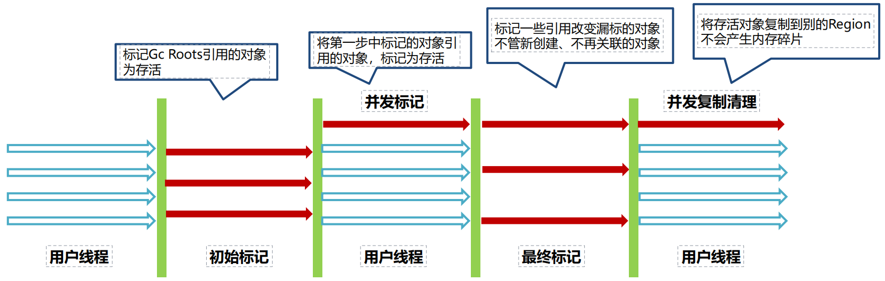

⚫G1对老年代的清理会选择存活度最低的区域来进行回收，这样可以保证回收效率最高，这也是G1（Garbage first）名称的由来。

最后清理阶段使用复制算法，不会产生内存碎片。

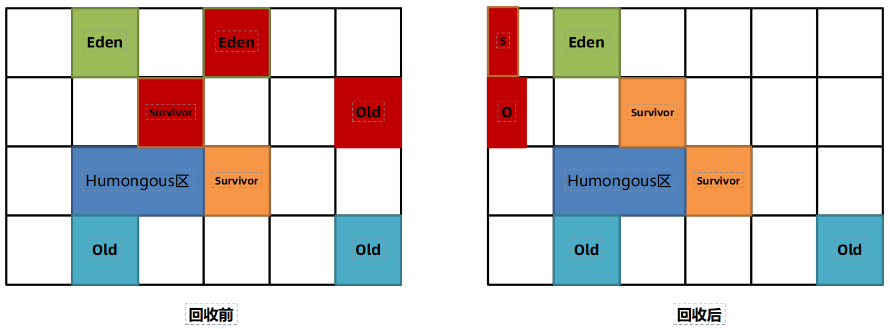

G1垃圾回收器–FULL GC

注意：如果清理过程中发现没有足够的空Region存放转移的对象，会出现Full GC。单线程执行标记-整理算法，

此时会导致用户线程的暂停。所以尽量保证应该用的堆内存有一定多余的空间。

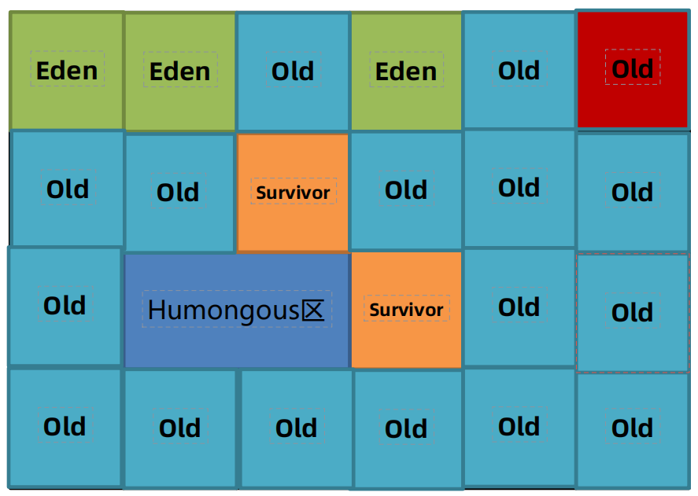

#### 3.4.8.4 G1 – Garbage First 垃圾回收器

参数1：-XX:+UseG1GC 打开G1的开关，JDK9之后默认不需要打开

参数2：-XX:MaxGCPauseMillis=毫秒值，最大暂停的时间

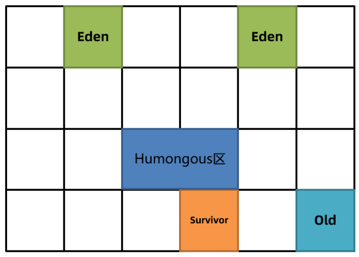

1. 回收年代和算法
- 年轻代+老年代

- 复制算法
2. 优点
- 对比较大的堆如超过6G的堆回收时，延迟可控

- 不会产生内存碎片

- 并发标记的SATB算法效率高
3. 缺点
- JDK8之前还不够成熟
4. 适用场景
- JDK8最新版本、JDK9之后建议默认使用

### 3.4.9 总结

垃圾回收器的组合关系虽然很多，但是针对几个特定的版本，比较好的组合选择如下：

1. JDK8及之前：
- ParNew + CMS（关注暂停时间）、Parallel Scavenge + Parallel Old (关注吞吐量)、G1（JDK8之前不建议，较大堆并且关注暂停时间）
2. JDK9之后：
- G1（默认）

从JDK9之后，由于G1日趋成熟，JDK默认的垃圾回收器已经修改为G1，所以强烈建议在生产环境上使用G1。

G1的实现原理将在《原理篇》中介绍，更多前沿技术ZGC、GraalVM将在《高级篇》中介绍。

1、Java中有哪几块内存需要进行垃圾回收？

2、有哪几种常见的引用类型？

3、有哪几种常见的垃圾回收算法？

4、常见的垃圾回收器有哪些？
