# JVM实战

实战篇从三方面利用Java虚拟机进行生产环境线上问题解决以及性能问题的优化。

1. 内存调优
- 什么是内存泄漏

- 监控Java内存的常用工具

- 内存泄漏的常见场景

- 内存泄漏的解决方案
2. GC调优
- 学习如何分析GC日志

- 解决生产环境由于频繁Full GC导致的系统假死问题
3. 性能调优
- 学习如何使用JMH性能测试框架进行性能测试

- 精准定位线上系统性能问题的根源，进行性能调优

# 1. 内存调优

## 1.1 内存溢出和内存泄漏

- <font color=red>内存泄漏</font>（memory leak）：在Java中如果不再使用一个对象，但是该对象依然在GC ROOT的引用链上，这个对象就不会被垃圾回收器回收，这种情况就称之为<font color=red>内存泄漏</font>。

- 内存泄漏绝大多数情况都是由<font color=red>堆内存</font>泄漏引起的，所以后续没有特别说明，则讨论的都是堆内存泄漏。

- 少量的内存泄漏可以容忍，但是如果发生持续的内存泄漏，就像滚雪球，雪球越滚越大，不管有多大的内存迟早会被消耗完，最终导致的结果就是<font color=red>内存溢出</font>。<font color=red>但是产生内存溢出并不是只有内存泄漏这一种原因</font>。

### 1.1.1 内存泄漏的常见场景

#### 1.1.1.1 场景1

内存泄漏导致溢出的常见场景是大型的Java后端应用中，在处理用户的请求之后，没有及时将用户的数据删除。随着用户请求数量越来越多，内存泄漏的对象占满了堆内存最终导致内存溢出。

这种产生的内存溢出会直接导致用户请求无法处理，影响用户的正常使用。重启可以恢复应用使用，但是在运行一段时间之后，依然会出现内存溢出。

#### 1.1.1.2 场景2

第二种常见场景是分布式任务调度系统，如Elastic-job、Quartz等进行任务调度时，被调度的Java应用在调度任务结束中出现了内存泄漏，最终导致多次调度之后内存溢出。

这种产生的内存溢出会导致应用执行下次的调度任务执行。同样重启可以恢复应用使用，但是在调度执行一段时间之后依然会出现内存溢出。

## 1.2 解决内存溢出的方法

解决内存溢出的步骤总共分为四个步骤，其中前两个步骤是最核心的：

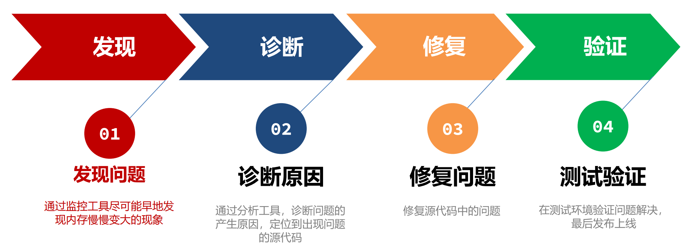

### 1.2.1 发现问题 - 工具

#### 1.2.1.1 Top命令

- top命令是linux下用来查看系统信息的一个命令，它提供给我们去实时地去查看系统的资源，比如执行时的进程、线程和系统参数等信息。

- 进程使用的内存为 RES（常驻内存）- SHR（共享内存）

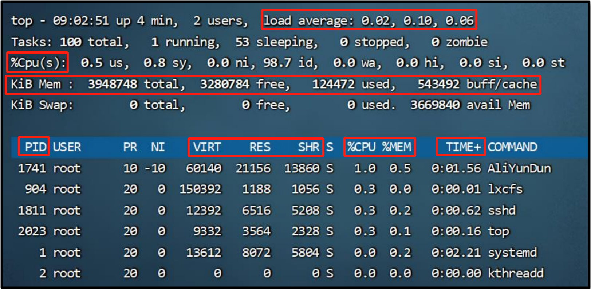

- load average：过去1分钟、5分钟、10分钟的系统负载情况。
  
  - 系统的负载的第一个值为1，表示过去1分钟内系统所有CPU都出忙碌中，没有一点空闲时间。
  
  - 死循环等情况，会导致CPU持续地跑着。

- KiB Mem：第一个total表示系统的总内存，free表示当前空闲的内存，used表示当前使用的内存，buff/cache表示缓存

- PID：进程ID，与通过PS等命令查询出来的值是一样的

- VIRT：虚拟内存

- RES：常驻内存，当前程序使用的内存（关注重点）。通过 RES - SHR 计算出当前程序真正使用的内存大小

- SHR：共享内存，当前程序依赖的第三方库，这些库是在多个程序中都有使用。

- %CPU：表示当前进程对CPU的使用率，如果是1，表示对CPU使用了1%的时间。该值长期保持了一个比较大的值，那么就说明可能出现死循环等问题

- %MEM：进程使用的内存占比实际的可用物理内存，如果该值比较大，而Mem 的 free有比较小，那么系统内存不足就是由该进程引起的。

- TIME+：表示该进程启动到现在累计的时间

在 top 命令的打印结果框中，输入大写的M，就会按照内存占比由大到小的排序；输入大写的C，就会按照CPU占比由大到小排序。

**优点：**

- 操作简单

- 无额外的软件安装

**缺点：**

- 只能查看最基础的进程信息，无法查看到每个部分的内存占用（堆、方法区、堆外）

#### 1.2.1.2 VisualVM

- VisualVM是多功能合一的Java故障排除工具并且他是一款可视化工具，整合了命令行 JDK 工具和轻量级分析功能，功能非常强大。

- 这款软件在Oracle JDK 6~8 中发布，但是在 Oracle JDK 9 之后不在JDK安装目录下需要单独下载。下载地址： https://visualvm.github.io/

优点：

- 功能丰富，实时监控CPU、内存、线程等详细信息

- 支持Idea插件，开发过程中也可以使用

缺点：

- 对大量集群化部署的Java进程需要手动进行管理

##### 简单使用

1. 本地解压安装
   
   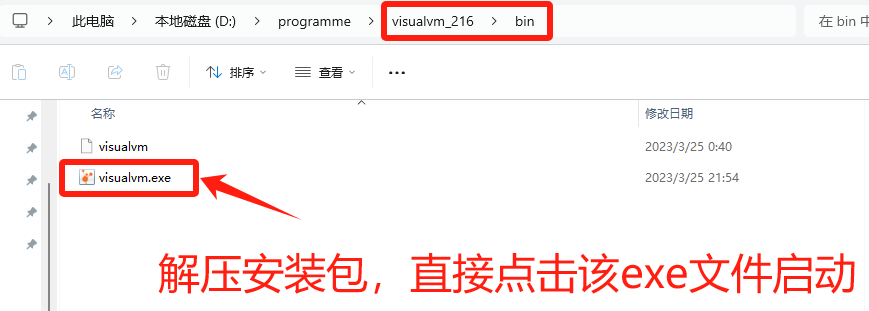
   
   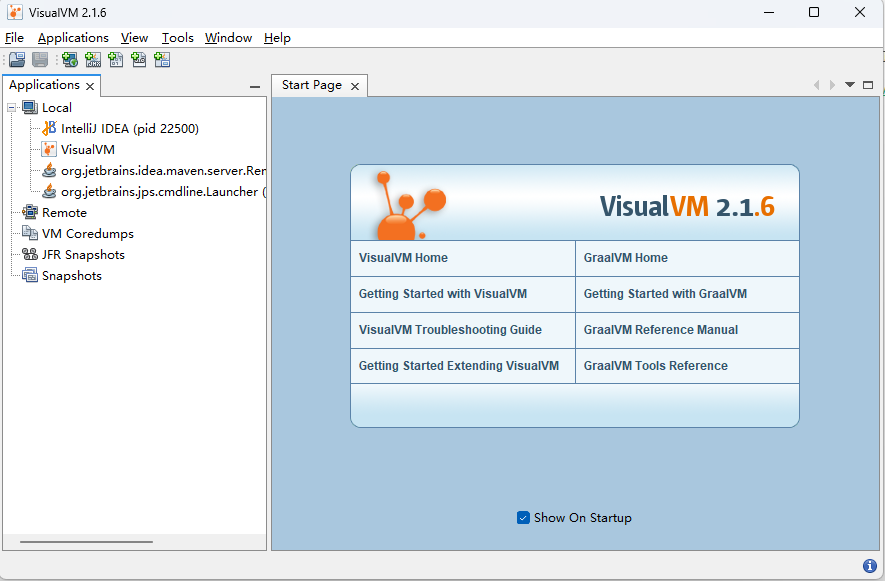
- 启动过程中报错：cannot find java 1.8 or higher，修改VisulaVM 安装包 etc目录下visualvm.conf文件 `visualvm_jdkhome="D:\jdk-17.0.8`
2. 使用VisualVM查看内存情况
   
   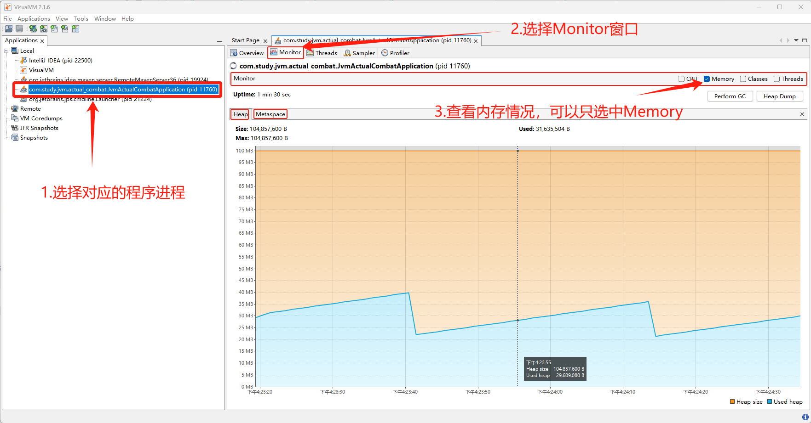

##### Idea中使用

1. 安装对应的插件
   
   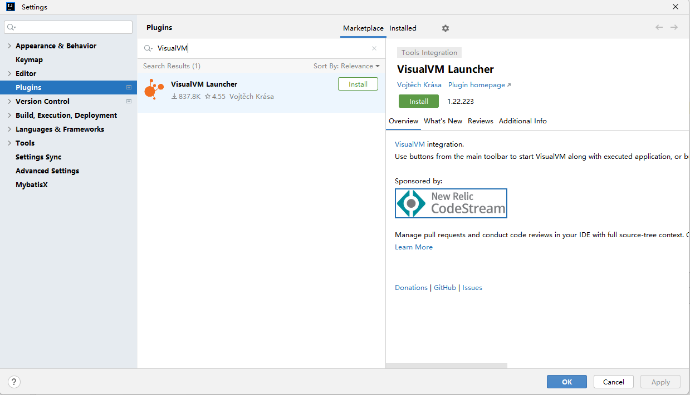

2. Settings中配置VisualVM Launcher，设置自己安装的visualvm目录
   
   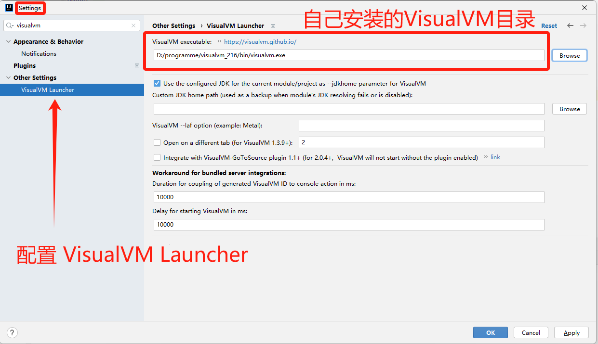

3. 通过 visualvm 启动程序
   
   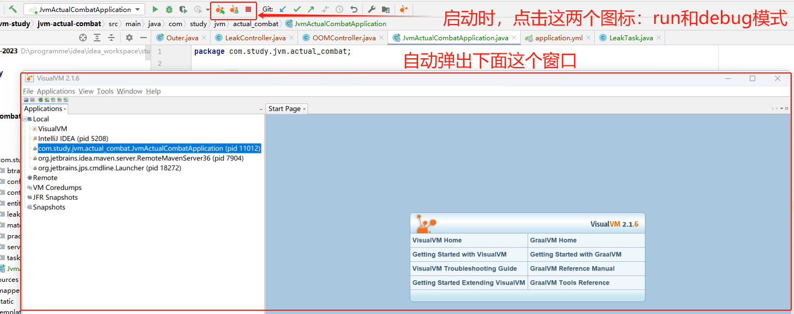

##### 连接远程程序使用

1. 在服务器上启动程序时，添加以下参数：
   
   ```bash
   java -jar -Djava.rmi.server.hostname=192.168.80.4 -Dcom.sun.management.jmxremote -Dcom.sun.management.jmxremote.port=9122 -Dcom.sun.management.jmxremote.ssl=false -Dcom.sun.management.jmxremote.authenticate=false jvm-service.jar
   ```

2. 上述程序在服务器上启动完成后，在VisualVM中选中Remote，右击选择Add Remote Host，输入ip
   
   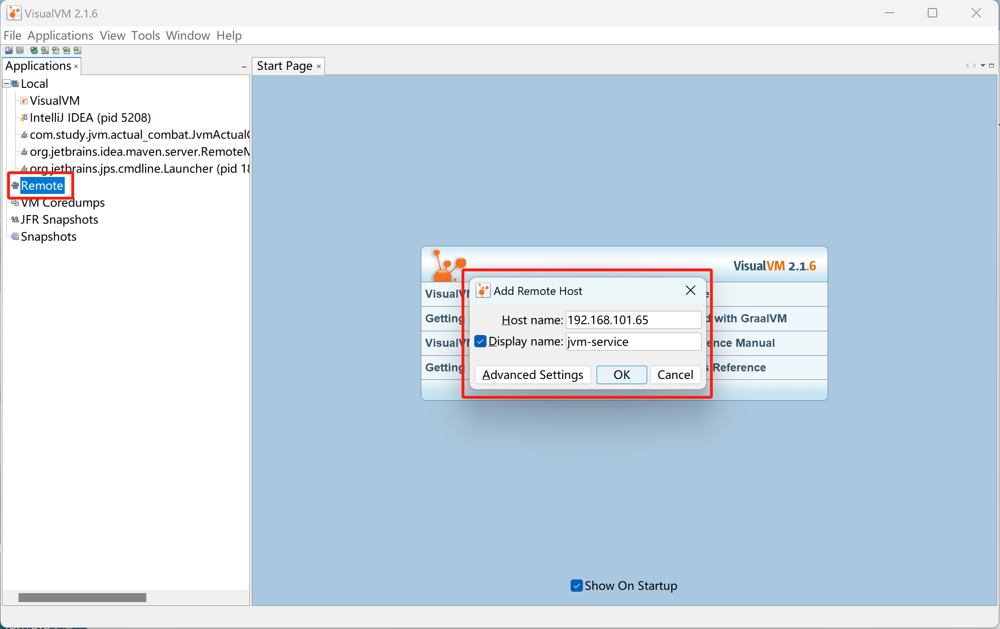

3. 接着在Remote中选择刚刚创建的jvm-service，右击，选择Add JMX Connection，输入对应的端口号，并取消SSL Connection
   
   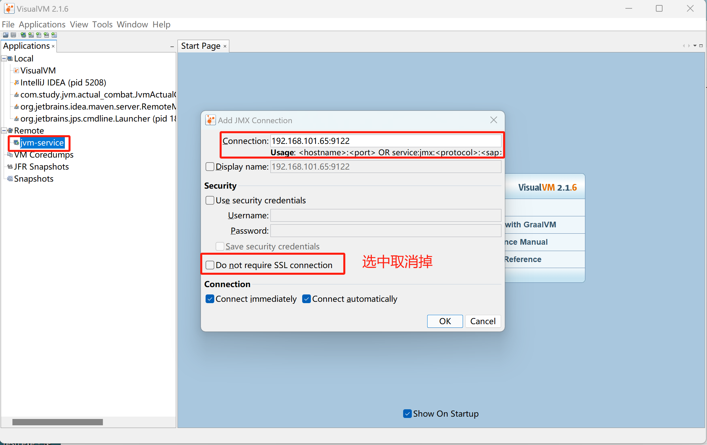

4. 查看结果
   
   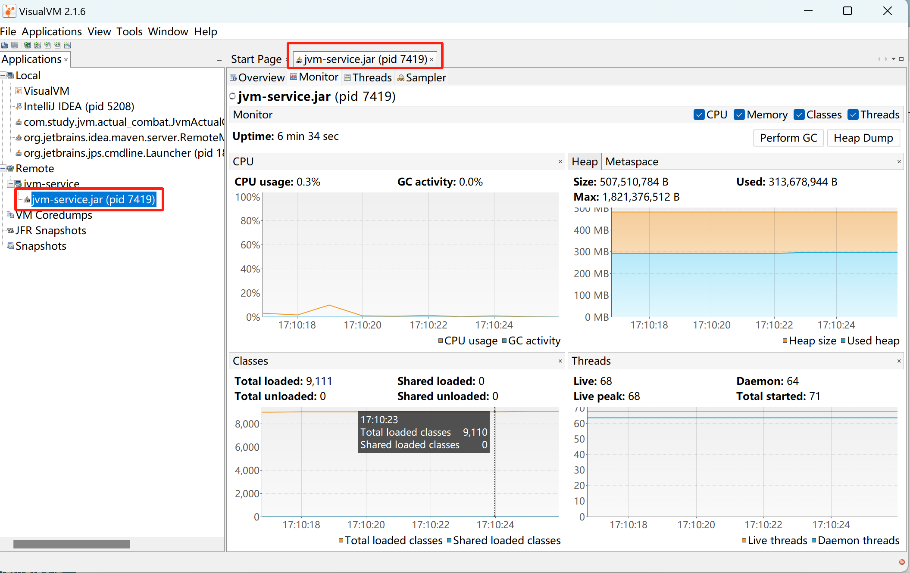

#### 1.2.1.3 Arthas

Arthas 是一款线上监控诊断产品，通过全局视角实时查看应用 load、内存、gc、线程的状态信息，并能在不修改应用代码的情况下，对业务问题进行诊断，包括查看方法调用的出入参、异常，监测方法执行耗时，类加载信息等，大大提升线上问题排查效率。

优点：

- 功能强大，不止于监控基础的信息，还能监控单个方法的执行耗时等细节内容。

- 支持应用的集群管理

缺点：

- 部分高级功能使用门槛较高

##### 案例：使用阿里arthas tunnel管理所有的需要监控的程序

**背景：**

        小李的团队已经普及了arthas的使用，但是由于使用了微服务架构，生产环境上的应用数量非常多，使用arthas还得登录到每一台服务器上再去操作非常不方便。他看到官方文档上可以使用tunnel来管理所有需要监控的程序。

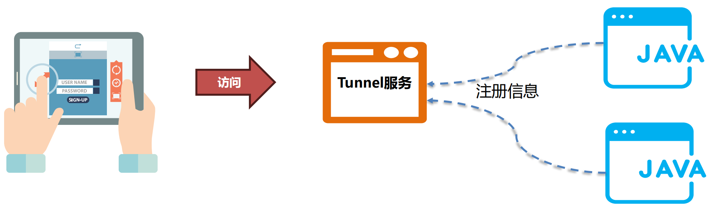

**步骤：**

1. 在Spring Boot程序中添加arthas的依赖(支持Spring Boot2)，在配置文件中添加tunnel服务端的地址，便于tunnel去监控所有的程序。
   
   ```xml
   <!-- 添加arthas的相关依赖，将其信息注册到tunnel服务上 -->
   <dependency>
      <groupId>com.taobao.arthas</groupId>
      <artifactId>arthas-spring-boot-starter</artifactId>
      <version>3.7.1</version>
   </depend
   ```
   
   ```yaml
   arthas:
     # tunnel地址，目前是部署在同一台服务器，正式环境需要拆分
     tunnel-server: ws://localhost:7777/ws
     # tunnel显示的应用名称，直接使用应用名
     app-name: ${spring.application.name}
     # arthas http访问的端口和远程连接的端口
     http-port: 8888
     telnet-port: 9999
   ```

2. 将tunnel服务端程序部署在某台服务器上并启动，添加参数：-Darthas.enable-detail-pages=true
   
   ```bash
   nohup java -jar -Darthas.enable-detail-pages=true arthas-tunnel-server-3.7.1-fatjar.jar &
   ```
   
   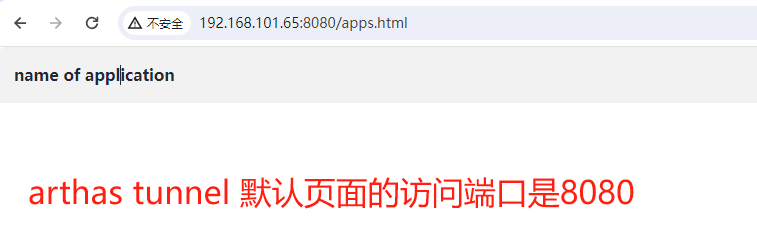

3. 启动 java程序，配置端口号参数防止重复
   
   ```bash
   nohup java -jar -Dserver.port=8081 -Darthas.http-port=3661 -Darthas.telnet-port=8565 jvm-service.jar &
   nohup java -jar -Dserver.port=8082 -Darthas.http-port=3662 -Darthas.telnet-port=8566 jvm-service.jar &
   ```

4. 打开tunnel的服务端页面，查看所有的进程列表，并选择进程进行arthas的操作。（以下是在192.168.80.4服务器上测试，与上面的不一致）
   
   - 访问 http://192.168.80.4:8080/apps.html 地址
     
     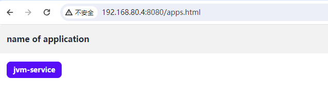
   
   - 点击 jvm-service，产看对应服务的不同节点
     
     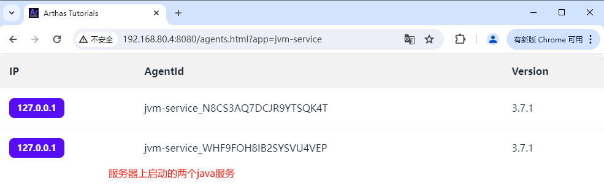
   
   - 点击任意一个进入该程序的arthas界面，查看相应的内存，垃圾回收等信息
     
     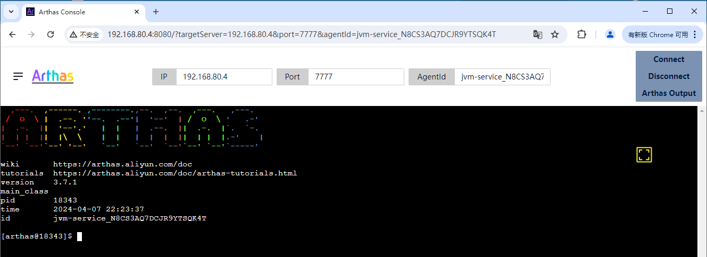

#### 1.2.1.4 Prometheus + Grafana

- Prometheus+Grafana是企业中运维常用的监控方案，其中Prometheus用来采集系统或者应用的相关数据，同时具备告警功能。Grafana可以将Prometheus采集到的数据以可视化的方式进行展示。

- Java程序员要学会如何读懂Grafana展示的Java虚拟机相关的参数。

优点：

- 支持系统级别和应用级别的监控，比如linux操作系统、Redis、MySQL、Java进程。

- 支持告警并允许自定义告警指标，通过邮件、短信等方式尽早通知相关人员进行处理

缺点：环境搭建较为复杂，一般由运维人员完成

步骤：

##### 1.2.1.4.1 actuator组件暴露spring boot信息

- spring boot 的监控功能使用
1. 添加spring boot 的 监控依赖
   
   ```xml
   <dependency>
      <groupId>org.springframework.boot</groupId>
      <artifactId>spring-boot-starter-actuator</artifactId>
      <exclusions><!-- 去掉springboot默认配置 -->
          <exclusion>
              <groupId>org.springframework.boot</groupId>
              <artifactId>spring-boot-starter-logging</artifactId>
          </exclusion>
      </exclusions>
   </dependency>
   ```

2. 配置web的监控端口信息
   
   ```yaml
   management:
     endpoints:
       web:
         exposure:
           include: '*' #开放所有端口
   ```

3. 启动程序，访问 http://localhost:8881/actuator 测试，会查看到服务中的监控信息接口地址
   
   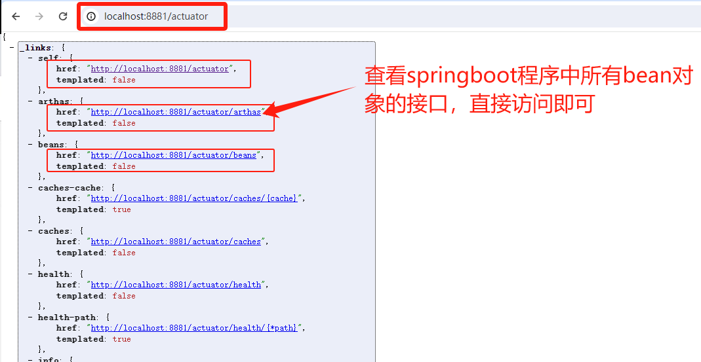

4. 任选其中一个其中地址访问，此处使用 http://localhost:8881/actuator/beans 查看Bean信息
   
   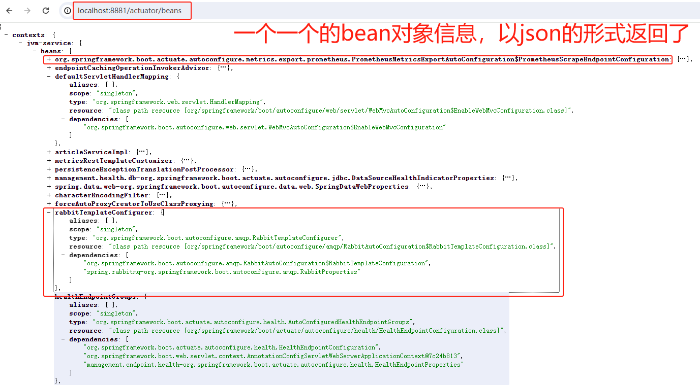

##### 1.2.1.4.2 Prometheus的使用

- 通过 Prometheus 暴露所有需要用的信息
1. 添加依赖
   
   ```xml
   <!-- 将java的基本信息，虚拟机的信息，以及磁盘等信息全部收集起来，组装成prometheus能识别的数据信息 -->
   <dependency>
      <groupId>io.micrometer</groupId>
      <artifactId>micrometer-registry-prometheus</artifactId>
      <scope>runtime</scope>
   </dependency>
   ```

2. 配置文件中添加Prometheus配置：将此服务的虚拟机等信息暴露出去，并且将此暴露的服务命名为 “jvm-test”
   
   ```yaml
   management:
     endpoint:
       metrics:
         enabled: true # 支持metrics
       prometheus:
         enabled: true #支持Prometheus
     metrics:
       export:
         prometheus:
           enabled: true
       tags:
         application: jvm-test #实例名采集
   ```

3. 通过 spring boot actuator 查看 Prometheus 接口信息
   
   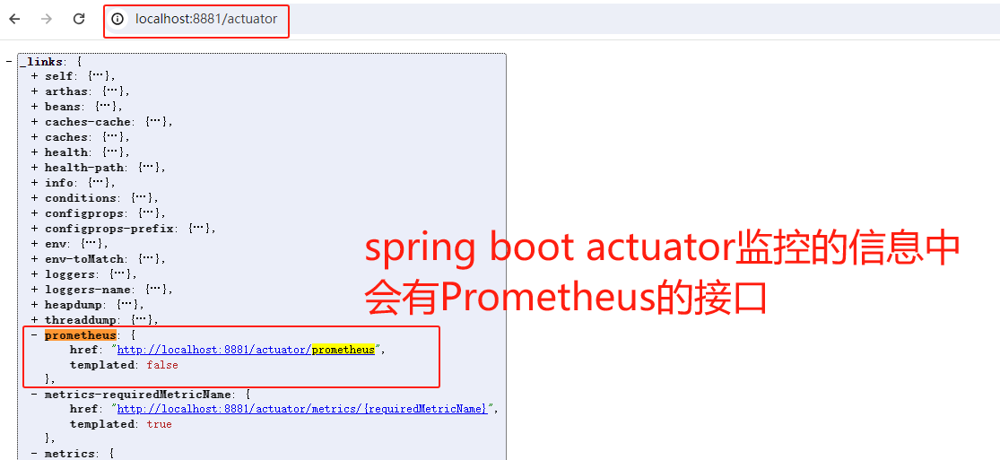

4. 通过Prometheus的查询接口，查询测试
   
   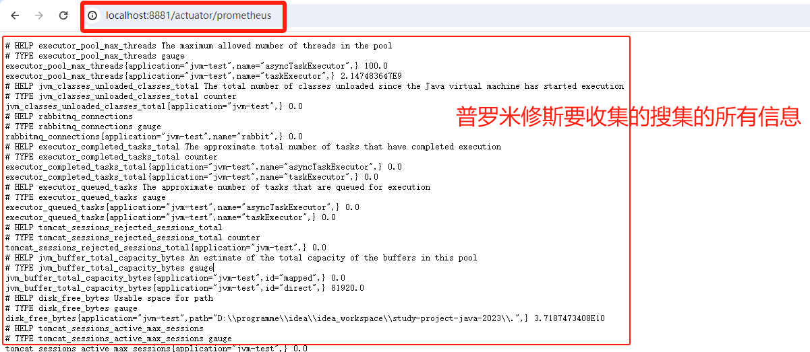

5. 安装 Promethues 的服务器，通过Grafana分析数据，略 。。。
   
   具体内容查看： https://upwer66cqk.feishu.cn/wiki/Y5tNwJgL0i1wd9kauAAczM2znWg 

### 1.2.2 发现问题 - 堆内存状况的对比

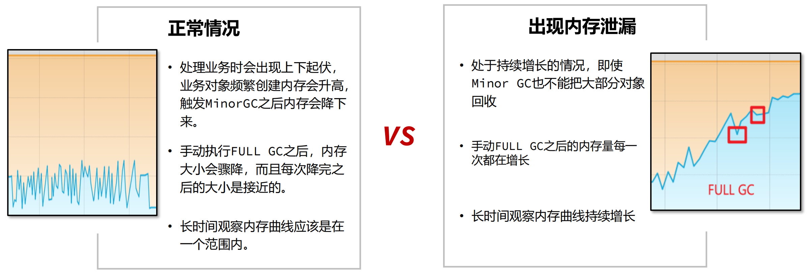

#### 1.2.2.1 产生内存溢出原因一 ：代码中的内存泄漏

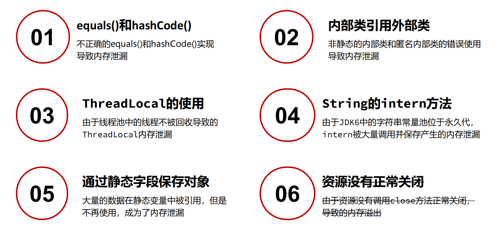

##### 案例1：equals()和hashCode()导致的内存泄漏

**问题：** （出现频率2星）

        在定义新类时没有重写正确的equals()和hashCode()方法。在使用HashMap的场景下，如果使用这个类对象作为key，HashMap在判断key是否已经存在时会使用这些方法，如果重写方式不正确，会导致相同的数据被保存多份

**正常情况：**

1. 以JDK8为例，首先调用hash方法计算key的哈希值，hash方法中会使用到key的hashcode方法。根据hash方法的结果决定存放的数组中位置。

2. 如果没有元素，直接放入。如果有元素，先判断key是否相等，会用到equals方法，如果key相等，直接替换value；key不相等，走链表或者红黑树查找逻辑，其中也会使用equals比对是否相同。

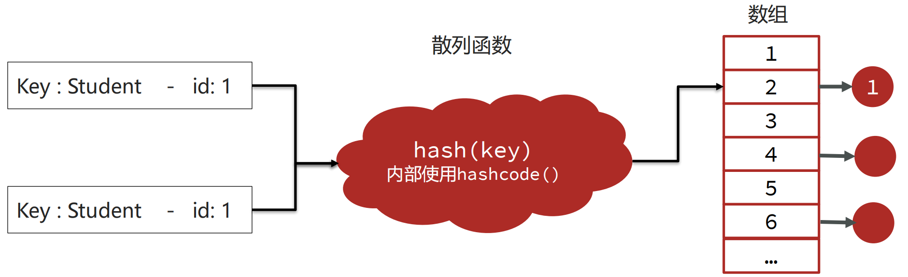

**异常情况：**

1. hashCode方法实现不正确，会导致相同id的学生对象计算出来的hash值不同，可能会被分到不同的槽中。
   
   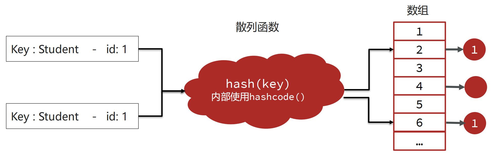

2. equals方法实现不正确，会导致key在比对时，即便学生对象的id是相同的，也被认为是不同的key。
   
   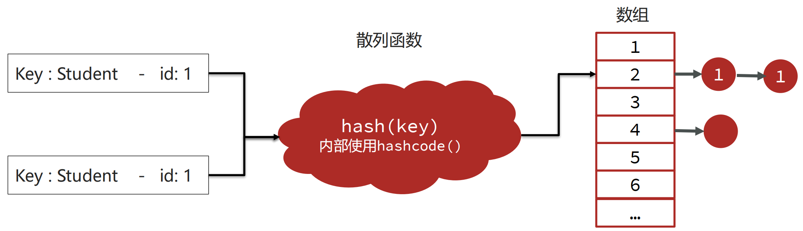

3. 长时间运行之后HashMap中会保存大量相同id的学生数据。
   
   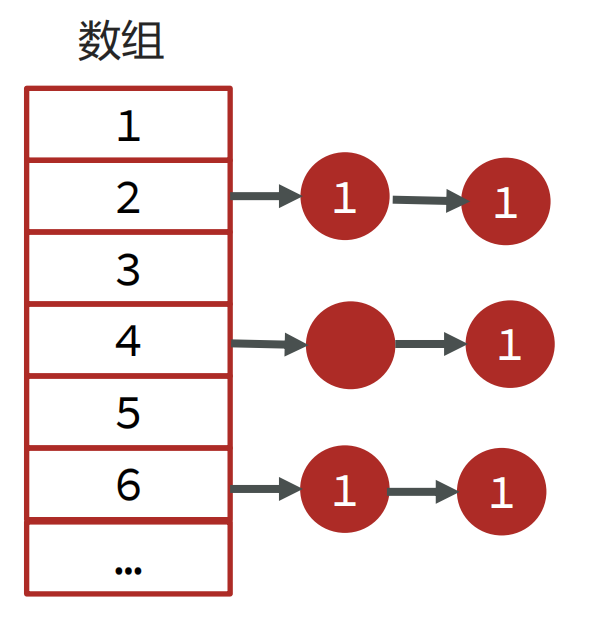

**解决方案：**

1. 在定义新实体时，始终重写equals()和hashCode()方法。

2. 重写时一定要确定使用了唯一标识去区分不同的对象，比如用户的id等。

3. hashmap使用时，尽量使用编号id等数据作为key，不要将整个实体类对象作为key存放。

##### 案例2：内部类引用外部类

**问题：** (出现频率2星)

1. 非静态的内部类默认会持有外部类，尽管代码上不再使用外部类，所以如果有地方引用了这个非静态内部类，会导致外部类也被引用，垃圾回收时无法回收这个外部类。
   
   ```java
   package com.study.jvm.actual_combat.memory_leak.demo3;
   
   import java.io.IOException;
   import java.util.ArrayList;
   
   /**
    * 内存泄露问题：内部类引用外部类
    */
   public class Outer {
       private byte[] bytes = new byte[1024]; // 外部类持有数据：1KB
       private String name = "测试";
   
       class Inner {
           private String name;
   
           public Inner() {
               // 内部类引用了外部类的成员，外部类的变量是成员变量，内部类是通过
               this.name = Outer.this.name;
           }
       }
   
       public static void main(String[] args) throws IOException, InterruptedException {
           System.in.read();
           int count = 0;
           ArrayList<Inner> inners = new ArrayList<>();
   
           while (true) {
               if (count++ % 100 == 0) {
                   Thread.sleep(10);
               }
               inners.add(new Outer().new Inner());
           }
       }
   }
   ```

2. 匿名内部类对象如果在非静态方法中被创建，会持有调用者对象，垃圾回收时无法回收调用者。
   
   ```java
   package com.study.jvm.actual_combat.memory_leak.demo4;
   
   import java.io.IOException;
   import java.util.ArrayList;
   import java.util.List;
   
   /**
    * 内存泄露问题：内部类引用外部类情况2
    * 匿名内部类对象如果在非静态方法中被创建，会持有调用者对象，垃圾回收时无法回收调用者。
    */
   public class Outer {
       private byte[] bytes = new byte[1024 * 1024]; // 1M
       public List<String> newList() {
           // 使用匿名内部类的方式创建了数组对象，并将其返回
           List<String> list = new ArrayList<String>() {{
               add("1");
               add("2");
           }};
           return list;
       }
   
       public static void main(String[] args) throws IOException {
           System.in.read();
           int count = 0;
           ArrayList<Object> objects = new ArrayList<>();
           while (true) {
               System.out.println(++count);
               /*
                   将通过匿名内部类创建的对象放入到objects数组中，但是运行过程中发现内存中有Outer对象，但它是不需要的，所以造成了内存泄漏。
                   此处虽然无法拿到Outer对象，但是他在内存中占着空间
                */
               objects.add(new Outer().newList());
           }
       }
   }
   ```
   
    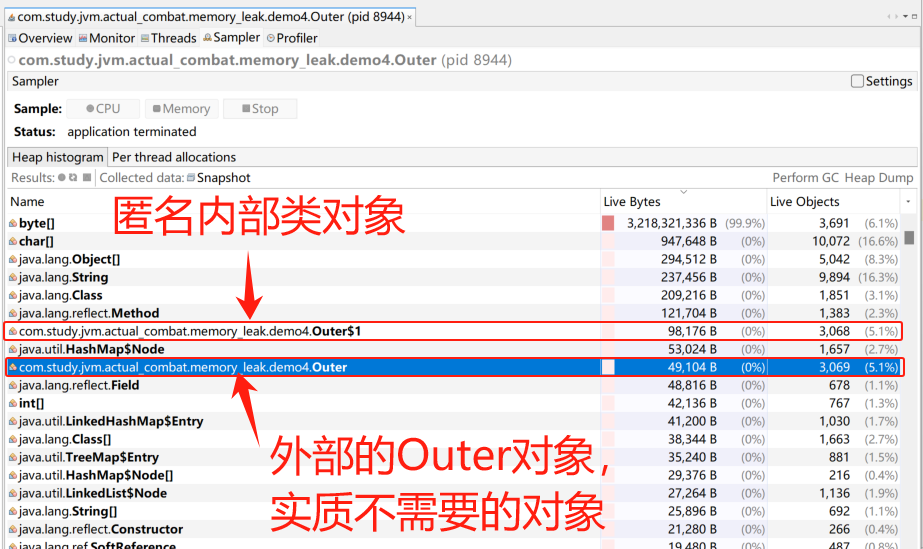   

**解决方案：**

1. 这个案例中，使用内部类的原因是可以直接获取到外部类中的成员变量值，简化开发。如果不想持有外部类对象，应该使用静态内部类。

2. 使用静态方法，可以避免匿名内部类持有调用者对象。(以下图片是上述代码内存泄漏的原因)
   
   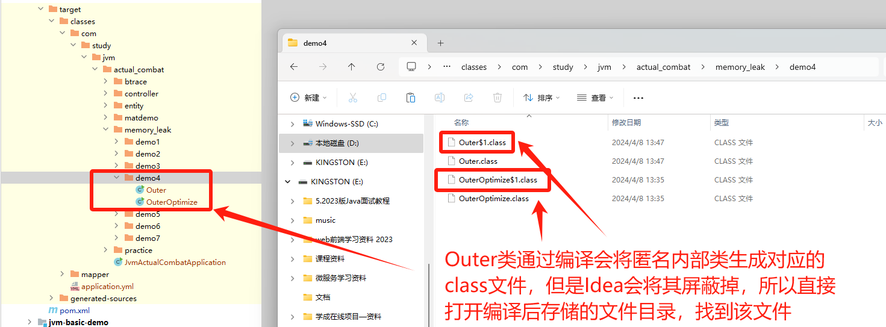
   
   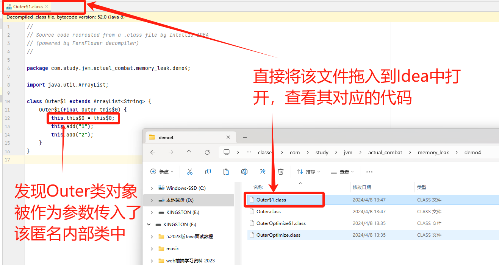

##### 案例3：ThreadLocal的使用

**问题：** (出现频率4星)

        如果仅仅使用手动创建的线程，就算没有调用ThreadLocal的remove方法清理数据，也不会产生内存泄漏。因为当线程被回收时，ThreadLocal也同样被回收。但是如果使用线程池就不一定了。

**解决方案：**

        线程方法执行完，一定要调用ThreadLocal中的remove方法清理对象。

##### 案例4：String的intern方法

**问题：** (出现频率2星)

        JDK6中字符串常量池位于堆内存中的Perm Gen永久代中，如果不同字符串的intern方法被大量调用，字符串常量池会不停的变大超过永久代内存上限之后就会产生内存溢出问题。

```java
package com.study.jvm.actual_combat.memory_leak.demo6;

import java.util.ArrayList;
import java.util.List;

/**
 * 内存泄露问题：String的intern方法
 * JDK6中字符串常量池位于堆内存中的Perm Gen永久代中，
 * 如果不同字符串的intern方法被大量调用，字符串常量池会不停的变大超过永久代内存上限之后就会产生内存溢出问题。
 */
public class Demo6 {
    public static void main(String[] args) {
        while (true) {
            List<String> list = new ArrayList<String>();
            int i = 0;
            while (true) {
                // String.valueOf(i++).intern(); // JDK1.6 perm gen ，发现会被回收，所以不会溢出
                list.add(String.valueOf(i++).intern()); // 溢出
            }
        }
    }
}
```

解决方案：

1. 注意代码中的逻辑，尽量不要将随机生成的字符串加入字符串常量池

2. 增大永久代空间的大小，根据实际的测试/估算结果进行设置-XX:MaxPermSize=256M

##### 案例5：通过静态字段保存对象

**问题：** (出现频率5星)

        如果大量的数据在静态变量中被长期引用，数据就不会被释放，如果这些数据不再使用，就成为了内存泄漏。

**解决方案：**

1. 尽量减少将对象长时间的保存在静态变量中，如果不再使用，必须将对象删除（比如在集合中）或者将静态变量设置为null。

2. 使用单例模式时，尽量使用懒加载，而不是立即加载。

3. Spring的Bean中不要长期存放大对象，如果是缓存用于提升性能，尽量设置过期时间定期失效。

##### 案例6：资源没有正常关闭

**问题：**

        连接和流这些资源会占用内存，如果使用完之后没有关闭，这部分内存不一定会出现内存泄漏，但是会导致close方法不被执行。

**解决方案：**

1. 为了防止出现这类的资源对象泄漏问题，必须在finally块中关闭不再使用的资源。

2. 从 Java 7 开始，使用try-with-resources语法可以用于自动关闭资源。

#### 1.2.2.2 产生内存溢出原因二 ：并发请求问题

并发请求问题指的是用户通过发送请求向Java应用获取数据，正常情况下Java应用将数据返回之后，这部分数据就可以在内存中被释放掉。但是由于用户的并发请求量有可能很大，同时处理数据的时间很长，导致大量的数据存在于内存中，最终超过了内存的上限，导致内存溢出。这类问题的处理思路和内存泄漏类似，首先要定位到对象产生的根源。

模拟并发请求

- 使用Apache Jmeter软件可以进行并发请求测试。

- Apache Jmeter是一款开源的测试软件，使用Java语言编写，最初是为了测试Web程序，目前已经发展成支持数据库、消息队列、邮件协议等不同类型内容的测试工具。

- Apache Jmeter支持插件扩展，生成多样化的测试结果。
  
  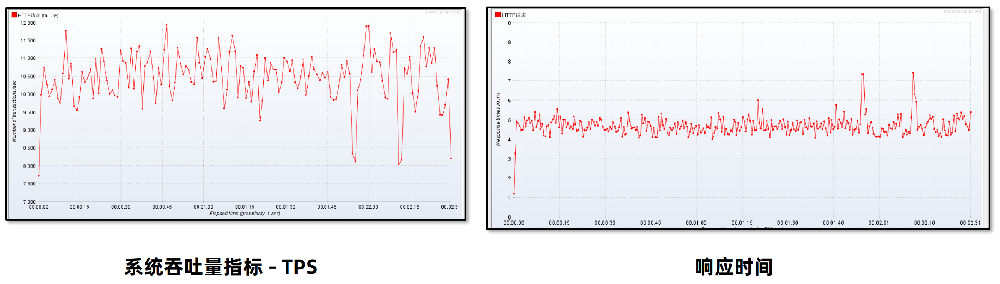

##### 案例：使用Jmeter进行并发测试，发现内存溢出问题

**背景：**

        小李的团队发现有一个微服务在晚上8点左右用户使用的高峰期会出现内存溢出的问题，于是他们希望在自己的开发环境能重现类似的问题。

**步骤：**

1. 安装Jmeter软件，添加线程组。
   
   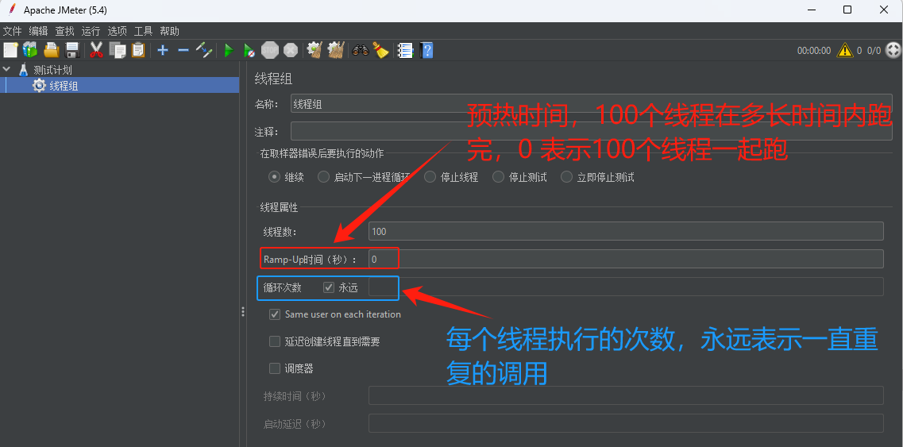

2. 在线程组中增加Http请求，添加随机参数。
   
   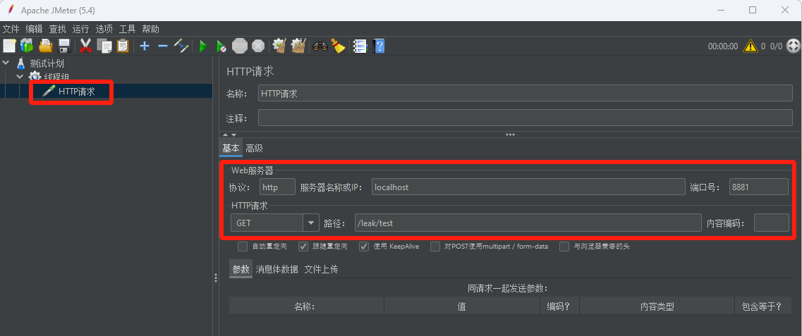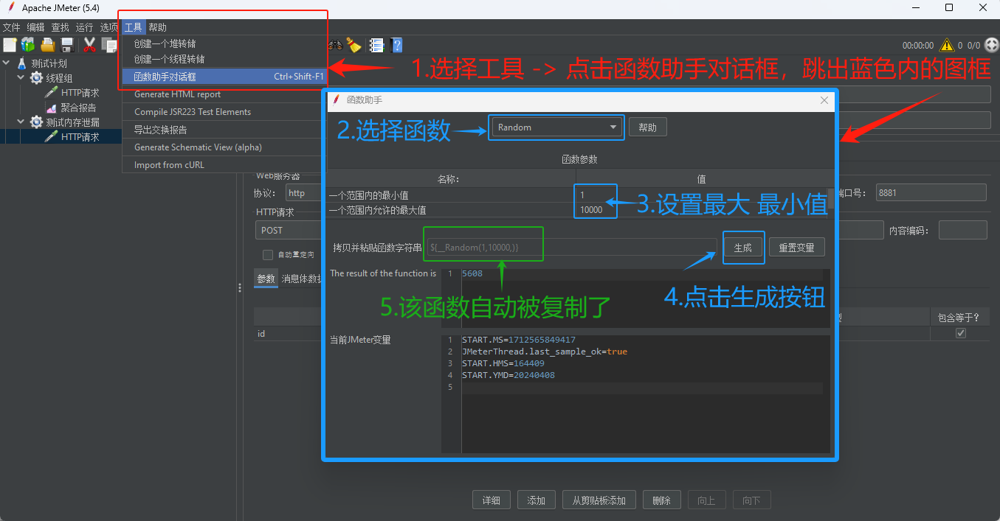
   
   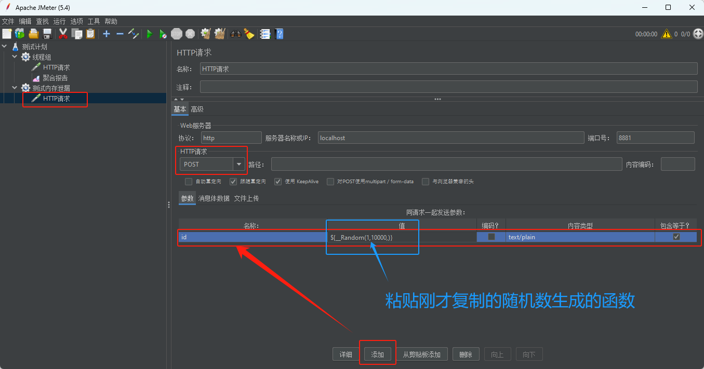

3. 在线程组中添加监听器 – 聚合报告，用来展示最终结果。
   
   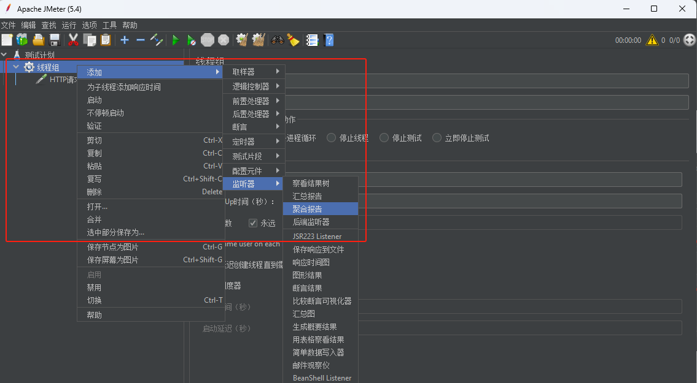

4. 启动程序，运行线程组并观察程序是否出现内存溢出。

### 1.2.3 诊断原因 - 内存快照

当堆内存溢出时，需要在堆内存溢出时将整个堆内存保存下来，生成内存快照(Heap Profile )文件。

生成内存快照的Java虚拟机参数：

- -XX:+HeapDumpOnOutOfMemoryError：发生OutOfMemoryError错误时，自动生成hprof内存快照文件。

- -XX:HeapDumpPath=<path>：指定hprof文件的输出路径

使用MAT打开hprof文件，并选择内存泄漏检测功能，MAT会自行根据内存快照中保存的数据分析内存泄漏的根源。

#### MAT内存泄漏检测的原理 – 支配树

MAT提供了称为<font color=red>支配树</font>（Dominator Tree）的对象图。支配树展示的是对象实例间的支配关系。在对象引用图中，所有指向对象B的路径都经过对象A，则认为对象A支配对象B。

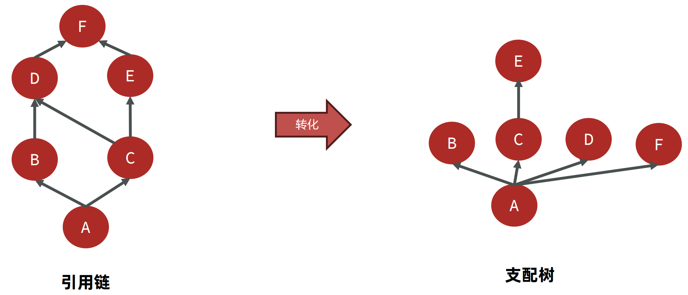

#### MAT内存泄漏检测的原理 – 深堆和浅堆

支配树中对象本身占用的空间称之为<font color=red>浅堆(Shallow Heap）</font>。

支配树中对象的子树就是所有被该对象支配的内容，这些内容组成了对象的<font color=red>深堆（Retained Heap）</font>，也称之为保留集（ Retained Set ） 。<font color=red>深堆的大小表示该对象如果可以被回收，能释放多大的内存空间</font>。

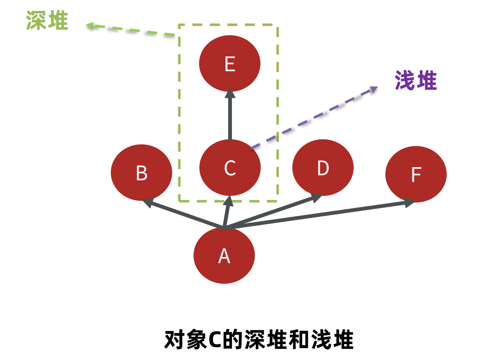

- A的浅堆就是A本身，A的深堆就是ABCDEF

需求：

        使用如下代码生成内存快照，并分析TestClass对象的深堆和浅堆。

- ```java
  package com.study.jvm.actual_combat.mat_demo;
  
  import java.util.ArrayList;
  import java.util.List;
  
  /**
   * 添加虚拟机参数： -XX:+HeapDumpBeforeFullGC -XX:HeapDumpPath=D:/documents/temp/matTest.hprof
   * -XX:+HeapDumpBeforeFullGC的作用是：在程序准备发生Full GC时，那么会将此时堆内存的快照打印一下
   */
  public class HeapDemo {
      public static void main(String[] args) {
          TestClass a1 = new TestClass();
          TestClass a2 = new TestClass();
          TestClass a3 = new TestClass();
          String s1 = "itheima1";
          String s2 = "itheima2";
          String s3 = "itheima3";
  
          a1.list.add(s1);
  
          a2.list.add(s1);
          a2.list.add(s2);
  
          a3.list.add(s3);
  
          // System.out.print(ClassLayout.parseClass(TestClass.class).toPrintable());
          s1 = null;
          s2 = null;
          s3 = null;
          System.gc();
      }
  }
  
  class TestClass {
      public List<String> list = new ArrayList<>(10);
  }
  ```

如何在不内存溢出情况下生成堆内存快照？ -XX:+HeapDumpBeforeFullGC 可以在FullGC之前就生成内存快照。

解析：


验证：通过 MAT 工具验证，即用MAT打开此程序生成堆快照


- 填充4个字节是为了字节数能被8整除，这是一种机制

- 所以上述MAT的分析结果中，该 java.lang.String 的浅堆是24个字节，深堆是再加上char[8]对那个的32个字节空间，即56

#### MAT内存泄漏检测的原理

MAT就是根据支配树，从叶子节点向根节点遍历，如果发现深堆的大小超过整个堆内存的一定比例阈值，就会将其标记成内存泄漏的“嫌疑对象”。

#### 案例：导出运行中系统的内存快照并进行分析

背景：

        小李的团队通过监控系统发现有一个服务内存在持续增长，希望尽快通过内存快照分析增长的原因，由于并未产生内存溢出所以不能通过HeapDumpOnOutOfMemoryError 参数生成内存快照。

思路：

导出运行中系统的内存快照，比较简单的方式有两种，注意只需要导出标记为存活的对象：

1. 通过JDK自带的jmap命令导出，格式为：<font color=red> jmap -dump:live,format=b,file=文件路径和文件名 进程ID </font> 
   
   

2. 通过arthas的heapdump命令导出，格式为：<font color=red> heapdump --live 文件路径和文件名 </font> 
   
   

#### 补充: 分析超大堆的内存快照

- 在程序员开发用的机器内存范围之内的快照文件，直接使用MAT打开分析即可。但是经常会遇到服务器上的程序占用的内存达到10G以上，开发机无法正常打开此类内存快照，此时需要下载服务器操作系统对应的MAT。下载地址： https://eclipse.dev/mat/downloads.php

- 通过MAT中的脚本生成分析报告，即执行下面的脚本：
  
  ```bash
  ./ParseHeapDump.sh 快照文件路径 org.eclipse.mat.api:suspects org.eclipse.mat.api:overview org.eclipse.mat.api:top_components
  ```

注意：默认MAT分析时只使用了1G的堆内存，如果快照文件超过1G，需要修改MAT目录下的 MemoryAnalyzer.ini配置文件调整最大堆内存。


## 1.3 案例实战 - 修复问题

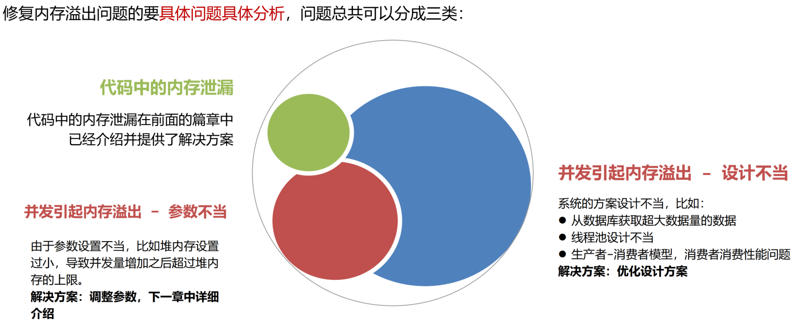

### 案例1：分页查询文章接口的内存溢出

**背景：**

        小李负责的新闻资讯类项目采用了微服务架构，其中有一个文章微服务，这个微服务在业务高峰期出现了内存溢出的现象。

解决思路：

1. 服务出现OOM内存溢出时，生成内存快照。

2. 使用MAT分析内存快照，找到内存溢出的对象。

3. 尝试在开发环境中重现问题，分析代码中问题产生的原因。

4. 修改代码。

5. 测试并验证结果。

具体操作查看视频资料：[视频资料中第2个视频](https://upwer66cqk.feishu.cn/wiki/Y5tNwJgL0i1wd9kauAAczM2znWg?fromScene=spaceOverview)

问题根源：

        文章微服务中的分页接口没有限制最大单次访问条数，并且单个文章对象占用的内存量较大，在业务高峰期并发量较大时这部分从数据库获取到内存之后会占用大量的内存空间。

解决思路：

1. 与产品设计人员沟通，限制最大的单次访问条数。

2. 分页接口如果只是为了展示文章列表，不需要获取文章内容，可以大大减少对象的大小。

3. 在高峰期对微服务进行限流保护。

### 案例2 – Mybatis导致的内存溢出

背景：

        小李负责的文章微服务进行了升级，新增加了一个判断id是否存在的接口，第二天业务高峰期再次出现了内存溢出，小李觉得应该和新增加的接口有关系。

解决思路：

1. 服务出现OOM内存溢出时，生成内存快照。

2. 使用MAT分析内存快照，找到内存溢出的对象。

3. 尝试在开发环境中重现问题，分析代码中问题产生的原因。

4. 修改代码。

5. 测试并验证结果。

问题根源：

        Mybatis在使用foreach进行sql拼接时，会在内存中创建对象，如果foreach处理的数组或者集合元素个数过多，会占用大量的内存空间。

解决思路：

1. 限制参数中最大的id个数。

2. 将id缓存到redis或者内存缓存中，通过缓存进行校验。

具体操作查看视频资料：[视频资料中第3个视频](https://upwer66cqk.feishu.cn/wiki/Y5tNwJgL0i1wd9kauAAczM2znWg?fromScene=spaceOverview)

### 案例3 – 导出大文件内存溢出

背景：

        小李负责了一个管理系统，这个管理系统支持几十万条数据的excel文件导出。他发现系统在运行时，如果有几十个人同时进行大数据量的导出，会出现内存溢出。

小李团队使用的是k8s将管理系统部署到了容器中，所以这一次我们使用阿里云的k8s环境还原场景，并解决问题。阿里云的k8s整体规划如下：

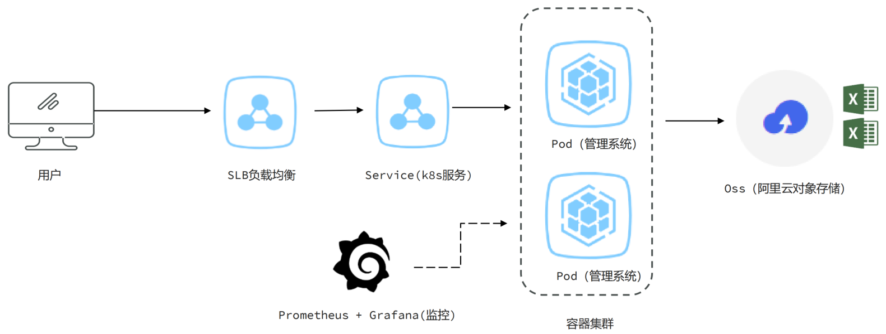

问题根源：

        Excel文件导出如果使用POI的XSSFWorkbook，在大数据量（几十万）的情况下会占用大量的内存。

解决思路：

1. 使用poi的SXSSFWorkbook。

2. hutool提供的BigExcelWriter减少内存开销。

3. 使用easy excel，对内存进行了大量的优化。

具体操作查看视频资料：[视频资料中第4个视频](https://upwer66cqk.feishu.cn/wiki/Y5tNwJgL0i1wd9kauAAczM2znWg?fromScene=spaceOverview)

### 案例4 – ThreadLocal使用时占用大量内存

背景：

        小李负责了一个微服务，但是他发现系统在没有任何用户使用时，也占用了大量的内存。导致可以使用的内存大大减少。

问题根源和解决思路：

        很多微服务会选择在拦截器preHandle方法中去解析请求头中的数据，并放入一些数据到 ThreadLocal 中方便后续使用。在拦截器的afterCompletion方法中，必须要将ThreadLocal中的数据清理掉。

具体操作查看视频资料：[视频资料中第5个视频](https://upwer66cqk.feishu.cn/wiki/Y5tNwJgL0i1wd9kauAAczM2znWg?fromScene=spaceOverview)

### 案例5 – 文章内容审核接口的内存问题

背景：

        文章微服务中提供了文章审核接口，会调用阿里云的内容安全接口进行文章中文字和图片的审核，在自测过程中出现内存占用较大的问题。

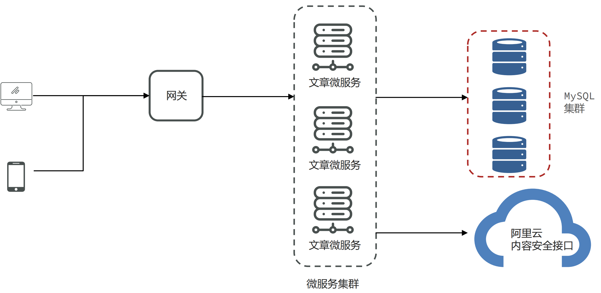

具体操作查看视频资料：[视频资料中第6个视频](https://upwer66cqk.feishu.cn/wiki/Y5tNwJgL0i1wd9kauAAczM2znWg?fromScene=spaceOverview)

#### 设计方案1：

使用SpringBoot中的@Async注解进行异步的审核。

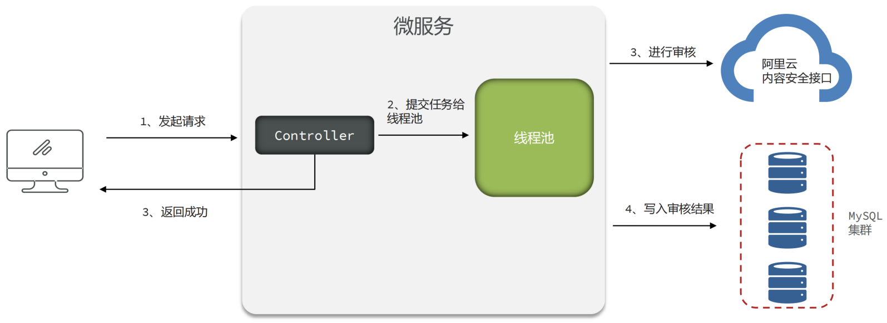

存在问题：

1. 线程池参数设置不当，会导致大量线程的创建或者队列中保存大量的数据。

2. 任务没有持久化，一旦走线程池的拒绝策略或者服务宕机、服务器掉电等情况很有可能会丢失任务

#### 设计方案2：

使用生产者和消费者模式进行处理，队列数据可以实现持久化到数据库。

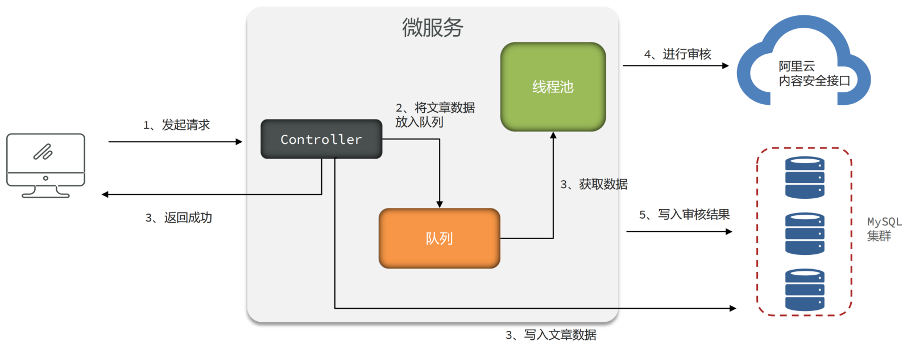

存在问题：

1、队列参数设置不正确，会保存大量的数据。

2、实现复杂，需要自行实现持久化的机制，否则数据会丢失。

#### 设计方案3：

使用mq消息队列进行处理，由mq来保存文章的数据。发送消息的服务和拉取消息的服务可以是同一个，也可以不是同一个。

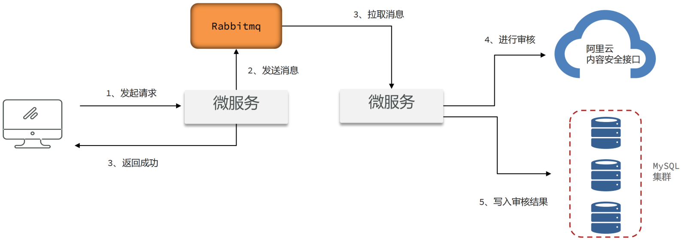

问题根源和解决思路：

在项目中如果要使用异步进行业务处理，或者实现生产者 – 消费者的模型，如果在Java代码中实现，会占用大量的内存去保存中间数据。

尽量使用Mq消息队列，可以很好地将中间数据单独进行保存，不会占用Java的内存。同时也可以将生产者和消费者拆分成不同的微服务。

## 1.4 诊断和解决问题 – 两种方案

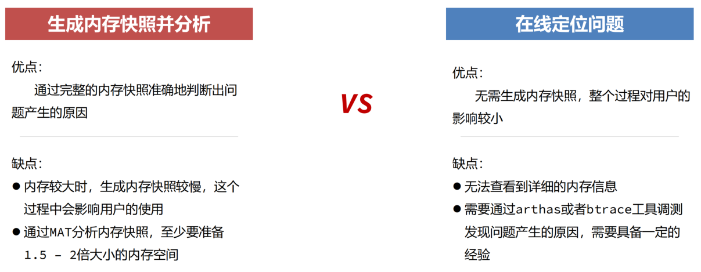

#### 1.4.1 在线定位问题 – 步骤

1、使用jmap -histo:live 进程ID > 文件名 命令将内存中存活对象以直方图的形式保存到文件中，这个过程会影响用户的时间，但是时间比较短暂。

2、分析内存占用最多的对象，一般这些对象就是造成内存泄漏的原因。

3、使用arthas的stack命令，追踪对象创建的方法被调用的调用路径，找到对象创建的根源。也可以使用btrace工具编写脚本追踪方法执行的过程。

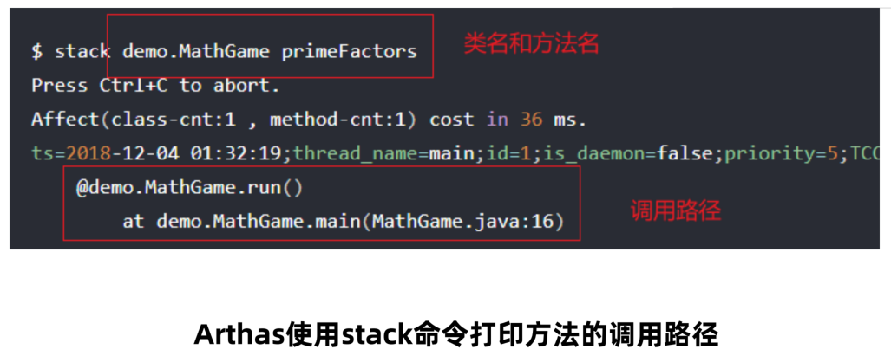

具体操作查看视频资料：[视频资料中第7个视频](https://upwer66cqk.feishu.cn/wiki/Y5tNwJgL0i1wd9kauAAczM2znWg?fromScene=spaceOverview)

#### 1.4.2 在线定位问题 – btrace

BTrace 是一个在 Java 平台上执行的追踪工具，可以有效地用于线上运行系统的方法追踪，具有侵入性小、对性能的影响微乎其微等特点。

项目中可以使用btrace工具，打印出方法被调用的栈信息。

使用方法：

1. 下载btrace工具， 官方地址：https://github.com/btraceio/btrace/releases/latest

2. 编写btrace脚本，通常是一个java文件。

3. 将btrace工具和脚本上传到服务器，在服务器上运行 btrace 进程ID 脚本文件名 。

4. 观察执行结果

具体操作查看视频资料：[视频资料中第7个视频](https://upwer66cqk.feishu.cn/wiki/Y5tNwJgL0i1wd9kauAAczM2znWg?fromScene=spaceOverview)

## 1.5 总结

1、什么是内存溢出，什么是内存泄漏？

- 内存泄漏（memory leak）：在Java中如果不再使用一个对象，但是该对象依然在GC ROOT的引用链上，这个对象就不会被垃圾回收器回收，这种情况就称之为内存泄漏。

- 内存溢出指的是内存的使用量超过了Java虚拟机可以分配的上限，最终产生了内存溢出OutOfMemory的错误。

2、内存溢出有哪几种产生的原因？

1. 持续的内存泄漏：内存泄漏持续发生，不可被回收同时不再使用的内存越来越多，就像滚雪球雪球越滚越大，最终内存被消耗完无法分配更多的内存取使用，导致内存溢出。

2. 并发请求问题：用户通过发送请求向Java应用获取数据，正常情况下Java应用将数据返回之后，这部分数据就可以在内存中被释放掉。但是由于用户的并发请求量有可能很大，同时处理数据的时间很长，导致大量的数据存在于内存中，最终超过了内存的上限，导致内存溢出。

3、解决内存泄漏问题的方法是什么？

1. 发现问题，通过监控工具尽可能尽早地发现内存慢慢变大的现象。

2. 诊断原因，通过分析内存快照或者在线分析方法调用过程，诊断问题产生的根源，定位到出现问题的源代码。

3. 修复源代码中的问题，如代码bug、技术方案不合理、业务设计不合理等等。

4. 在测试环境验证问题是否已经解决，最后发布上线。

# 2. GC调优

GC调优指的是对垃圾回收（Garbage Collection）进行调优。GC调优的主要目标是避免由垃圾回收引起程序性能下降。

GC调优的核心分成三部分：

- 通用 Jvm 参数的设置。

- 特定垃圾回收器的 Jvm 参数的设置。

- 解决由频繁的FULL GC引起的程序性能问题。

GC调优<font color=red>没有没有唯一的标准答案</font>，如何调优与硬件、程序本身、使用情况均有关系，重点学习调优的工具和方法。

## 2.1 GC调优的核心指标

判断GC是否需要调优，需要从三方面来考虑，与GC算法的评判标准类似：

### 2.1.1 吞吐量(Throughput)

吞吐量分为业务吞吐量和垃圾回收吞吐量

业务吞吐量指的在一段时间内，程序需要完成的业务数量。比如企业中对于吞吐量的要求可能会是这样的：

- 支持用户每天生成10000笔订单

- 在晚上8点到10点，支持用户查询50000条商品信息

保证高吞吐量的常规手段有两条：

1、优化业务执行性能，减少单次业务的执行时间

2、优化垃圾回收吞吐量

垃圾回收吞吐量

垃圾回收吞吐量指的是 CPU 用于执行用户代码的时间与 CPU 总执行时间的比值，即吞吐量 = 执行用户代码时间 /（执行用户代码时间 + GC时间）。吞吐量数值越高，垃圾回收的效率就越高，允许更多的CPU时间去处理用户的业务，相应的业务吞吐量也就越高。


### 2.1.2 延迟（Latency）

延迟指的是从用户发起一个请求到收到响应这其中经历的时间。比如企业中对于延迟的要求可能会是这样的：

- 所有的请求必须在5秒内返回给用户结果

延迟 = GC延迟 + 业务执行时间，所以如果GC时间过长，会影响到用户的使用。


### 2.1.3 内存使用量

内存使用量指的是Java应用占用系统内存的最大值，一般通过Jvm参数调整，在满足上述两个指标的前提下，这个值越小越好。

## 2.2 GC调优的方法

GC调优的步骤总共分为四个步骤：


### 2.2.1 发现问题 – jstat工具

Jstat工具是JDK自带的一款监控工具，可以提供各种垃圾回收、类加载、编译信息等不同的数据。

使用方法为：jstat -gc 进程ID 每次统计的间隔（毫秒） 统计次数


- C代表Capacity容量，U代表Used使用量

- S – 幸存者区，E – 伊甸园区，O – 老年代，M – 元空间

- YGC、YGT：年轻代GC次数和GC耗时（单位：秒）

- FGC、FGCT：Full GC次数和Full GC耗时

- GCT：GC总耗时

优点：

- 操作简单

- 无额外的软件安装

缺点：

- 无法精确到GC产生的时间，只能用于判断GC是否存在问题

### 2.2.2 发现问题 – visualvm插件

VisualVm中提供了一款Visual Tool插件，实时监控Java进程的堆内存结构、堆内存变化趋势以及垃圾回收时间的变化趋势。同时还可以监控对象晋升的直方图。


优点：

- 适合开发使用，能直观的看到堆内存和GC的变化趋势

缺点：

- 对程序运行性能有一定影响

- 生产环境程序员一般没有权限进行操作

步骤：

1. 点击 Tools -> 点击Plugins

2. 在线安装插件，使用的是国外的服务器资源，可能比较慢
   
   

3. 本地安装插件
   
   

4. 通过插件查看GC状态
   
   

### 2.2.3 发现问题 – Prometheus + Grafana

Prometheus+Grafana是企业中运维常用的监控方案，其中Prometheus用来采集系统或者应用的相关数据，同时具备告警功能。Grafana可以将Prometheus采集到的数据以可视化的方式进行展示。

Java程序员要学会如何读懂Grafana展示的Java虚拟机相关的参数。

优点：

- 支持系统级别和应用级别的监控，比如linux操作系统、Redis、MySQL、Java进程。

- 支持告警并允许自定义告警指标，通过邮件、短信等方式尽早通知相关人员进行处理

缺点：

- 环境搭建较为复杂，一般由运维人员完成

### 2.2.3 发现问题 – GC 日志

通过GC日志，可以更好的看到垃圾回收细节上的数据，同时也可以根据每款垃圾回收器的不同特点更好地发现存在的问题。

使用方法（JDK 8及以下）：-XX:+PrintGCDetails -Xloggc:文件名

使用方法（JDK 9+）：-Xlog:gc*:file=文件名


操作示例：

1. 在Idea的启动程序文件时，添加虚拟参数
   
   

2. 查看GC的日志文件
   
   

### 2.2.4 发现问题 – GC Viewer

GCViewer是一个将GC日志转换成可视化图表的小工具，github地址： https://github.com/chewiebug/GCViewer

使用方法：执行命令 `java -jar gcviewer_1.3.4.jar 日志文件.log` 

操作示例：

1. 执行命令
   
   

2. 查看GC 视图数据：可以通过View工具栏中选择想看的数据线；右下角图框是汇总数据统计分析
   
   

### 2.2.5 发现问题 – GCeasy

GCeasy是业界首款使用AI机器学习技术在线进行GC分析和诊断的工具。定位内存泄漏、GC延迟高的问题，提供JVM参数优化建议，支持在线的可视化工具图表展示。

官方网站： https://gceasy.io/

操作步骤：登录网站，上传GC报告进行诊断，每个人只有5次免费的机会，需要进行注册登录（绑定邮箱注册）。

账号/密码：allenwork2021@163.com/qwer1234


### 2.2.6 发现问题 –常见的GC模式

#### 2.2.6.1 正常情况

特点：呈现锯齿状，对象创建之后内存上升，一旦发生垃圾回收之后下降到底部，并且每次下降之后的内存大小接近，存留的对象较少。


#### 2.2.6.2 缓存对象过多

特点：呈现锯齿状，对象创建之后内存上升，一旦发生垃圾回收之后下降到底部，并且每次下降之后的内存大小接近，处于比较高的位置。

问题产生原因： 程序中保存了大量的缓存对象，导致GC之后无法释放，可以使用MAT或者HeapHero等工具进行分析内存占用的原因。


#### 2.2.6.3 内存泄漏

特点：呈现锯齿状，每次垃圾回收之后下降到的内存位置越来越高，最后由于垃圾回收无法释放空间导致对象无法分配产生OutOfMemory的错误。

问题产生原因： 程序中保存了大量的内存泄漏对象，导致GC之后无法释放，可以使用MAT或者HeapHero等工具进行分析是哪些对象产生了内存泄漏。


#### 2.2.6.4 持续的Full GC

特点：在某个时间点产生多次Full GC，CPU使用率同时飙高，用户请求基本无法处理。一段时间之后恢复正常。

问题产生原因： 在该时间范围请求量激增，程序开始生成更多对象，同时垃圾收集无法跟上对象创建速率，导致持续地在进行FULL GC。GC分析报告


#### 2.2.6.5 元空间不足导致的FULL GC

特点：堆内存的大小并不是特别大，但是持续发生FULL GC。

问题产生原因： 元空间大小不足，导致持续FULLGC回收元空间的数据。


### 2.2.7 解决问题

解决GC问题的手段

解决GC问题的手段中，前三种是比较推荐的手段，第四种仅在前三种无法解决时选用：


#### 2.2.7.1 解决问题 - 优化基础JVM参数

##### 参数1：-Xmx 和 –Xms

-Xmx参数设置的是最大堆内存，但是由于程序是运行在服务器或者容器上，计算可用内存时，要将元空间、操作系统、其它软件占用的内存排除掉。

案例： 服务器内存4G，操作系统+元空间最大值+其它软件占用1.5G，-Xmx可以设置为2g。

<font color=red>最合理的设置方式应该是根据最大并发量估算服务器的配置，然后再根据服务器配置计算最大堆内存的值</font>。


-Xms用来设置初始堆大小，建议将-Xms设置的和-Xmx一样大，有以下几点好处：

- 运行时性能更好，堆的扩容是需要向操作系统申请内存的，这样会导致程序性能短期下降。

- 可用性问题，如果在扩容时其他程序正在使用大量内存，很容易因为操作系统内存不足分配失败。

- 启动速度更快，Oracle官方文档的原话：如果初始堆太小，Java 应用程序启动会变得很慢，因为 JVM 被迫频繁执行垃圾收集，直到堆增长到更合理的大小。为了获得最佳启动性能，请将初始堆大小设置为与最大堆大小相同。

##### 参数2：-XX:MaxMetaspaceSize 和 –XX:MetaspaceSize

-XX:MaxMetaspaceSize=值 参数指的是最大元空间大小，默认值比较大，如果出现元空间内存泄漏会让操作系统可用内存不可控，建议根据测试情况设置最大值，一般设置为256m。

-XX:MetaspaceSize=值 参数指的是到达这个值之后会触发FULL GC（网上很多文章的初始元空间大小是错误的），后续什么时候再触发JVM会自行计算。如果设置为和MaxMetaspaceSize一样大，就不会FULL GC，但是对象也无法回收。

##### 参数3：-Xss虚拟机栈大小

如果我们不指定栈的大小，JVM 将创建一个具有默认大小的栈。大小取决于操作系统和计算机的体系结构。

比如Linux x86 64位 ： 1MB，如果不需要用到这么大的栈内存，完全可以将此值调小节省内存空间，合理值为256k – 1m之间。

使用：-Xss256k

##### 参数4：不建议手动设置的参数

由于JVM底层设计极为复杂，一个参数的调整也许让某个接口得益，但同样有可能影响其他更多接口。

- -Xmn 年轻代的大小，默认值为整个堆的1/3，可以根据峰值流量计算最大的年轻代大小，尽量让对象只存放在年轻代，不进入老年代。但是实际的场景中，接口的响应时间、创建对象的大小、程序内部还会有一些定时任务等不确定因素都会导致这个值的大小并不能仅凭计算得出，如果设置该值要进行大量的测试。G1垃圾回收器尽量不要设置该值，G1会动态调整年轻代的大小。
  
  

- ‐XX:SurvivorRatio 伊甸园区和幸存者区的大小比例，默认值为8。
  
  

- ‐XX:MaxTenuringThreshold 最大晋升阈值，年龄大于此值之后，会进入老年代。另外JVM有动态年龄判断机制：将年龄从小到大的对象占据的空间加起来，如果大于survivor区域的50%，然后把等于或大于该年龄的对象，放入到老年代。
  
  

##### 其他参数:

- -XX:+DisableExplicitGC
  
  禁止在代码中使用System.gc()， System.gc()可能会引起FULL GC，在代码中尽量不要使用。使用DisableExplicitGC参数可以禁止使用System.gc()方法调用。

- -XX:+HeapDumpOnOutOfMemoryError：发生OutOfMemoryError错误时，自动生成hprof内存快照文件。-XX:HeapDumpPath=<path>：指定hprof文件的输出路径。

- 打印GC日志
  
  JDK8及之前 ： -XX:+PrintGCDetails -XX:+PrintGCDateStamps -Xloggc:文件路径
  
  JDK9及之后 ： -Xlog:gc*:file=文件路径

##### JVM参数模板：

```bash
-Xms1g
-Xmx1g
-Xss256k
-XX:MaxMetaspaceSize=512m 
-XX:+DisableExplicitGC
-XX:+HeapDumpOnOutOfMemoryError
-XX:HeapDumpPath=/opt/logs/my-service.hprof
-XX:+PrintGCDetails
-XX:+PrintGCDateStamps
-Xloggc:文件路径
```

注意：

1. JDK9及之后gc日志输出修改为 -Xlog:gc*:file=文件名

2. 堆内存大小和栈内存大小根据实际情况灵活调整。

#### 2.2.7.2 垃圾回收器的选择

案例：

背景：

        小李负责的程序在高峰期遇到了性能瓶颈，团队从业务代码入手优化了多次也取得了不错的效果，这次他希望能采用更合理的垃圾回收器优化性能。

思路：

1. 编写Jmeter脚本对程序进行压测，同时添加RT响应时间、每秒钟的事务数等指标进行监控。

2. 选择不同的垃圾回收器进行测试，并发量分别设置50、100、200，观察数据的变化情况

3. JDK8 下 ParNew + CMS 组合 ： -XX:+UseParNewGC -XX:+UseConcMarkSweepGC       默认组合 ： PS + PO
   
   JDK8使用g1 : -XX:+UseG1GC
   
   JDK11 默认 g1

具体操作查看视频资料：[视频资料中第8个视频](https://upwer66cqk.feishu.cn/wiki/Y5tNwJgL0i1wd9kauAAczM2znWg?fromScene=spaceOverview)

#### 2.2.7.3 优化案例

背景：

        CMS的<font color=red>并发模式失败</font>（concurrent mode failure）现象。由于CMS的垃圾清理线程和用户线程是并行进行的，如果在并发清理的过程中老年代的空间不足以容纳放入老年代的对象，会产生<font color=red>并发模式失败</font>。


- 尝试将伊甸园的对象放入到幸存者区，发现幸存者区空间不足，所以直接将该对象放入到老年代，但是发现老年代已经满了，没有空间存放对象，那么此时就会产生并发模式失败

- <font color=red>并发模式失败</font>会导致Java虚拟机使用Serial Old单线程进行FULLGC回收老年代，出现长时间的停顿。

解决方案：

1. 减少对象的产生以及对象的晋升。

2. 增加堆内存大小

3. 优化垃圾回收器的参数，比如 <font color=red>-XX:CMSInitiatingOccupancyFraction=值</font>，当老年代大小到达该阈值时，会自动进行CMS垃圾回收，通过控制这个参数提前进行老年代的垃圾回收，减少其大小。
   
   JDK8中默认这个参数值为 -1，根据其他几个参数计算出阈值：((100 - MinHeapFreeRatio) + (double)(CMSTriggerRatio * MinHeapFreeRatio) / 100.0)
   
   <font color=red>该参数设置完是不会生效的，必须开启 -XX:+UseCMSInitiatingOccupancyOnly参数。</font>

具体操作查看视频资料：[视频资料中第9个视频](https://upwer66cqk.feishu.cn/wiki/Y5tNwJgL0i1wd9kauAAczM2znWg?fromScene=spaceOverview)

## 2.3 案例实战

### 2.3.1 内存调优 + GC调优

背景：

        小李负责的程序在高峰期经常会出现接口调用时间特别长的现象，他希望能优化程序的性能。该程序上线前一定经过测试，平时测试没有问题，响应时间挺短的，但是到了高峰期就响应时间比较长，那么大概率是垃圾回收导致的。

思路：

1. 生成GC报告，通过Gceasy工具进行分析，判断是否存在GC问题或者内存问题。

2. 存在内存问题，通过jmap或者arthas将堆内存快照保存下来。

3. 通过MAT或者在线的heaphero工具分析内存问题的原因。

4. 修复问题，并发布上线进行测试

问题1：发生了连续的FULL GC,堆内存1g如果没有请求的情况下，内存大小在200-300mb之间。

分析：没有请求的情况下，内存大小并没有处于很低的情况，满足缓存对象过多的情况，怀疑内存种缓存了很多数据。需要将堆内存快照保存下来进行分析。

---

问题2：堆内存快照保存到本地之后，使用MAT打开，发现只有几十兆的内存。

分析：有大量的对象不在GC Root引用链上，可以被回收，使用MAT查看这些对象。

---

问题3：由于这些对象已经不在引用链上，无法通过支配树等手段分析创建的位置。

分析：在不可达对象列表中，除了发现大量的byte[]还发现了大量的线程，可以考虑跟踪线程的栈信息来判断对象在哪里创建

问题产生原因：在定时任务中通过线程创建了大量的对象，导致堆内存一直处于比较高的位置。

解决方案：暂时先将这段代码注释掉，测试效果，由于这个服务本身的内存压力比较大，将这段定时任务移动到别的服务中。

---

问题4：修复之后内存基本上处于100m左右，但是当请求发生时，依然有频繁FULL GC的发生。

分析：请求产生的内存大小比当前最大堆内存大，尝试选择配置更高的服务器，将-Xmx和-Xms参数调大一些

---

具体操作查看视频资料：[视频资料中第10个视频](https://upwer66cqk.feishu.cn/wiki/Y5tNwJgL0i1wd9kauAAczM2znWg?fromScene=spaceOverview)

### 2.3.2 案例总结：

1、压力比较大的服务中，尽量不要存放大量的缓存或者定时任务，会影响到服务的内存使用。

2、内存分析发现有大量线程创建时，可以使用导出线程栈来查看线程的运行情况。

3、如果请求确实创建了大量的内存超过了内存上限，只能考虑减少请求时创建的对象，或者使用更大的内存。

4、推荐使用g1垃圾回收器，并且使用较新的JDK可以获得更好的性能。

GC调优的核心流程：

1. 监控是否出现连续的FULL GC或者单次GC时间过长。

2. 诊断并解决，一般通过四种途径解决：
- 优化基础JVM参数

- 减少对象的产生

- 更换垃圾回收器

- 优化垃圾回收参数
3. 在测试环境验证问题是否已经解决，最后发布上线。

# 3. 性能调优

## 3.1 性能调优解决的问题

应用程序在运行过程中经常会出现性能问题，比较常见的性能问题现象是：

1. 通过top命令查看CPU占用率高，接近100甚至多核CPU下超过100都是有可能的。
   
   

2. 请求单个服务处理时间特别长，多服务使用skywalking等监控系统来判断是哪一个环节性能低下。
   
   

3. 程序启动之后运行正常，但是在运行一段时间之后无法处理任何的请求（内存和GC正常）。

## 3.2 性能调优的方法

### 3.2.1 线程转储文件的生成方式

1. 通过 ` jstack 进程ID > 日志文件名` 命令
   
   

2. 通过 VisualVM 工具
   
   
   
   
- 选择左侧栏中对应的threaddump，右击选择 Save As，跳出文件存储框
  
  
  
  

### 3.2.2 线程转储的查看方式

线程转储（Thread Dump）提供了对所有运行中的线程当前状态的快照。线程转储可以通过jstack、visualvm等工具获取。其中包含了线程名、优先级、线程ID、线程状态、线程栈信息等等内容，可以用来解决<font color=red>CPU占用率高、死锁等问题</font>。


线程转储（Thread Dump）中的几个核心内容：

- 名称： 线程名称，通过给线程设置合适的名称更容易 “见名知意”

- 优先级（prio）：线程的优先级

- Java ID（tid）：JVM中线程的唯一ID

- 本地 ID (nid)：操作系统分配给线程的唯一ID

- 状态：线程的状态，分为：
  
  - NEW ：新创建的线程，尚未开始执行
  
  - RUNNABLE ：正在运行或准备执行
  
  - BLOCKED ：等待获取监视器锁以进入或重新进入同步块/方法
  
  - WAITING ：等待其他线程执行特定操作，没有时间限制
  
  - TIMED_WAITING ： 等待其他线程在指定时间内执行特定操作
  
  - TERMINATED ：已完成执行

- 栈追踪： 显示整个方法的栈帧信息

线程转储的可视化在线分析平台：

1. https://jstack.review/

2. https://fastthread.io/

### 3.2.3 案例1：CPU占用率高问题的解决方案

问题：监控人员通过prometheus的告警发现CPU占用率一直处于很高的情况，通过top命令看到是由于Java程序引起的，希望能快速定位到是哪一部分代码导致了性能问题。

解决思路：

1. 通过top –c 命令找到CPU占用率高的进程，获取它的进程ID。
   
   

2. 使用top -p 进程ID单独监控某个进程，**按H可以查看到所有的线程以及线程对应的CPU使用率**，找到CPU使用率特别高的线程。
   
   

3. 使用 `jstack 进程ID` 命令可以查看到所有线程正在执行的栈信息。使用 `jstack 进程ID > 文件名` 保存到文件中方便查看。

4. 找到nid线程ID相同的栈信息，需要将之前记录下的十进制线程号转换成16进制。通过 <font color=red>printf ‘%x\n’ 线程ID</font> 命令直接获得16进制下的线程ID。

5. 找到栈信息对应的源代码，并分析问题产生原因。

具体操作查看视频资料：[视频资料中第12个视频](https://upwer66cqk.feishu.cn/wiki/Y5tNwJgL0i1wd9kauAAczM2znWg?fromScene=spaceOverview)

遗留问题：

- 如果方法中嵌套方法比较多，如何确定栈信息中哪一个方法性能较差？

案例补充：

- 在定位CPU占用率高的问题时，比较需要关注的是状态为RUNNABLE的线程。但实际上，有一些线程执行本地方法时并不会消耗CPU，而只是在等待。但 JVM 仍然会将它们标识成“RUNNABLE”状态。
  
  


### 3.2.4 案例2：接口响应时间很长的问题

问题：

        在程序运行过程中，发现有几个接口的响应时间特别长，需要快速定位到是哪一个方法的代码执行过程中出现了性能问题。

解决思路：

        已经确定是某个接口性能出现了问题，但是由于方法嵌套比较深，需要借助于arthas定位到具体的方法


#### Arthas的trace命令

    使用arthas的trace命令，可以展示出整个方法的调用路径以及每一个方法的执行耗时。

命令： `trace 类名 方法名`

- 添加 --skipJDKMethod false 参数可以输出JDK核心包中的方法及耗时。

- 添加 ‘#cost > 毫秒值’ 参数，只会显示耗时超过该毫秒值的调用。

- 添加 –n 数值 参数，最多显示该数值条数的数据。

优点

- 所有监控都结束之后，输入stop结束监控，重置arthas增强的对象。

#### Arthas的watch命令

在使用trace定位到性能较低的方法之后，使用watch命令监控该方法，可以获得更为详细的方法信息。

命令：` watch 类名 方法名 ‘{params, returnObj}’ ‘#cost>毫秒值' -x 2`

- ‘{params, returnObj}‘ 代表打印参数和返回值。

- -x 代表打印的结果中如果有嵌套（比如对象里有属性），最多只展开2层。允许设置的最大值为4。

具体操作查看视频资料：[视频资料中第13个视频](https://upwer66cqk.feishu.cn/wiki/Y5tNwJgL0i1wd9kauAAczM2znWg?fromScene=spaceOverview)

总结：

1、通过arthas的trace命令，首先找到性能较差的具体方法，如果访问量比较大，建议设置最小的耗时，精确的找到耗时比较高的调用。

2、通过watch命令，查看此调用的参数和返回值，重点是参数，这样就可以在开发环境或者测试环境模拟类似的现象，通过debug找到具体的问题根源。

3、使用stop命令将所有增强的对象恢复。


### 3.2.5 案例3：定位偏底层的性能问题

问题：有一个接口中使用了for循环向ArrayList中添加数据，但是最终发现执行时间比较长，需要定位是由于什么原因导致的性能低下。

解决思路：Arthas提供了性能火焰图的功能，可以非常直观地显示所有方法中哪些方法执行时间比较长。

#### Arthas的profile命令

使用arthas的profile命令，生成性能监控的火焰图。

命令1： profiler start 开始监控方法执行性能

命令2： profiler stop --format html 以HTML的方式生成火焰图

火焰图中一般找绿色部分Java中栈顶上比较平的部分，很可能就是性能的瓶颈。

具体操作查看视频资料：[视频资料中第14个视频](https://upwer66cqk.feishu.cn/wiki/Y5tNwJgL0i1wd9kauAAczM2znWg?fromScene=spaceOverview)

总结：

- 偏底层的性能问题，特别是由于JDK中某些方法被大量调用导致的性能低下，可以使用火焰图非常直观的找到原因。

- 这个案例中是由于创建ArrayList时没有手动指定容量，导致使用默认的容量而在添加对象过程中发生了多次的扩容，扩容需要将原来数组中的元素复制到新的数组中，消耗了大量的时间。

- 通过火焰图可以看到大量的调用，修复完之后节省了20% ~ 50%的时间。

### 3.2.6 案例4：线程被耗尽问题

问题：程序在启动运行一段时间之后，就无法接受任何请求了。将程序重启之后继续运行，依然会出现相同的情况。

解决思路，线程耗尽问题，一般是由于执行时间过长，分析方法分成两步：

1. 检测是否有死锁产生，无法自动解除的死锁会将线程永远阻塞。

2. 如果没有死锁，再使用案例1的打印线程栈的方法检测线程正在执行哪个方法，一般这些大量出现的方法就是慢方法。
- 死锁：两个或以上的线程因为争夺资源而造成互相等待的现象。

解决方案：（线程死锁可以通过三种方法定位问题）

1. jstack -l 进程ID > 文件名 将线程栈保存到本地。在文件中搜索deadlock即可找到死锁位置：

2. 开发环境中使用visual vm或者Jconsole工具，都可以检测出死锁。使用线程快照生成工具就可以看到死锁的根源。生产环境的服务一般不会允许使用这两种工具连接。

3. 使用fastthread自动检测线程问题。 https://fastthread.io/ Fastthread和Gceasy类似，是一款在线的AI自动线程问题检测工具，可以提供线程分析报告。通过报告查看是否存在死锁问题。

具体操作查看视频资料：[视频资料中第15个视频](https://upwer66cqk.feishu.cn/wiki/Y5tNwJgL0i1wd9kauAAczM2znWg?fromScene=spaceOverview)

### 3.2.7 更精细化的性能测试

面试题：你是如何判断一个方法需要耗时多少时间的？

面试者：我会在方法上打印开始时间和结束时间，他们的差值就是方法的执行耗时。手动通过postman或者jmeter发起一笔请求，在控制台上看输出的时间。

面试官：这样做是不准确的，第一测试时有些对象创建是懒加载的，所以会影响第一次的请求时间，第二因为虚拟机中JIT即时编译器会优化你的代码，所以你这个测试得出的时间并不一定是最终用户处理的时间。


#### JIT对程序性能的影响

- Java程序在运行过程中，JIT即时编译器会实时对代码进行性能优化，所以仅凭少量的测试是无法真实反应运行系统最终给用户提供的性能。

- 如下图，随着执行次数的增加，程序性能会逐渐优化。
  
  


#### 正确地测试代码性能

OpenJDK中提供了一款叫JMH（Java Microbenchmark Harness）的工具，可以准确地对Java代码进行基准测试，量化方法的执行性能。

官网地址： https://github.com/openjdk/jmh

JMH会首先执行预热过程，确保JIT对代码进行优化之后再进行真正的迭代测试，最后输出测试的结果。


JMH环境搭建：

- 创建基准测试项目，在CMD窗口中，使用以下命令创建JMH环境项目：
  
  ```bash
  mvn archetype:generate \
  -DinteractiveMode=false \
  -DarchetypeGroupId=org.openjdk.jmh \
  -DarchetypeArtifactId=jmh-java-benchmark-archetype \
  -DgroupId=org.sample \
  -DartifactId=test \
  -Dversion=1.0
  ```

优点

- 修改POM文件中的JDK版本号和JMH版本号，JMH最新版本号参考Github。


## 3.3 案例实战
