# JVM 高级篇

# 1. GraalVM

## 1.1 什么是GraalVM

- GraalVM是Oracle官方推出的一款高性能JDK，使用它享受比OpenJDK或者OracleJDK更好的性能。

- GraalVM的官方网址： https://www.graalvm.org/

- 官方标语：Build faster, smaller, leaner applications。

### 1.1.1 优点

优点1：更低的CPU、内存使用率

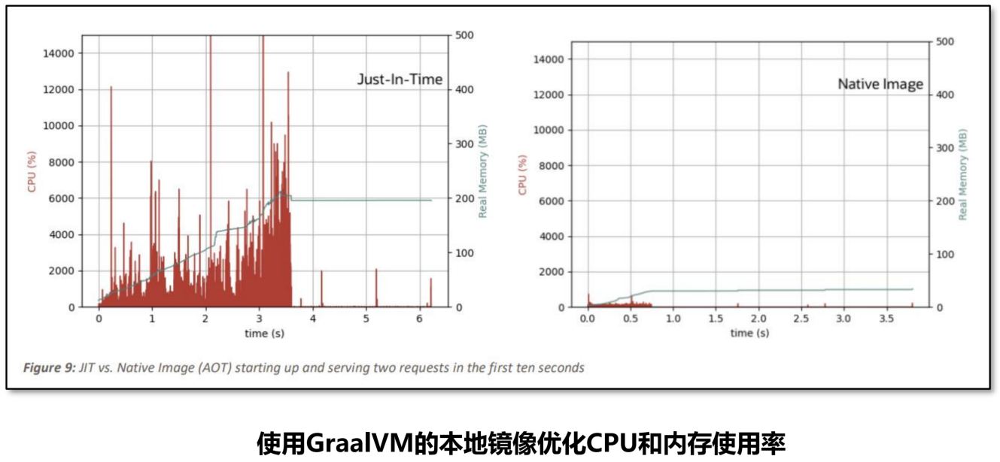

- 左图是传统的JIT，前4秒占用CPU的百分比，上下波动非常大

- 右图是GraalVM的本地镜像，CPU的占比很小，且波动不大，在硬件比较差的情况也能使用

优点2：更快的启动速度，无需预热即可获得最好的性能

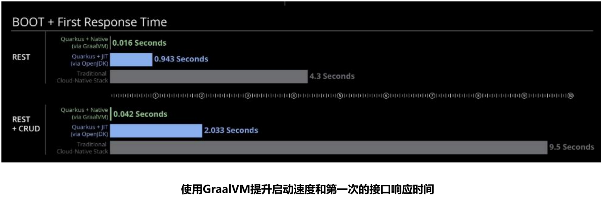

优点3：更好的安全性、更小的可执行文件

优点4：支持多种框架Spring Boot、Micronaut、Helidon 和 Quarkus。

优点5： 多家云平台支持。

优点6： 通过Truffle框架运行JS、Python、Ruby等其他语言。

### 1.1.2 GraalVM的版本

GraalVM分为社区版（Community Edition）和企业版（Enterprise Edition）。企业版相比较社区版，在性能上有更多的优化

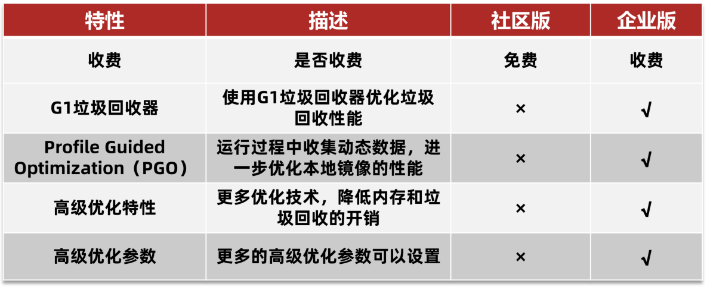

### 1.1.3 GraalVM社区版环境搭建

需求：搭建Linux下的GraalVM社区版本环境。

步骤：

1. 使用arch查看Linux架构
   
   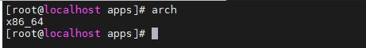

2. 根据架构下载社区版的GraalVM： https://www.graalvm.org/downloads/

3. 安装GraalVM，安装方式与安装JDK相同。
   
   - 执行命令：` tar -xvf graalvm-jdk-21_linux-x64_bin.tar.gz ` 
   
   - 在 /etc/profile 文件中配置 jdk 目录，结束后执行 ` source /etc/profile `
     
     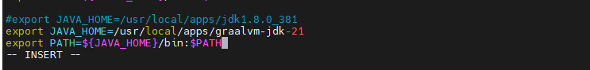

4. 使用java -version和HelloWorld测试GraalVM
   
   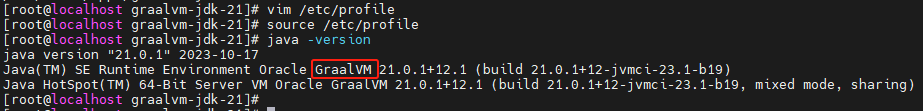
   
   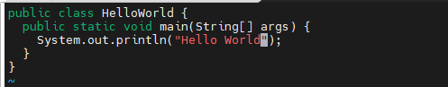
   
   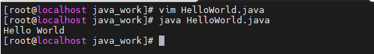

## 1.2 GraalVM的两种运行模式

### 1.2.1 JIT（ Just-In-Time ）模式 ，即时编译模式

JIT模式的处理方式与Oracle JDK类似，满足两个特点：

✓ Write Once,Run Anywhere -> 一次编写，到处运行。

✓ 预热之后，通过<font color=red>内置的Graal即时编译器</font>优化热点代码，生成比Hotspot JIT更高性能的机器码。

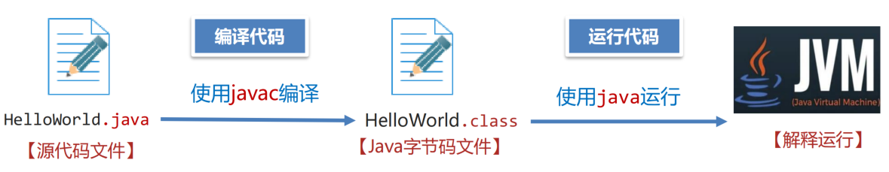

需求：分别在JDK8 、 JDK21 、 GraalVM 21 Graal即时编译器、GraalVM 21 不开启Graal即时编译器运行Jmh性能测试用例，对比其性能。

步骤：

1. 在代码文件夹中找到GraalVM的案例代码，将java-simple-stream benchmark文件夹下的代码使用maven打包成jar包。

2. 将jar包上传到服务器，使用不同的JDK进行测试，对比结果。

注意：-XX:-UseJVMCICompiler参数可以关闭GraalVM中的Graal编译器。

[具体操作查看该页第18个视频](https://upwer66cqk.feishu.cn/wiki/Y5tNwJgL0i1wd9kauAAczM2znWg?fromScene=spaceOverview)

### 1.2.2 AOT（Ahead-Of-Time）模式 ，提前编译模式

AOT 编译器通过源代码，为特定平台创建可执行文件。比如，在Windows下编译完成之后，会生成exe文件。通过这种方式，达到启动之后获得最高性能的目的。但是不具备跨平台特性，不同平台使用需要单独编译。

这种模式生成的文件称之为<font color=red>Native Image本地镜像</font>。

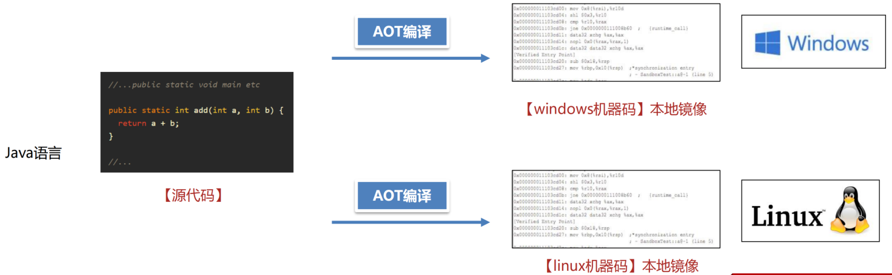

需求：使用GraalVM AOT模式制作本地镜像并运行。

步骤：

1. 安装Linux环境本地镜像制作需要的依赖库： https://www.graalvm.org/latest/reference-manual/native-image/#prerequisites

2. 使用 <font color=red>native-image 类名</font> 制作本地镜像。

3. 运行本地镜像可执行文件。

[具体操作查看该页第18个视频](https://upwer66cqk.feishu.cn/wiki/Y5tNwJgL0i1wd9kauAAczM2znWg?fromScene=spaceOverview)

### 1.2.3 GraalVM模式和版本的性能对比

社区版的GraalVM使用本地镜像模式性能不如Hotspot JVM的JIT模式，但是企业版的性能相对会高很多。

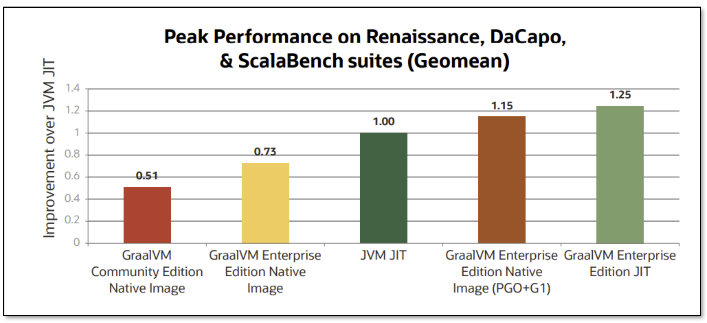

## 1.3 应用场景

### 1.3.1 GraalVM存在的问题

GraalVM的AOT模式虽然在启动速度、内存和CPU开销上非常有优势，但是使用这种技术会带来几个问题：

1. 跨平台问题，在不同平台下运行需要编译多次。编译平台的依赖库等环境要与运行平台保持一致。

2. 使用框架之后，编译本地镜像的时间比较长，同时也需要消耗大量的CPU和内存。

3. AOT 编译器在编译时，需要知道运行时所有可访问的所有类。但是Java中有一些技术可以在运行时创建类，例如反射、动态代理等。这些技术在很多框架比如Spring中大量使用，所以框架需要对AOT编译器进行适配解决类似的问题。

### 1.3.2 解决方案

1. 使用公有云的Docker等容器化平台进行在线编译，确保编译环境和运行环境是一致的，同时解决了编译资源问题。

2. 使用SpringBoot3等整合了GraalVM AOT模式的框架版本。

### 1.3.3 案例1：使用SpringBoot3搭建GraalVM环境

需求：SpringBoot3对GraalVM进行了完整的适配，所以编写GraalVM服务推荐使用SpringBoot3。

步骤：

1. 使用 https://start.spring.io/ spring提供的在线生成器构建项目。

2. 编写业务代码。

3. 执行 mvn -Pnative clean native:compile 命令生成本地镜像。

4. 运行本地镜像。

[具体操作查看该页第19个视频](https://upwer66cqk.feishu.cn/wiki/Y5tNwJgL0i1wd9kauAAczM2znWg?fromScene=spaceOverview)

### 过渡: 什么场景下需要使用GraalVM呢？

1、对性能要求比较高的场景，可以选择使用收费的企业版提升性能。

2、公有云的部分服务是按照CPU和内存使用量进行计费的，使用GraalVM可以有效地降低费用。

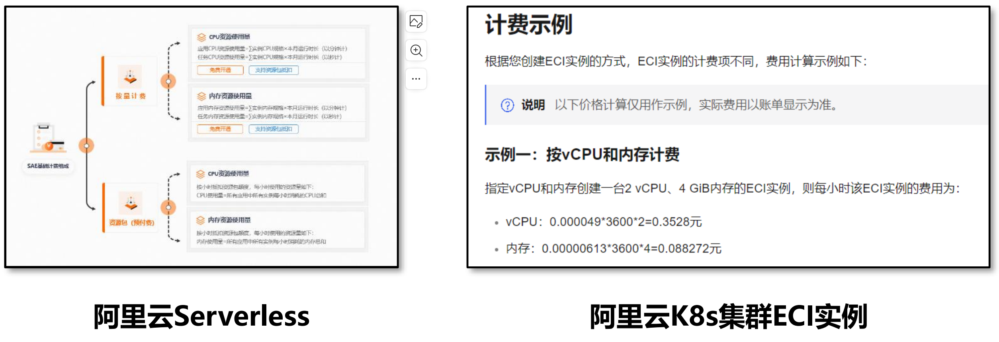

### 1.3.4 GraalVM企业级应用 - Serverless架构 - 函数计算

传统的系统架构中，服务器等基础设施的运维、安全、高可用等工作都需要企业自行完成，存在两个主要问题：

1. 开销大，包括了人力的开销、机房建设的开销。

2. 资源浪费，面对一些突发的流量冲击，比如秒杀等活动，必须提前规划好容量准备好大量的服务器，这些服务器在其他时候会处于闲置的状态，造成大量的浪费。

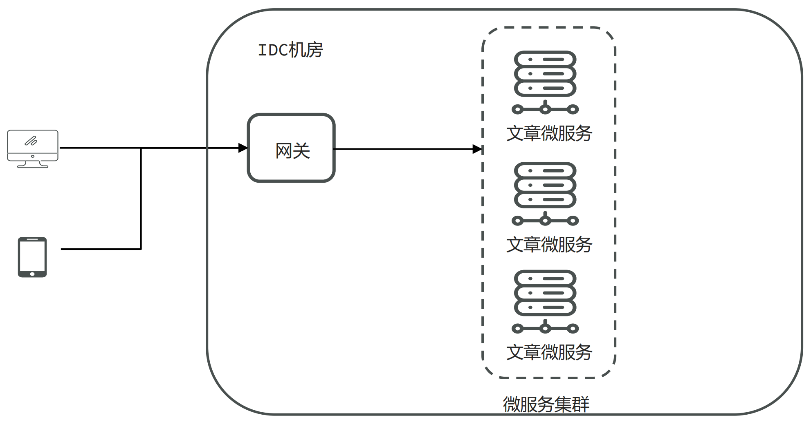

随着虚拟化技术、云原生技术的愈发成熟，云服务商提供了一套称为Serverless无服务器化的架构。企业无需进行服务器的任何配置和部署，完全由云服务商提供。比较典型的有亚马逊AWS、阿里云等。

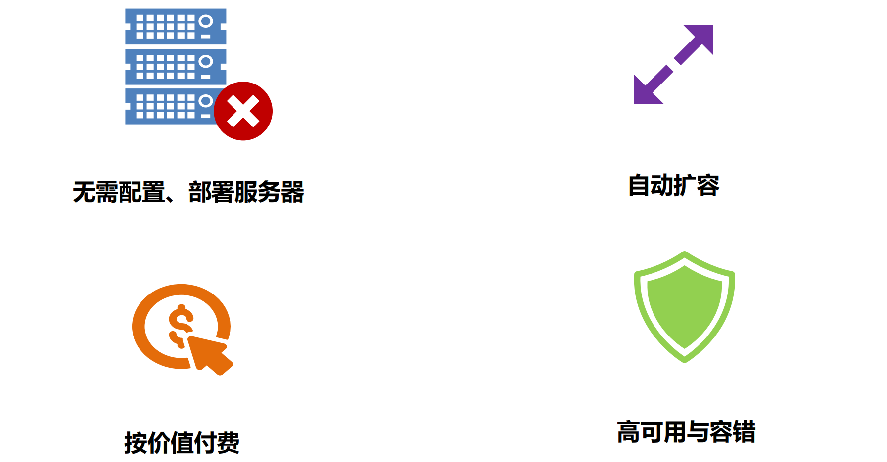

**Serverless架构 – 函数计算**

Serverless架构中第一种常见的服务是函数计算（Function as a Service），将一个应用拆分成多个函数，每个函数会以事件驱动的方式触发。典型代表有AWS的Lambda、阿里云的FC。

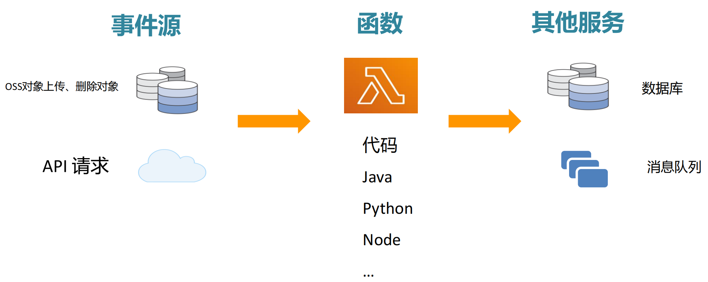

函数计算主要应用场景有如下几种：

① 小程序、API服务中的接口，此类接口的调用频率不高，使用常规的服务器架构容易产生资源浪费，使用Serverless就可以实现按需付费降低成本，同时支持自动伸缩能应对流量的突发情况。

② 大规模任务的处理，比如音视频文件转码、审核等，可以利用事件机制当文件上传之后，自动触发对应的任务。

函数计算的计费标准中包含CPU和内存使用量，所以使用GraalVM AOT模式编译出来的本地镜像可以节省更多的成本。

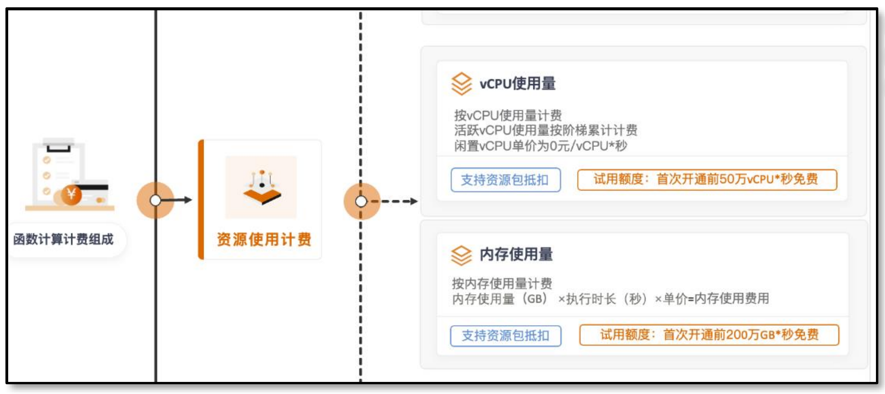

### 1.3.5 案例2：将程序部署到阿里云函数计算

**步骤：**

1. 在项目中编写Dockerfile文件。

2. 使用服务器制作镜像，这一步会消耗大量的CPU和内存资源，同时GraalVM相关的镜像服务器在国外，建议使用阿里云的镜像服务器制作Docker镜像。

3. 使用函数计算将Docker镜像转换成函数服务。

4. 绑定域名并进行测试。

[具体操作查看该页第20个视频](https://upwer66cqk.feishu.cn/wiki/Y5tNwJgL0i1wd9kauAAczM2znWg?fromScene=spaceOverview)

### 1.3.6 GraalVM企业级应用 - Serverless架构 – Serverless应用

函数计算的服务资源比较受限，比如AWS的Lambda服务一般无法支持超过15分钟的函数执行，所以云服务商提供了另外一套方案：基于容器的Serverless应用，无需手动配置K8s中的Pod、Service等内容，只需选择镜像就可自动生成应用服务。

同样，Serverless应用的计费标准中包含CPU和内存使用量，所以使用GraalVM AOT模式编译出来的本地镜像可以节省更多的成本。

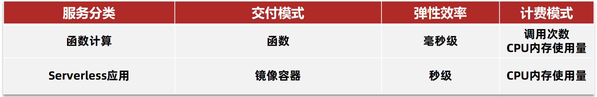

### 1.3.7 案例3：将程序部署到阿里云Serverless应用

**步骤：**

1. 在项目中编写Dockerfile文件。

2. 使用服务器制作镜像，这一步会消耗大量的CPU和内存资源，同时GraalVM相关的镜像服务器在国外，建议使用阿里云的镜像服务器制作Docker镜像。
   
   前两步同实战案例2

3. 配置Serverless应用，选择容器镜像、CPU和内存。

4. 绑定外网负载均衡并使用Postman进行测试。

[具体操作查看该页第21个视频](https://upwer66cqk.feishu.cn/wiki/Y5tNwJgL0i1wd9kauAAczM2znWg?fromScene=spaceOverview)

## 1.4 参数优化和故障诊断

### 1.4.1 GraalVM的内存参数

由于GraalVM是一款独立的JDK，所以大部分HotSpot中的虚拟机参数都不适用。常用的参数参考：[官方手册]([social-network](https://www.graalvm.org/22.3/reference-manual/native-image/optimizations-and-performance/MemoryManagement/))。

- 社区版只能使用串行垃圾回收器（Serial GC），使用串行垃圾回收器的默认最大 Java 堆大小会设置为物理内存大小的 80%，调整方式为使用 -Xmx最大堆大小。如果希望在编译期就指定该大小，可以在编译时添加参数-R:MaxHeapSize=最大堆大小。

- G1垃圾回收器只能在企业版中使用，开启方式为添加--gc=G1参数，有效降低垃圾回收的延迟。

- 另外提供一个Epsilon GC，开启方式：--gc=epsilon ，它不会产生任何的垃圾回收行为所以没有额外的内存、CPU开销。如果在公有云上运行的程序生命周期短暂不产生大量的对象，可以使用该垃圾回收器，以节省最大的资源。

-XX:+PrintGC -XX:+VerboseGC 参数打印垃圾回收详细信息。

### 1.4.2 案例4：内存快照文件的获取

**需求：** 获得运行中的内存快照文件，使用MAT进行分析。

步骤：

1. 编译程序时，添加 --enable-monitoring=heapdump，参数添加到pom文件的对应插件中。

2. 运行中使用 <font color=red>kill -SIGUSR1 进程ID</font> 命令，创建内存快照文件。

3. 使用MAT分析内存快照文件。

[具体操作查看该页第22个视频](https://upwer66cqk.feishu.cn/wiki/Y5tNwJgL0i1wd9kauAAczM2znWg?fromScene=spaceOverview)

### 1.4.3 案例5：运行时数据的获取

JDK Flight Recorder (JFR) 是一个内置于 JVM 中的工具，可以收集正在运行中的 Java 应用程序的诊断和分析数据，比如线程、异常等内容。GraalVM本地镜像也支持使用JFR生成运行时数据，导出的数据可以使用VisualVM分析。

**步骤：**

1. 编译程序时，添加 --enable-monitoring=jfr，参数添加到pom文件的对应插件中。

2. 运行程序，添加 -XX:StartFlightRecording=filename=recording.jfr,duration=10s 参数。

3. 使用VisualVM分析JFR记录文件。

[具体操作查看该页第22个视频](https://upwer66cqk.feishu.cn/wiki/Y5tNwJgL0i1wd9kauAAczM2znWg?fromScene=spaceOverview)

## 1.5 总结

1、什么是GraalVM？

<font color=red>GraalVM</font>是Oracle官方推出的一款<font color=red>高性能JDK</font>，具备两种模式，JIT模式使用方式与Oracel JDK相同；使用AOT模式制作的本地镜像，具备启动速度快、CPU和内存占用率低的优点，分为免费的社区版和收费的企业版，企业版拥有比社区版更好的性能。

2、什么场景下使用GraalVM？

① 希望拥有更好的性能，使用JIT模式或者升级为企业版。

② 执行时间较短的业务，使用GraalVM生成本地镜像，发布到函数计算云服务。

③ 执行时间较长的业务，比如长时间的计算任务，使用GraalVM生成本地镜像，发布到Serverless容器云服务。

# 2. 新一代的GC

## 2.1 垃圾回收器的技术演进

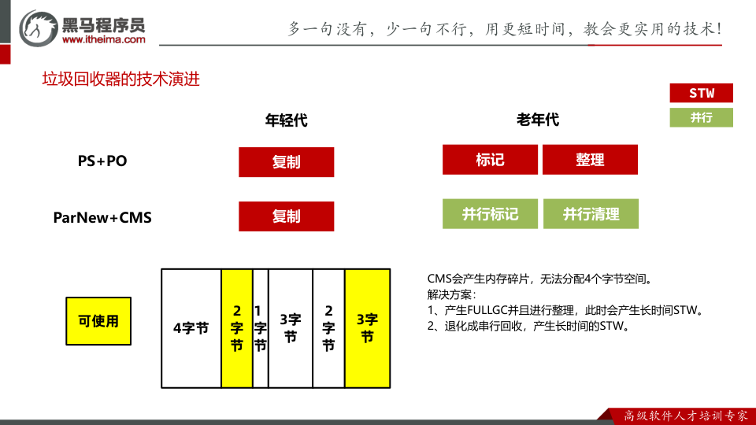

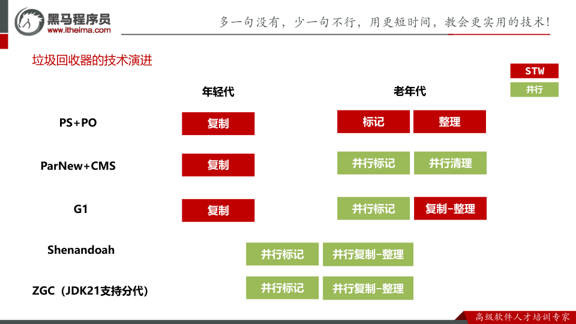

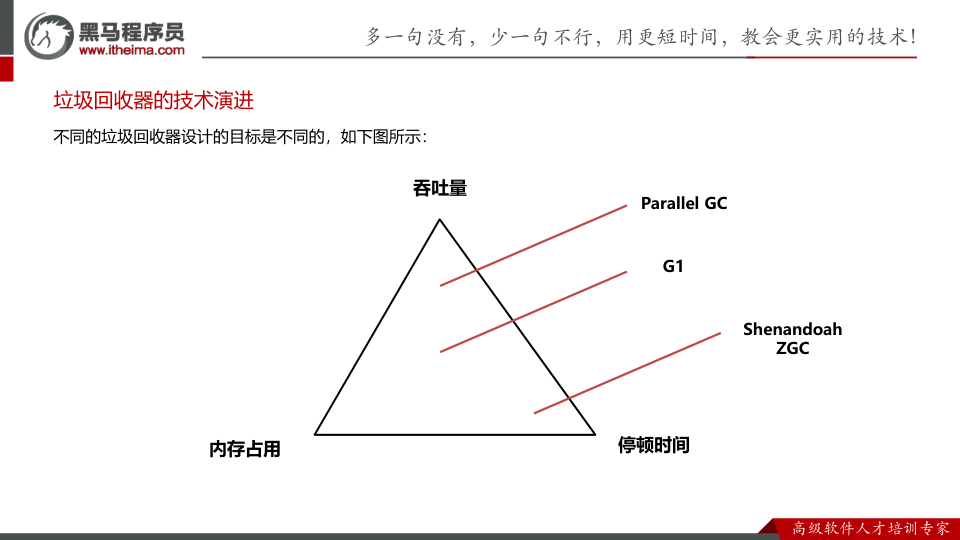

## 2.2 Shenandoah GC

### 2.2.1 什么是Shenandoah？

Shenandoah 是由Red Hat开发的一款低延迟的垃圾收集器，Shenandoah 并发执行大部分 GC 工作，包括并发的整理，堆大小对STW的时间基本没有影响。

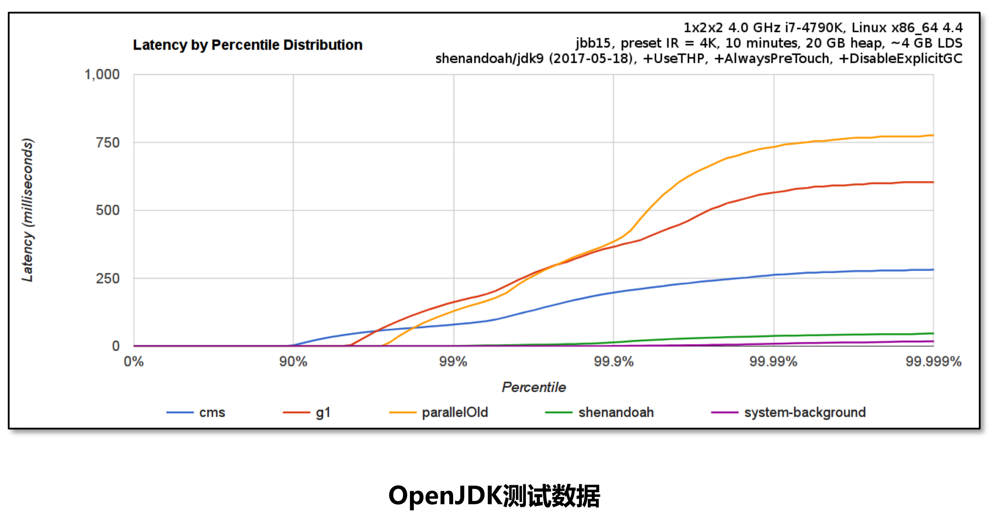

### 2.2.2 Shenandoah的使用方法

1. 下载。Shenandoah只包含在OpenJDK中，默认不包含在内，需要单独构建，可以直接下载构建好的。
- 下载地址： https://builds.shipilev.net/openjdk-jdk-shenandoah/

- 选择方式如下：
  
  {aarch64, arm32-hflt, mipsel, mips64el, ppc64le, s390x, x86_32, x86_64}：架构，使用arch命令选择对应的的架构。
  
  {server,zero}：虚拟机类型，选择server，包含所有GC的功能。
  
  {release, fastdebug, Slowdebug, optimization}：不同的优化级别，选择release，性能最高。
  
  {gcc*-glibc*, msvc*}：编译器的版本，选择较高的版本性能好一些，如果兼容性有问题（无法启动），选择较低的版本
2. 配置。将OpenJDK配置到环境变量中，使用java –version进行测试。打印出如下内容代表成功。
   
   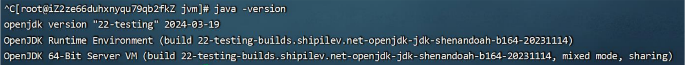

3. 添加参数，运行Java程序。
   
   -XX:+UseShenandoahGC 开启Shenandoah GC
   
   -Xlog:gc 打印GC日志
   
   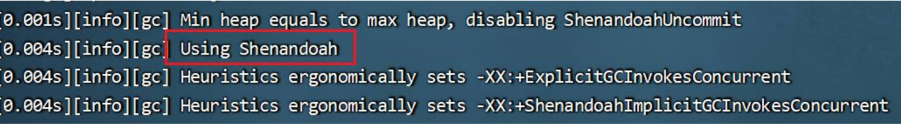

[具体操作查看该页第24个视频](https://upwer66cqk.feishu.cn/wiki/Y5tNwJgL0i1wd9kauAAczM2znWg?fromScene=spaceOverview)

## 2.3 ZGC

### 2.3.1 什么是ZGC？

ZGC 是一种可扩展的低延迟垃圾回收器。ZGC 在垃圾回收过程中，STW的时间不会超过一毫秒，适合需要低延迟的应用。支持几百兆到16TB 的堆大小，堆大小对STW的时间基本没有影响。

ZGC降低了停顿时间，能降低接口的最大耗时，提升用户体验。但是吞吐量不佳，所以如果Java服务比较关注QPS（每秒的查询次数）那么G1是比较不错的选择。

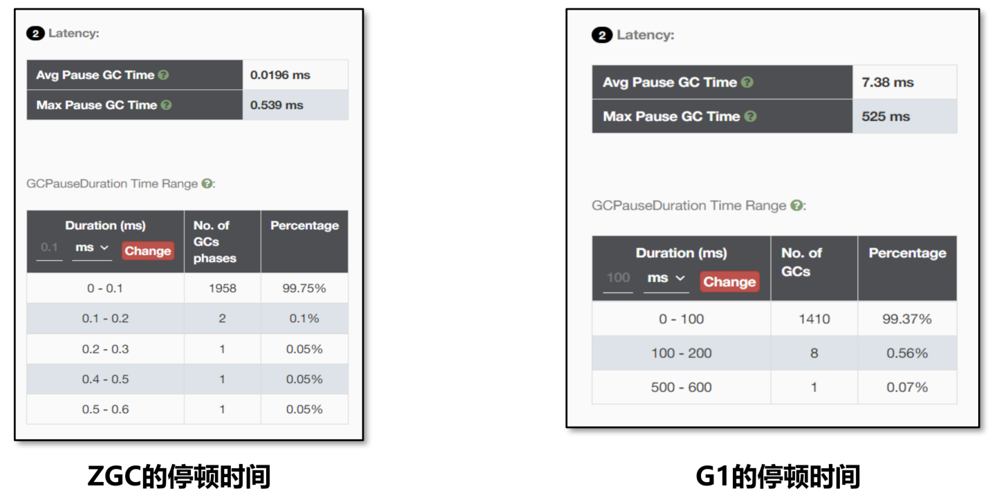

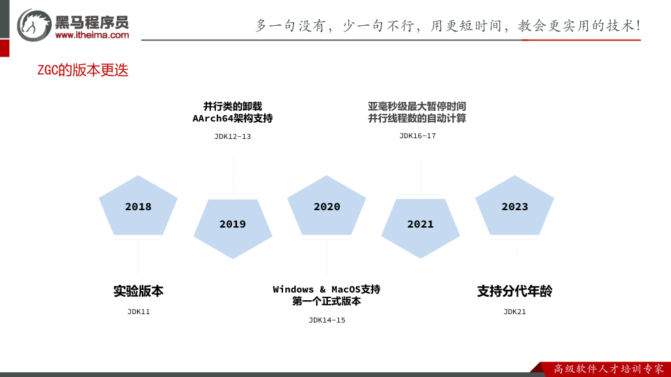

### 2.3.2 ZGC的使用方法

OracleJDK和OpenJDK中都支持ZGC，阿里的DragonWell龙井JDK也支持ZGC但属于其自行对OpenJDK 11的ZGC进行优化的版本。

建议使用JDK17之后的版本，延迟较低同时无需手动配置并行线程数。

- 分代 ZGC添加如下参数启用<font color=red> -XX:+UseZGC -XX:+ZGenerational </font> 

- 非分代 ZGC通过命令行选项启用<font color=red> -XX:+UseZGC </font> 

### 2.3.3 ZGC的参数设置

ZGC在设计上做到了自适应，根据运行情况自动调整参数，让用户手动配置的参数最少化。

- 自动设置年轻代大小，无需设置-Xmn参数。

- 自动晋升阈值（复制中存活多少次才搬运到老年代），无需设置-XX:TenuringThreshold。

- JDK17之后支持自动的并行线程数，无需设置-XX:ConcGCThreads。

需要设置的参数：

-Xmx 值 最大堆内存大小

这是ZGC最重要的一个参数，必须设置。ZGC在运行过程中会使用一部分内存用来处理垃圾回收，所以尽量保证堆中有足够的空间。设置多少值取决于对象分配的速度，根据测试情况来决定。

可以设置的参数：

-XX:SoftMaxHeapSize=值

ZGC会尽量保证堆内存小于该值，这样在内存靠近这个值时会尽早地进行垃圾回收，但是依然有可能会超过该值。例如，-Xmx5g -XX:SoftMaxHeapSize=4g 这个参数设置，ZGC会尽量保证堆内存小于4GB，最多不会超过5GB

### 2.3.4 ZGC的调优

ZGC 中可以使用Linux的Huge Page大页技术优化性能，提升吞吐量、降低延迟。

注意：安装过程需要 root 权限，所以ZGC默认没有开启此功能。

操作步骤：

1. 计算所需页数，Linux x86架构中大页大小为2MB，根据所需堆内存的大小估算大页数量。比如堆空间需要16G，预留2G（JVM需要额外的一些非堆空间），那么页数就是18G / 2MB = 9216。

2. 配置系统的大页池以具有所需的页数（需要root权限）：
   
   ```bash
   $ echo 9216 > /sys/kernel/mm/hugepages/hugepages-2048kB/nr_hugepages
   ```

3. 添加参数-XX:+UseLargePages 启动程序进行测试

[具体操作查看该页第25个视频](https://upwer66cqk.feishu.cn/wiki/Y5tNwJgL0i1wd9kauAAczM2znWg?fromScene=spaceOverview)

## 2.4 实战案例

案例：内存不足时的垃圾回收测试

需求：

Java服务中存在大量软引用的缓存导致内存不足，测试下g1、Shenandoah、ZGC这三种垃圾回收器在这种场景下的回收情况。

步骤：

1、启动程序，添加不同的虚拟机参数进行测试。

2、使用Apache Benchmark测试工具对本机进行压测。

3、生成GC日志，使用GcEasy进行分析。

4、对比压测之后的结果。

## 2.5 总结

ZGC和Shenandoah设计的目标都是追求较短的停顿时间，他们具体的使用场景如下：

两种垃圾回收器在并行回收时都会使用垃圾回收线程占用CPU资源

① 在内存足够的情况下，ZGC垃圾回收表现的效果会更好，停顿时间更短。

② 在内存不是特别充足的情况下， Shenandoah GC表现更好，并行垃圾回收的时间较短，用户请求的执行效率比较高。

[具体操作查看该页第26个视频](https://upwer66cqk.feishu.cn/wiki/Y5tNwJgL0i1wd9kauAAczM2znWg?fromScene=spaceOverview)

# 3. 揭秘Java工具

## 3.1 Java工具的介绍

在Java的世界中，除了Java编写的业务系统之外，还有一类程序也需要Java程序员参与编写，这类程序就是Java工具。

常见的Java工具有以下几类：

1、诊断类工具，如Arthas、VisualVM等。

2、开发类工具，如Idea、Eclipse。

3、APM应用性能监测工具，如Skywalking、Zipkin等。

4、热部署工具，如Jrebel等。

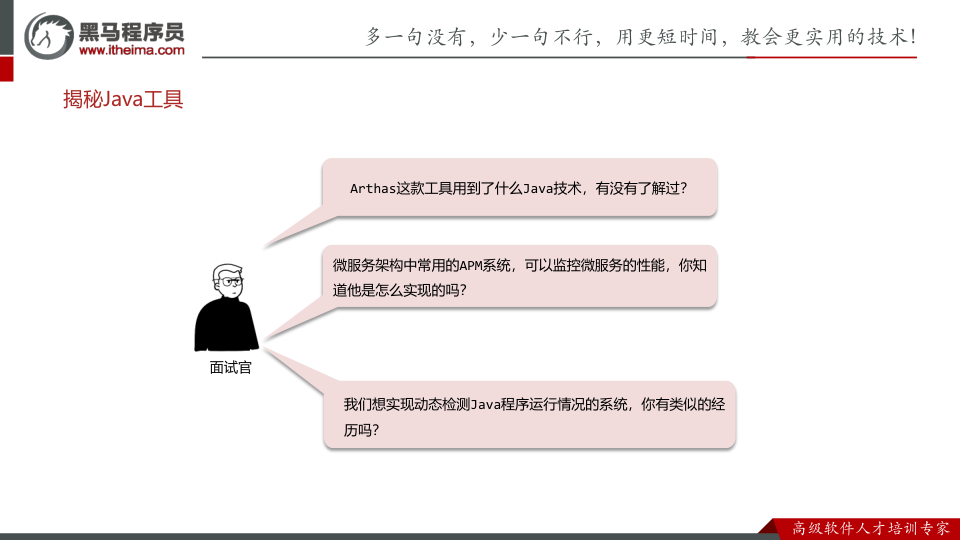

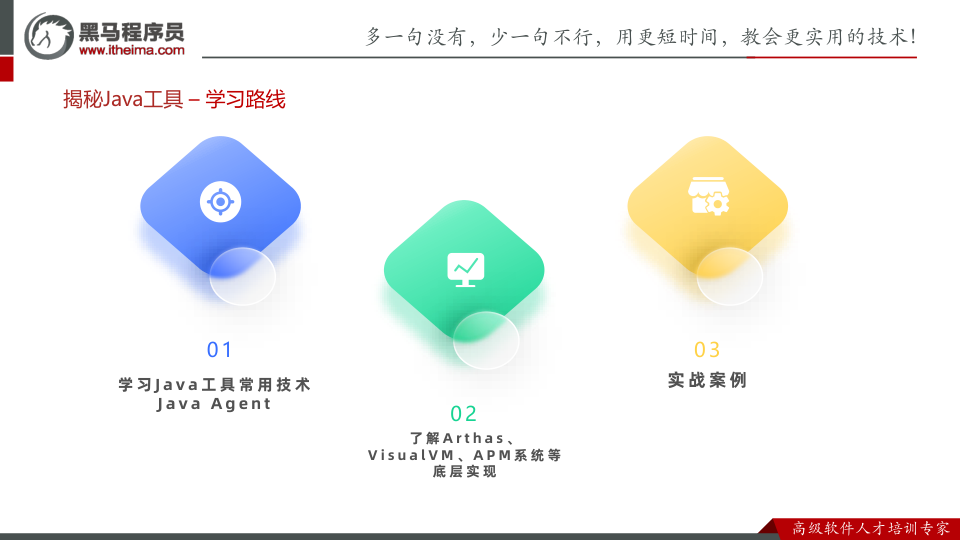

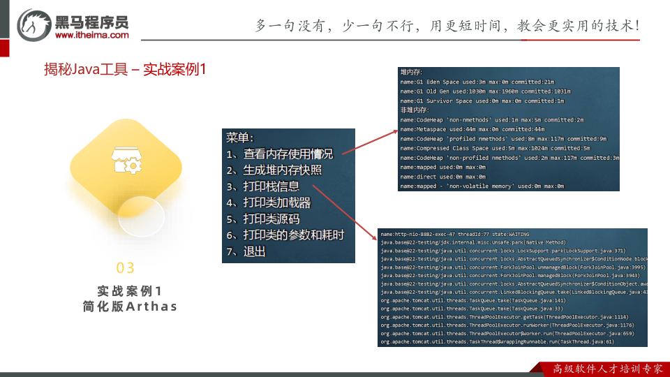

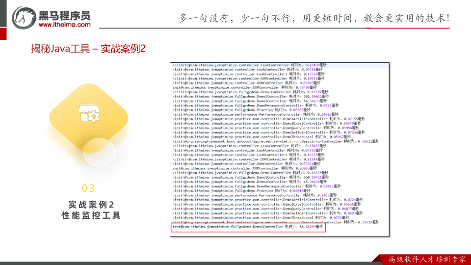

## 3.2 Java工具的核心：Java Agent技术

Java Agent技术是JDK提供的用来编写Java工具的技术，使用这种技术生成一种特殊的jar包，这种jar包可以让Java程序运行其中的代码。

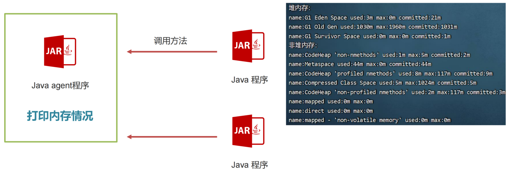

Java Agent技术的两种模式

Java Agent技术实现了让Java程序执行独立的Java Agent程序中的代码，执行方式有两种：

- 静态加载模式

- 动态加载模式

### 3.2.1 Java Agent技术的两种模式 - 静态加载模式

静态加载模式可以在程序启动的一开始就执行我们需要执行的代码，适合用APM等性能监测系统从一开始就监控程序的执行性能。静态加载模式需要在Java Agent的项目中编写一个premain的方法，并打包成jar包。

```java
public static void premain(String agentArgs, Instrumentation inst)
```

接下来使用以下命令启动Java程序，此时Java虚拟机将会加载agent中的代码并执行。

```bash
java -javaagent:./agent.jar -jar test.jar
```

premain方法会在主线程中执行:


- 可以添加多个java工具，能够多次执行premain方法；这些premain方法都执行完成后，会开始执行main方法，即主方法

### 3.2.2 Java Agent技术的两种模式 – 动态加载模式

动态加载模式可以随时让java agent代码执行，适用于Arthas等诊断系统。动态加载模式需要在Java Agent的项目中编写一个agentmain的方法，并打包成jar包。

```java
public static void agentmain(String agentArgs, Instrumentataion inst)
```

接下来使用以下代码就可以让java agent代码在指定的java进程中执行了。

```java
VirtualMachine vm = VirtualMachine.attach("24200); // 动态连接到24200进程ID的java程序
vm.loadAgent("jvm-java-agent-jar-with-dependencies.jar"); // 加载java agent
```

agentmain方法会在独立线程中执行：

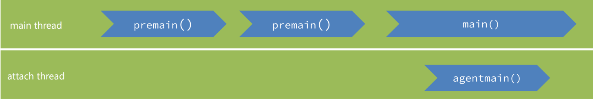

- 静态加载模式是在mian方法前执行，其是在主线程中执行的

- 而动态加载模式是随时进入进程的，所以需要创建新的线程(attach thread)来执行对应的agentmain方法

### 3.3.3 搭建java agent静态加载模式的环境

步骤：

1. 创建maven项目，添加maven-assembly-plugin插件，此插件可以打包出java agent的jar包。
   
   ```xml
   <build>
       <finalName>jvm-java-agent</finalName>
       <plugins>
           <plugin>
               <groupId>org.apache.maven.plugins</groupId>
               <artifactId>maven-assembly-plugin</artifactId>
               <configuration>
                   <!-- 将所有依赖都打入同一个jar包中 -->
                   <descriptorRefs>
                       <descriptorRef>jar-with-dependencies</descriptorRef>
                   </descriptorRefs>
                   <!-- 指定java agent相关配置文件 -->
                   <archive>
                       <manifestFile>src/main/resources/MANIFEST.MF</manifestFile>
                   </archive>
               </configuration>
           </plugin>
       </plugins>
   </build>
   ```

2. 编写类和premain方法，premain方法中打印一行信息。
   
   ```java
   package com.study.jvm.java_agent;
   
   import java.lang.instrument.Instrumentation;
   
   public class AgentMain {
       // 编写premain方法
       public static void premain(String agentArgs, Instrumentation inst) {
           System.out.println("com.study.jvm.java_agent.AgentMain.premain执行了 ... ");
       }
   }
   ```

3. 编写MANIFEST.MF文件，此文件主要用于描述java agent的配置属性，比如使用哪一个类的premain方法。
   
   ```yaml
   Manifest-Version: 1.0
   Premain-Class: com.study.jvm.java_agent.AgentMain
   Agent-Class: com.study.jvm.java_agent.AgentMain
   Can-Redefine-Classes: true
   Can-Retransform-Classes: true
   Can-Set-Native-Method-Prefix: true
   ```
   
   - Premain-Class：配置的是静态加载模式对应的类，该类中必须有premain方法（否则Idea会报错）
   
   - Agent-Class：配置的是动态加载模式对应的类，该类中必须有agentmain方法（否则Idea会报错）
     
     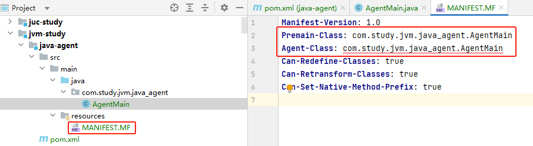

4. 使用maven-assembly-plugin进行打包。
   
   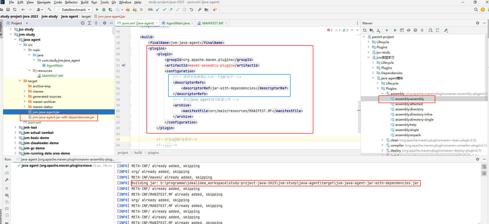

5. 创建spring boot应用，并使用静态模式加载上一步打包完的java agent。
   
   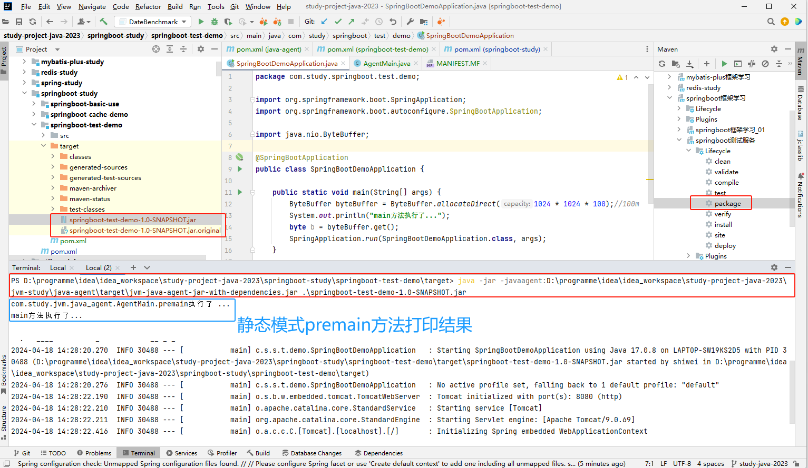
   
   - 通过以下命令启动springboot项目：
   
   - ` java -jar -javaagent:D:\jvm-java-agent-jar-with-dependencies.jar .\springboot-test-demo-1.0-SNAPSHOT.jar `

### 3.3.4 搭建java agent动态加载模式的环境

步骤：

1. 创建maven项目，添加maven-assembly-plugin插件，此插件可以打包出java agent的jar包。

2. 编写类和agentmain方法， agentmain方法中打印一行信息。
   
   ```java
   package com.study.jvm.java_agent;
   
   import java.lang.instrument.Instrumentation;
   
   public class AgentMain {
   
       // 编写动态加载模式下的agentmain方法
       public static void agentmain(String agentArgs, Instrumentation inst) {
           System.out.println("com.study.jvm.java_agent.AgentMain.agentmain执行了 ... ");
       }
   
   }
   ```

3. 编写MANIFEST.MF文件，此文件主要用于描述java agent的配置属性，比如使用哪一个类的agentmain方法。

4. 使用maven-assembly-plugin进行打包。

5. 编写main方法，动态连接到运行中的java程序。
   
   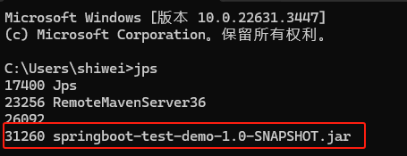
   
   ```java
   package com.study.jvm.java_agent;
   
   import com.sun.tools.attach.AgentInitializationException;
   import com.sun.tools.attach.AgentLoadException;
   import com.sun.tools.attach.AttachNotSupportedException;
   import com.sun.tools.attach.VirtualMachine;
   
   import java.io.IOException;
   
   public class AttachMain {
       public static void main(String[] args) throws AttachNotSupportedException, AgentLoadException, IOException, AgentInitializationException {
           // 获取进程虚拟机对象
           VirtualMachine vm = VirtualMachine.attach("31260");
           // 执行java agent里面的agentmain方法
           vm.loadAgent("D:\\java-agent\\target\\jvm-java-agent-jar-with-dependencies.jar");
       }
   
   }
   ```

6. 执行上述main方法，查看springboot应用日志
   
   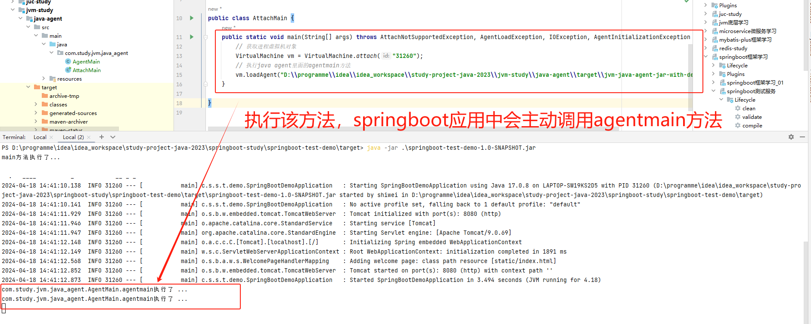

### 3.3.5 实战案例1：简化版的Arthas

功能需求：编写一个简化版的Arthas程序，具备以下几个功能：

1. 查看内存使用情况

2. 生成堆内存快照

3. 打印栈信息

4. 打印类加载器

5. 打印类的源码

6. 打印方法执行的参数和耗时

非功能需求：该程序是一个独立的Jar包，可以应用于任何Java编写的系统中。

具备以下特点：代码无侵入性、操作简单、性能高。

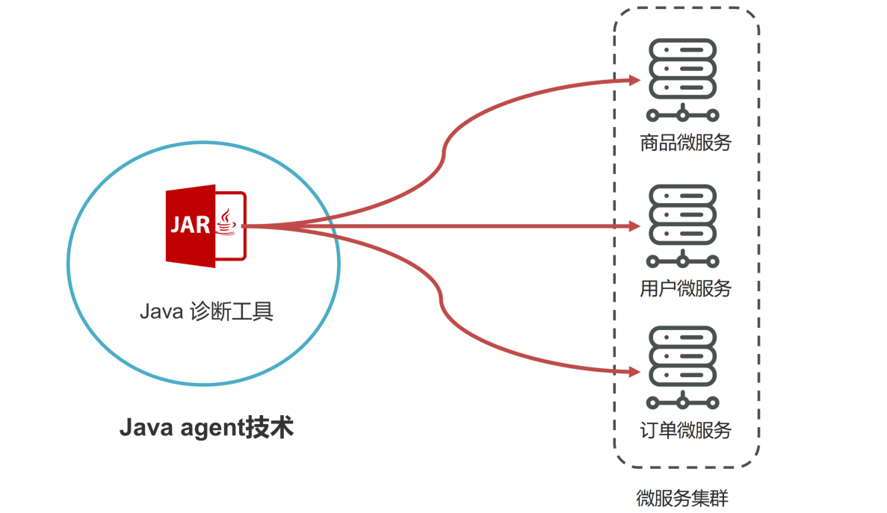

#### 获取运行时信息 - JMX技术

JDK从1.5开始提供了Java Management Extensions (JMX) 技术，通过Mbean对象的写入和获取，实现：

- 运行时配置的获取和更改

- 应用程序运行信息的获取（线程栈、内存、类信息等）

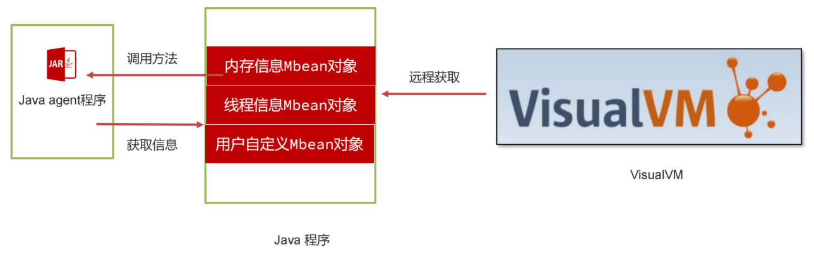

需求1：获取JVM默认提供的Mbean可以通过如下的方式，例如获取内存信息

```java
ManagementFactory.getMemoryPoolMXBeans()
```

ManagementFactory提供了一系列的方法获取各种各样的信息：

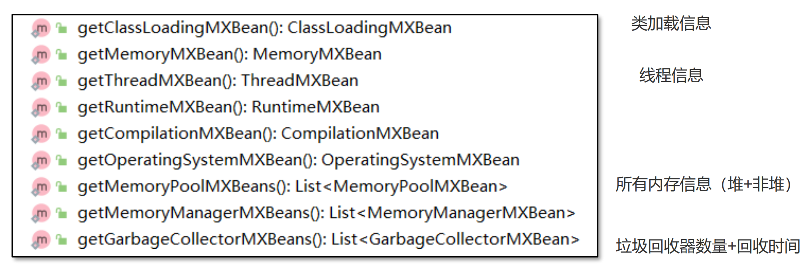

需求2：更多的信息可以通过ManagementFactory.getPlatformMXBeans获取，比如

```java
Class bufferPoolMXBeanClass = Class.forName("java.lang.management.BufferPoolMXBean");
List<BufferPoolMXBean> bufferPoolMXBeans = ManagementFactory.getPlatformMXBeans(bufferPoolMXBeanClass);
```

通过这种方式，获取到了Java虚拟机中分配的直接内存和内存映射缓冲区的大小。

```java
HotSpotDiagnosticMXBean hotSpotDiagnosticMXBean = ManagementFactory.getPlatformMXBean(HotSpotDiagnosticMXBean.class);
```

获取到虚拟机诊断用的MXBean，通过这个Bean对象可以生成内存快照。

## 3.3 实战案例1：简化版的Arthas

## 3.4 实战案例2：APM系统的数据采集
