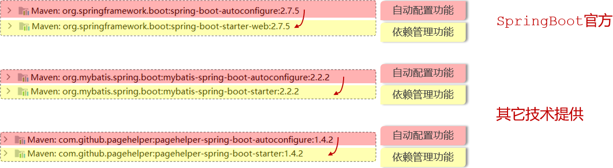
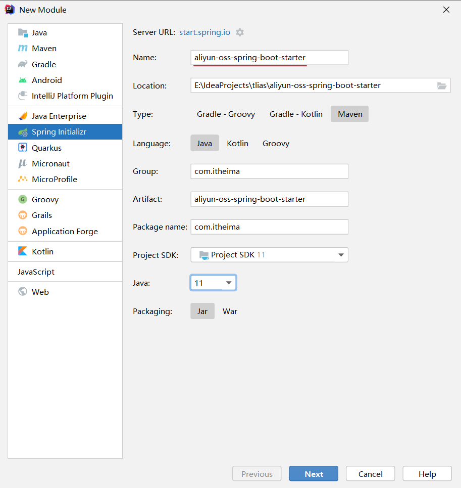
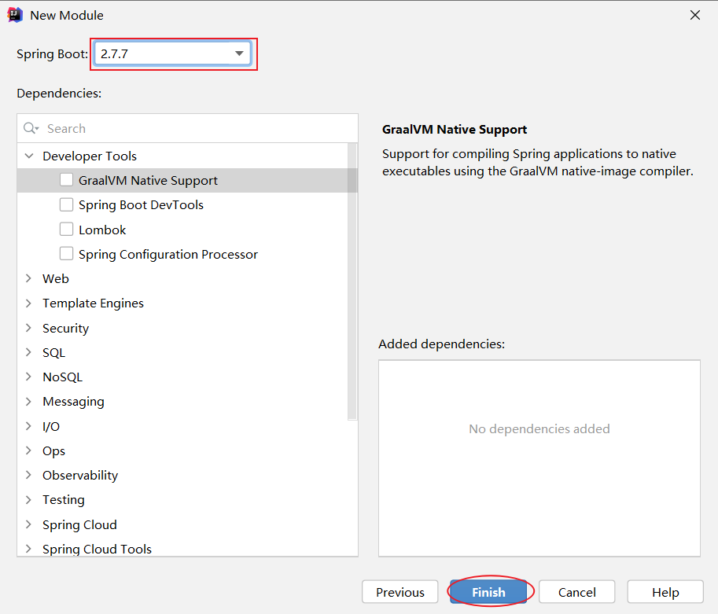
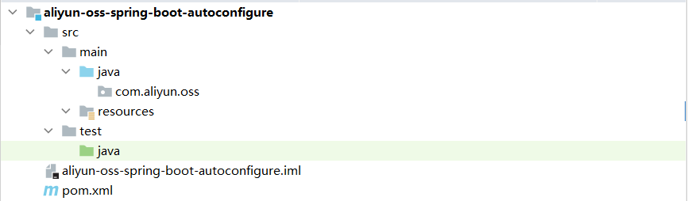
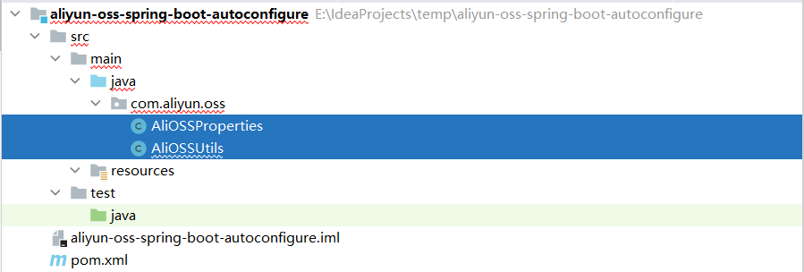
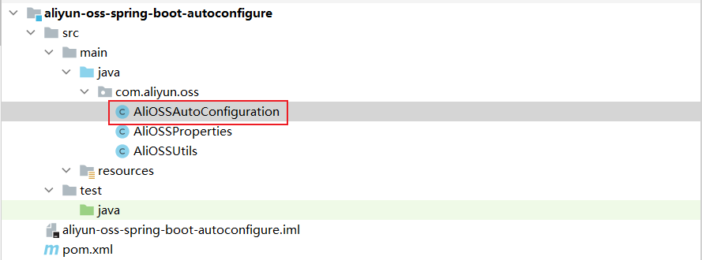
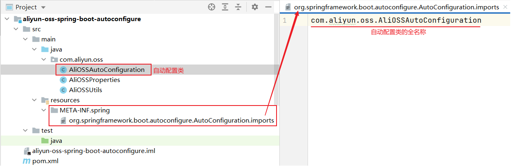
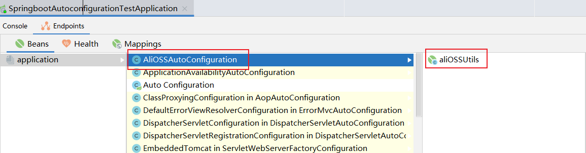
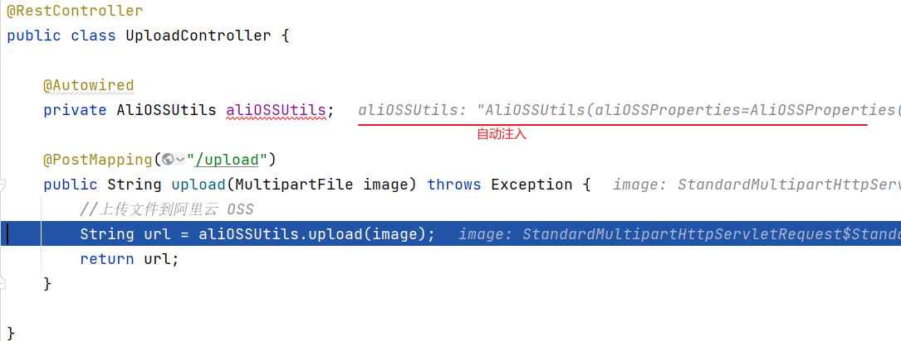

# 自定义starter分析

## 1. 自定义starter分析

前面我们解析了SpringBoot中自动配置的原理，下面我们就通过一个自定义starter案例来加深大家对于自动配置原理的理解。首先介绍一下自定义starter的业务场景，再来分析一下具体的操作步骤。

所谓starter指的就是SpringBoot当中的起步依赖。在SpringBoot当中已经给我们提供了很多的起步依赖了，我们为什么还需要自定义 starter 起步依赖？这是因为在实际的项目开发当中，我们可能会用到很多第三方的技术，并不是所有的第三方的技术官方都给我们提供了与SpringBoot整合的starter起步依赖，但是这些技术又非常的通用，在很多项目组当中都在使用。

业务场景：

- 我们前面案例当中所使用的阿里云OSS对象存储服务，现在阿里云的官方是没有给我们提供对应的起步依赖的，这个时候使用起来就会比较繁琐，我们需要引入对应的依赖。我们还需要在配置文件当中进行配置，还需要基于官方SDK示例来改造对应的工具类，我们在项目当中才可以进行使用。
- 大家想在我们当前项目当中使用了阿里云OSS，我们需要进行这么多步的操作。在别的项目组当中要想使用阿里云OSS，是不是也需要进行这么多步的操作，所以这个时候我们就可以自定义一些公共组件，在这些公共组件当中，我就可以提前把需要配置的bean都提前配置好。将来在项目当中，我要想使用这个技术，我直接将组件对应的坐标直接引入进来，就已经自动配置好了，就可以直接使用了。我们也可以把公共组件提供给别的项目组进行使用，这样就可以大大的简化我们的开发。

在SpringBoot项目中，一般都会将这些公共组件封装为SpringBoot当中的starter，也就是我们所说的起步依赖。

> SpringBoot官方starter命名： spring-boot-starter-xxxx
>
> 第三组织提供的starter命名：  xxxx-spring-boot-starter

> Mybatis提供了配置类，并且也提供了springboot会自动读取的配置文件。当SpringBoot项目启动时，会读取到spring.factories配置文件中的配置类并加载配置类，生成相关bean对象注册到IOC容器中。
>
> 结果：我们可以直接在SpringBoot程序中使用Mybatis自动配置的bean对象。

在自定义一个起步依赖starter的时候，按照规范需要定义两个模块：

1. starter模块（进行依赖管理[把程序开发所需要的依赖都定义在starter起步依赖中]）
2. autoconfigure模块（自动配置）

> 将来在项目当中进行相关功能开发时，只需要引入一个起步依赖就可以了，因为它会将autoconfigure自动配置的依赖给传递下来。

上面我们简单介绍了自定义starter的场景，以及自定义starter时涉及到的模块之后，接下来我们就来完成一个自定义starter的案例。

需求：自定义aliyun-oss-spring-boot-starter，完成阿里云OSS操作工具类AliyunOSSUtils的自动配置。

目标：引入起步依赖引入之后，要想使用阿里云OSS，注入AliyunOSSUtils直接使用即可。

之前阿里云OSS的使用：

- 配置文件

~~~yaml
#配置阿里云OSS参数
aliyun:
  oss:
    endpoint: https://oss-cn-shanghai.aliyuncs.com
    accessKeyId: LTAI5t9MZK8iq5T2Av5GLDxX
    accessKeySecret: C0IrHzKZGKqU8S7YQcevcotD3Zd5Tc
    bucketName: web-framework01
~~~

- AliOSSProperties类

~~~java
@Data
@Component
@ConfigurationProperties(prefix = "aliyun.oss")
public class AliOSSProperties {
    //区域
    private String endpoint;
    //身份ID
    private String accessKeyId ;
    //身份密钥
    private String accessKeySecret ;
    //存储空间
    private String bucketName;
}

~~~

- AliOSSUtils工具类

~~~java
@Component //当前类对象由Spring创建和管理
public class AliOSSUtils {
    @Autowired
    private AliOSSProperties aliOSSProperties;

    /**
     * 实现上传图片到OSS
     */
    public String upload(MultipartFile multipartFile) throws IOException {
        // 获取上传的文件的输入流
        InputStream inputStream = multipartFile.getInputStream();

        // 避免文件覆盖
        String originalFilename = multipartFile.getOriginalFilename();
        String fileName = UUID.randomUUID().toString() + originalFilename.substring(originalFilename.lastIndexOf("."));

        //上传文件到 OSS
        OSS ossClient = new OSSClientBuilder().build(aliOSSProperties.getEndpoint(),
                aliOSSProperties.getAccessKeyId(), aliOSSProperties.getAccessKeySecret());
        ossClient.putObject(aliOSSProperties.getBucketName(), fileName, inputStream);

        //文件访问路径
        String url =aliOSSProperties.getEndpoint().split("//")[0] + "//" + aliOSSProperties.getBucketName() + "." + aliOSSProperties.getEndpoint().split("//")[1] + "/" + fileName;

        // 关闭ossClient
        ossClient.shutdown();
        return url;// 把上传到oss的路径返回
    }
}
~~~

当我们在项目当中要使用阿里云OSS，就可以注入AliOSSUtils工具类来进行文件上传。但这种方式其实是比较繁琐的。

大家再思考，现在我们使用阿里云OSS，需要做这么几步，将来大家在开发其他的项目的时候，你使用阿里云OSS，这几步你要不要做？当团队中其他小伙伴也在使用阿里云OSS的时候，步骤 不也是一样的。

所以这个时候我们就可以制作一个公共组件(自定义starter)。starter定义好之后，将来要使用阿里云OSS进行文件上传，只需要将起步依赖引入进来之后，就可以直接注入AliOSSUtils使用了。

需求明确了，接下来我们再来分析一下具体的实现步骤：

- 第1步：创建自定义starter模块（进行依赖管理）
  - 把阿里云OSS所有的依赖统一管理起来
- 第2步：创建autoconfigure模块
  - 在starter中引入autoconfigure （我们使用时只需要引入starter起步依赖即可）
- 第3步：在autoconfigure中完成自动配置
  1. 定义一个自动配置类，在自动配置类中将所要配置的bean都提前配置好
  2. 定义配置文件，把自动配置类的全类名定义在配置文件中

我们分析完自定义阿里云OSS自动配置的操作步骤了，下面我们就按照分析的步骤来实现自定义starter。

## 2. 自定义starter实现

自定义starter的步骤我们刚才已经分析了，接下来我们就按照分析的步骤来完成自定义starter的开发。

首先我们先来创建两个Maven模块：

1). aliyun-oss-spring-boot-starter模块

创建完starter模块后，删除多余的文件，最终保留内容如下：

删除pom.xml文件中多余的内容后：

~~~xml
<?xml version="1.0" encoding="UTF-8"?>
<project xmlns="http://maven.apache.org/POM/4.0.0" xmlns:xsi="http://www.w3.org/2001/XMLSchema-instance"
	xsi:schemaLocation="http://maven.apache.org/POM/4.0.0 https://maven.apache.org/xsd/maven-4.0.0.xsd">
	<modelVersion>4.0.0</modelVersion>
	<parent>
		<groupId>org.springframework.boot</groupId>
		<artifactId>spring-boot-starter-parent</artifactId>
		<version>2.7.5</version>
		<relativePath/> <!-- lookup parent from repository -->
	</parent>

	<groupId>com.aliyun.oss</groupId>
	<artifactId>aliyun-oss-spring-boot-starter</artifactId>
	<version>0.0.1-SNAPSHOT</version>

	<properties>
		<java.version>11</java.version>
	</properties>
	
	<dependencies>
		<dependency>
			<groupId>org.springframework.boot</groupId>
			<artifactId>spring-boot-starter</artifactId>
		</dependency>
	</dependencies>

</project>
~~~

2). aliyun-oss-spring-boot-autoconfigure模块

创建完starter模块后，删除多余的文件，最终保留内容如下：

删除pom.xml文件中多余的内容后：

~~~xml
<?xml version="1.0" encoding="UTF-8"?>
<project xmlns="http://maven.apache.org/POM/4.0.0" xmlns:xsi="http://www.w3.org/2001/XMLSchema-instance"
	xsi:schemaLocation="http://maven.apache.org/POM/4.0.0 https://maven.apache.org/xsd/maven-4.0.0.xsd">
	<modelVersion>4.0.0</modelVersion>
	<parent>
		<groupId>org.springframework.boot</groupId>
		<artifactId>spring-boot-starter-parent</artifactId>
		<version>2.7.5</version>
		<relativePath/> <!-- lookup parent from repository -->
	</parent>
	
	<groupId>com.aliyun.oss</groupId>
	<artifactId>aliyun-oss-spring-boot-autoconfigure</artifactId>
	<version>0.0.1-SNAPSHOT</version>

	<properties>
		<java.version>11</java.version>
	</properties>

	<dependencies>
        <dependency>
            <groupId>org.springframework.boot</groupId>
            <artifactId>spring-boot-starter</artifactId>
        </dependency>
	</dependencies>

</project>
~~~

按照我们之前的分析，是需要在starter模块中来引入autoconfigure这个模块的。打开starter模块中的pom文件：

~~~xml
<?xml version="1.0" encoding="UTF-8"?>
<project xmlns="http://maven.apache.org/POM/4.0.0" xmlns:xsi="http://www.w3.org/2001/XMLSchema-instance"
	xsi:schemaLocation="http://maven.apache.org/POM/4.0.0 https://maven.apache.org/xsd/maven-4.0.0.xsd">
	<modelVersion>4.0.0</modelVersion>
	<parent>
		<groupId>org.springframework.boot</groupId>
		<artifactId>spring-boot-starter-parent</artifactId>
		<version>2.7.5</version>
		<relativePath/> <!-- lookup parent from repository -->
	</parent>

	<groupId>com.aliyun.oss</groupId>
	<artifactId>aliyun-oss-spring-boot-starter</artifactId>
	<version>0.0.1-SNAPSHOT</version>

	<properties>
		<java.version>11</java.version>
	</properties>
	
	<dependencies>
		<!--引入autoconfigure模块-->
		<dependency>
			<groupId>com.aliyun.oss</groupId>
			<artifactId>aliyun-oss-spring-boot-autoconfigure</artifactId>
			<version>0.0.1-SNAPSHOT</version>
		</dependency>
		
		<dependency>
			<groupId>org.springframework.boot</groupId>
			<artifactId>spring-boot-starter</artifactId>
		</dependency>
	</dependencies>

</project>
~~~

前两步已经完成了，接下来是最关键的就是第三步：

在autoconfigure模块当中来完成自动配置操作。

>  我们将之前案例中所使用的阿里云OSS部分的代码直接拷贝到autoconfigure模块下，然后进行改造就行了。

拷贝过来后，还缺失一些相关的依赖，需要把相关依赖也拷贝过来：

~~~xml
<?xml version="1.0" encoding="UTF-8"?>
<project xmlns="http://maven.apache.org/POM/4.0.0" xmlns:xsi="http://www.w3.org/2001/XMLSchema-instance"
	xsi:schemaLocation="http://maven.apache.org/POM/4.0.0 https://maven.apache.org/xsd/maven-4.0.0.xsd">
	<modelVersion>4.0.0</modelVersion>
	<parent>
		<groupId>org.springframework.boot</groupId>
		<artifactId>spring-boot-starter-parent</artifactId>
		<version>2.7.5</version>
		<relativePath/> <!-- lookup parent from repository -->
	</parent>
	
	<groupId>com.aliyun.oss</groupId>
	<artifactId>aliyun-oss-spring-boot-autoconfigure</artifactId>
	<version>0.0.1-SNAPSHOT</version>

	<properties>
		<java.version>11</java.version>
	</properties>

	<dependencies>
        <dependency>
            <groupId>org.springframework.boot</groupId>
            <artifactId>spring-boot-starter</artifactId>
        </dependency>

		<!--引入web起步依赖-->
		<dependency>
			<groupId>org.springframework.boot</groupId>
			<artifactId>spring-boot-starter-web</artifactId>
		</dependency>

		<!--Lombok-->
		<dependency>
			<groupId>org.projectlombok</groupId>
			<artifactId>lombok</artifactId>
		</dependency>

		<!--阿里云OSS-->
		<dependency>
			<groupId>com.aliyun.oss</groupId>
			<artifactId>aliyun-sdk-oss</artifactId>
			<version>3.15.1</version>
		</dependency>

		<dependency>
			<groupId>javax.xml.bind</groupId>
			<artifactId>jaxb-api</artifactId>
			<version>2.3.1</version>
		</dependency>
		<dependency>
			<groupId>javax.activation</groupId>
			<artifactId>activation</artifactId>
			<version>1.1.1</version>
		</dependency>
		<!-- no more than 2.3.3-->
		<dependency>
			<groupId>org.glassfish.jaxb</groupId>
			<artifactId>jaxb-runtime</artifactId>
			<version>2.3.3</version>
		</dependency>
	</dependencies>
</project>
~~~

现在大家思考下，在类上添加的@Component注解还有用吗？

答案：没用了。  在SpringBoot项目中，并不会去扫描com.aliyun.oss这个包，不扫描这个包那类上的注解也就失去了作用。

> @Component注解不需要使用了，可以从类上删除了。
>
> 
>
> 删除后报红色错误，暂时不理会，后面再来处理。
>
> 
>
> 删除AliOSSUtils类中的@Component注解、@Autowired注解
>
> 

下面我们就要定义一个自动配置类了，在自动配置类当中来声明AliOSSUtils的bean对象。

 AliOSSAutoConfiguration类：

~~~java
@Configuration//当前类为Spring配置类
@EnableConfigurationProperties(AliOSSProperties.class)//导入AliOSSProperties类，并交给SpringIOC管理
public class AliOSSAutoConfiguration {

    //创建AliOSSUtils对象，并交给SpringIOC容器
    @Bean
    public AliOSSUtils aliOSSUtils(AliOSSProperties aliOSSProperties){
        AliOSSUtils aliOSSUtils = new AliOSSUtils();
        aliOSSUtils.setAliOSSProperties(aliOSSProperties);
        return aliOSSUtils;
    }
}
~~~

AliOSSProperties类：

~~~java
/*阿里云OSS相关配置*/
@Data
@ConfigurationProperties(prefix = "aliyun.oss")
public class AliOSSProperties {
    //区域
    private String endpoint;
    //身份ID
    private String accessKeyId ;
    //身份密钥
    private String accessKeySecret ;
    //存储空间
    private String bucketName;
}
~~~

AliOSSUtils类：

~~~java
@Data 
public class AliOSSUtils {
    private AliOSSProperties aliOSSProperties;

    /**
     * 实现上传图片到OSS
     */
    public String upload(MultipartFile multipartFile) throws IOException {
        // 获取上传的文件的输入流
        InputStream inputStream = multipartFile.getInputStream();

        // 避免文件覆盖
        String originalFilename = multipartFile.getOriginalFilename();
        String fileName = UUID.randomUUID().toString() + originalFilename.substring(originalFilename.lastIndexOf("."));

        //上传文件到 OSS
        OSS ossClient = new OSSClientBuilder().build(aliOSSProperties.getEndpoint(),
                aliOSSProperties.getAccessKeyId(), aliOSSProperties.getAccessKeySecret());
        ossClient.putObject(aliOSSProperties.getBucketName(), fileName, inputStream);

        //文件访问路径
        String url =aliOSSProperties.getEndpoint().split("//")[0] + "//" + aliOSSProperties.getBucketName() + "." + aliOSSProperties.getEndpoint().split("//")[1] + "/" + fileName;

        // 关闭ossClient
        ossClient.shutdown();
        return url;// 把上传到oss的路径返回
    }
}
~~~

在aliyun-oss-spring-boot-autoconfigure模块中的resources下，新建自动配置文件：

- META-INF/spring/org.springframework.boot.autoconfigure.AutoConfiguration.imports

  ~~~java
  com.aliyun.oss.AliOSSAutoConfiguration
  ~~~

## 3. 自定义starter测试

阿里云OSS的starter我们刚才已经定义好了，接下来我们就来做一个测试。

> 今天的课程资料当中，提供了一个自定义starter的测试工程。我们直接打开文件夹，里面有一个测试工程。测试工程就是springboot-autoconfiguration-test，我们只需要将测试工程直接导入到Idea当中即可。

测试前准备：

1. 在test工程中引入阿里云starter依赖

   - 通过依赖传递，会把autoconfigure依赖也引入了

   ~~~xml
   <!--引入阿里云OSS起步依赖-->
   <dependency>
       <groupId>com.aliyun.oss</groupId>
       <artifactId>aliyun-oss-spring-boot-starter</artifactId>
       <version>0.0.1-SNAPSHOT</version>
   </dependency>
   ~~~

2. 在test工程中的application.yml文件中，配置阿里云OSS配置参数信息（从以前的工程中拷贝即可）

   ~~~yaml
   #配置阿里云OSS参数
   aliyun:
     oss:
       endpoint: https://oss-cn-shanghai.aliyuncs.com
       accessKeyId: LTAI5t9MZK8iq5T2Av5GLDxX
       accessKeySecret: C0IrHzKZGKqU8S7YQcevcotD3Zd5Tc
       bucketName: web-framework01
   ~~~

3. 在test工程中的UploadController类编写代码

   ~~~java
   @RestController
   public class UploadController {
   
       @Autowired
       private AliOSSUtils aliOSSUtils;
   
       @PostMapping("/upload")
       public String upload(MultipartFile image) throws Exception {
           //上传文件到阿里云 OSS
           String url = aliOSSUtils.upload(image);
           return url;
       }
   
   }
   ~~~

编写完代码后，我们启动当前的SpringBoot测试工程：

- 随着SpringBoot项目启动，自动配置会把AliOSSUtils的bean对象装配到IOC容器中

用postman工具进行文件上传：

通过断点可以看到自动注入AliOSSUtils的bean对象：

